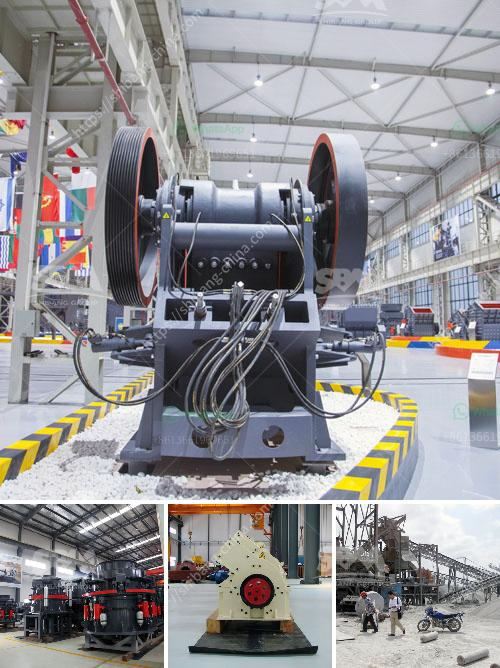

<h3>What is the waste from an ore-crushing plant?</h3>
Mining operations involve various stages of crushing and screening, which generate large quantities of waste. In this article, we will explore the different waste types generated by an ore-crushing plant.

Ore processing is a series of operations that extracts valuable minerals from the ore. In the initial step called crushing, the ore is reduced in size for further processing. Crushing typically consists of two or more stages of crushing, primary, secondary, and sometimes tertiary crushing.

During the crushing process, the ore is broken into smaller pieces. This initial crushing produces a mixture of larger rocks and finer particles. The larger rocks are usually discarded as waste material, commonly known as coarse reject. These rocks are often too large to be effectively processed and are usually used for landscaping or road construction purposes.

The finer particles generated during the crushing process are also considered waste and are commonly referred to as fines. These fines can be divided into two main categories: fine tailings and fines from screens and crushers.

Fine tailings are the result of the ore being washed and separated from other minerals. These tailings are usually composed of water and a mix of small particles, including minerals and chemicals used in the processing stage. Fine tailings are typically transported to a tailings storage facility, where they are stored and managed to prevent environmental harm.

The fines from screens and crushers refer to the smaller particles that pass through the screens during the crushing process. These fines are often collected in settling ponds or tanks, where they are further processed to remove any remaining valuable minerals. The remaining material is usually considered waste and is disposed of accordingly.

Aside from the waste generated during the actual crushing process, other waste types may also be produced in an ore-crushing plant. These include waste rock, overburden, and tailings.

Waste rock is the rock that is excavated to access the ore. It is usually found above the ore deposit and is removed and stockpiled during the mining process. Waste rock may contain low concentrations of valuable minerals, and in some cases, these minerals can be extracted and processed to generate additional revenue.

Overburden is the soil and rock that covers the ore deposit. It is typically removed and stored separately from the ore during mining operations. Overburden is often used for reclamation purposes, such as land restoration after mining activities cease.

Tailings are the fine-grained waste material that remains after the valuable minerals have been extracted. Tailings are typically stored in tailings storage facilities, either in the form of a slurry or solid form. Proper management of tailings is essential to prevent environmental contamination and ensure the long-term stability of the storage facility.

In conclusion, an ore-crushing plant generates various types of waste, including coarse reject, fines from screens and crushers, fine tailings, waste rock, overburden, and tailings. Effective management and disposal of these waste materials are crucial to minimize environmental impact and ensure the sustainability of mining operations.
<h3>Contact us</h3><ul><li><strong>Whatsapp:&nbsp;<a href="https://wa.me/8613661969651">+8613661969651</a></strong></li><li><a href="https://swt.shibang-china.com/?git&amp;zhl&amp;What is the waste from an orecrushing plant"><strong>Online Service(chat now)</strong></a></li></ul><h3>Related</h3><ul><li><a href='What is the cost of roller mills.md'>What is the cost of roller mills?</a></li><li><a href='What is the difference between a wet and dry coal crusher and a hammer crusher.md'>What is the difference between a wet and dry coal crusher and a hammer crusher?</a></li><li><a href='what are the various uses of lime stone powder？.md'>what are the various uses of lime stone powder？</a></li><li><a href='What is a ball mill for .md'>What is a ball mill for ?</a></li><li><a href='What is 42 and 65 in 42×65 gyratory crusher.md'>What is 42 and 65 in 42×65 gyratory crusher?</a></li></ul>