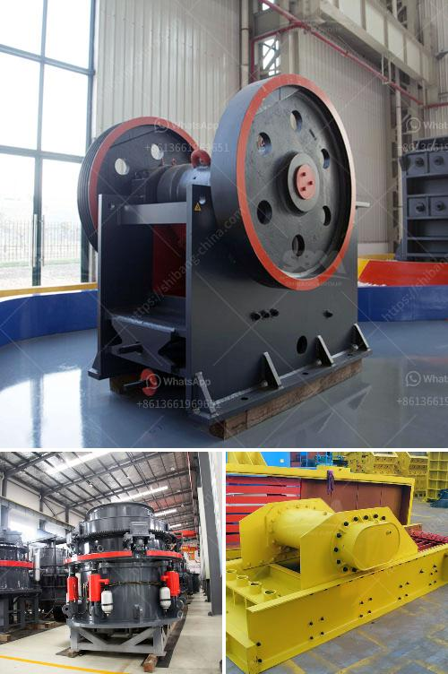

<h3>What is the waste of ore crushing plant ?</h3>
Ore crushing is an essential process in various industries, such as mining, metallurgy, building materials, and chemical industries. It aims at breaking down the large ore into smaller pieces, which helps in the extraction of valuable minerals. However, during this process, a significant amount of waste is generated, which needs to be properly managed.

The waste of an ore crushing plant primarily includes two types: mine tailings and waste rock. Mine tailings are the finely ground rock and mineral waste materials that remain after the valuable minerals have been extracted from the ore. They are usually discharged as slurry or sludge, often contained in tailings ponds. On the other hand, waste rock refers to the non-valuable rocks that are removed during the ore crushing process.

Mine tailings are typically composed of finely ground particles, including sand-sized material, silt, and clay. They can contain various chemicals used in the extraction process, such as cyanide, sulfuric acid, and mercury, which are potential environmental hazards if not properly managed. Additionally, the fine particles present in mine tailings can easily become airborne, causing air pollution and posing health risks to nearby communities.

One of the main challenges in managing mine tailings is their sheer volume. The large-scale mining operations often generate millions of tons of tailings annually. Therefore, effective storage and containment systems are crucial to prevent the spread of tailings and minimize the environmental impact. Tailings ponds are commonly used to store and treat mine tailings. These ponds must be engineered to ensure their integrity and prevent leakage into surrounding ecosystems.

Waste rock, on the other hand, is the non-valuable rock material obtained during the ore crushing process. It is typically stored in specific areas near the mine site. Waste rock can contain low levels of valuable minerals, which may be further processed to extract them. However, in most cases, the concentration of these minerals is too low to make the extraction economically viable. Therefore, waste rock is often considered a by-product of the ore crushing process and requires proper disposal.

To mitigate the environmental impact of waste rock, various measures are taken. These include using the waste rock for reclamation efforts, where it is used to reshape the land and restore it to its natural state after mining activities are completed. Additionally, waste rock can be used as construction material, such as in road construction or as aggregate in concrete production.

In conclusion, the waste generated from ore crushing plants consists of mine tailings and waste rock. Mine tailings are fine particles containing chemicals used in the extraction process, while waste rock is non-valuable rock material. Proper management of these wastes is crucial to prevent environmental pollution and minimize health risks. Storage and containment systems, such as tailings ponds, are used for mine tailings, while waste rock can be utilized in reclamation and construction efforts. By implementing effective waste management practices, the environmental impact of ore crushing plants can be significantly reduced.
<h3>Contact us</h3><ul><li><strong>Whatsapp:&nbsp;<a href="https://wa.me/8613661969651">+8613661969651</a></strong></li><li><a href="https://swt.shibang-china.com/?git&amp;zhl&amp;What is the waste of ore crushing plant "><strong>Online Service(chat now)</strong></a></li></ul><h3>Related</h3><ul><li><a href='What is the operation of a vertical roller mill.md'>What is the operation of a vertical roller mill?</a></li><li><a href='What are the byproducts of mining quartz.md'>What are the byproducts of mining quartz?</a></li><li><a href='What is antimony ore used for.md'>What is antimony ore used for?</a></li><li><a href='What are some good ways to improve the capacity of a cement ball mill.md'>What are some good ways to improve the capacity of a cement ball mill?</a></li><li><a href='What is the best design for stone screening equipment.md'>What is the best design for stone screening equipment</a></li></ul>