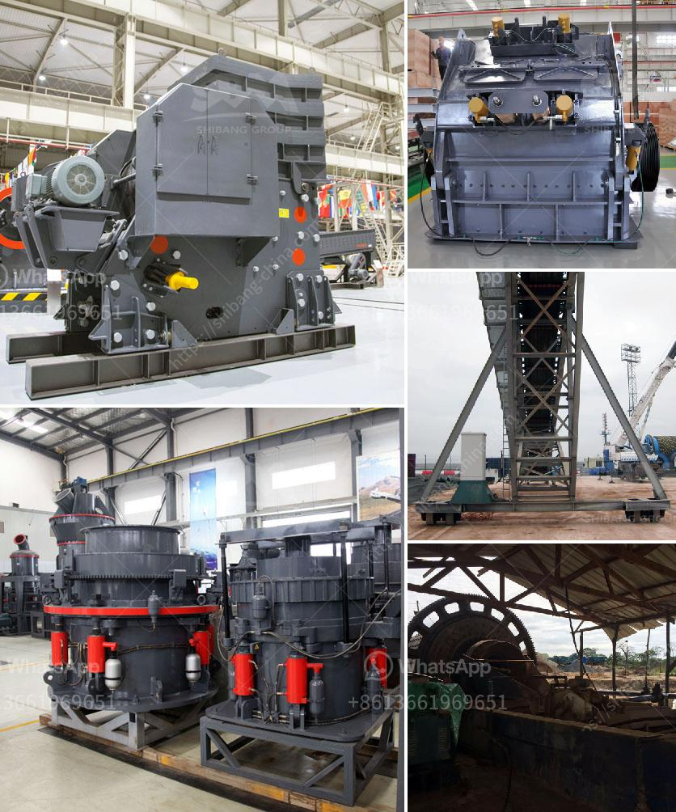

<h3>What is the way to block the material of sand crusher ?</h3>
A sand crusher is an essential machine in the sand production line. It is also known as a sand making machine or a sand maker, which is a type of equipment commonly used in the sand making process. It is typically used to crush various raw materials into small and uniform particles that can be used as construction, industrial, or other purposes.

However, sometimes certain materials can cause blockages in the sand crusher, preventing it from operating efficiently. This can be a frustrating issue as it not only disrupts the production process but also affects the overall productivity of the sand production line. Therefore, finding an effective way to block the material of the sand crusher is crucial.

One common material that often causes blockages in the sand crusher is large-sized rocks or stones. These rocks can be difficult to crush and may get stuck in the machine, causing it to jam or experience mechanical failures. To prevent such blockages, it is important to implement proper feeding techniques.

One way to block the material is to regulate the size of the input material. It is recommended to ensure that no rocks or stones larger than the prescribed maximum size are fed into the sand crusher. This can be done by using a vibrating screen or a sieve to separate large-sized materials before they enter the machine.

Furthermore, maintaining a consistent and steady feeding rate is also essential. Uneven or abrupt feeding can overload the sand crusher and result in blockages. Installing a feeder device or controlling the feeding rate manually can help regulate the flow of material into the machine.

Another material that can potentially cause blockages is wet or sticky materials. These materials tend to stick to the inner walls of the sand crusher, making it difficult to crush and causing a decrease in efficiency. To block the material in this case, it is important to adjust the moisture content.

Drying the wet materials before feeding them into the sand crusher can help prevent blockages. Additionally, adding a drying device or a dehumidifier to the production line can help eliminate excess moisture from the materials, enabling smoother operations.

Moreover, regular maintenance and cleaning of the sand crusher can also contribute to preventing material blockages. Cleaning the inner chamber and removing any accumulated debris, dust, or material residue can improve the performance and efficiency of the machine.

In conclusion, blocking the material in a sand crusher can be a challenging issue that affects the productivity of the sand production line. However, by implementing proper feeding techniques, controlling the moisture content of materials, and regularly maintaining and cleaning the machine, it is possible to prevent blockages effectively. By addressing these issues, the sand crusher can operate efficiently, contributing to the smooth and uninterrupted production of high-quality sand.
<h3>Contact us</h3><ul><li><strong>Whatsapp:&nbsp;<a href="https://wa.me/8613661969651">+8613661969651</a></strong></li><li><a href="https://swt.shibang-china.com/?git&amp;zhl&amp;What is the way to block the material of sand crusher "><strong>Online Service(chat now)</strong></a></li></ul><h3>Related</h3><ul><li><a href='What is bauxite used to make and how to extraction process.md'>What is bauxite used to make? and how to extraction process?</a></li><li><a href='What kind of machine is needed to grind ore into fine powder？.md'>What kind of machine is needed to grind ore into fine powder？</a></li><li><a href='What is the price of mobile crusher.md'>What is the price of mobile crusher?</a></li><li><a href='How oftenwhat maintenance needs to be done on crushing plant.md'>How often/what maintenance needs to be done on crushing plant</a></li><li><a href='What is a dry ball mill.md'>What is a dry ball mill?</a></li></ul>