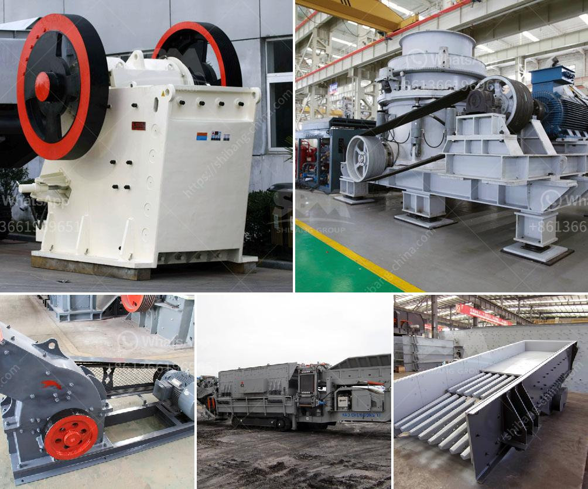

<h3>What is the yield in mineral processing?</h3>
Mineral processing is a complex and vital process that involves extracting valuable minerals from the ore. Yield is a term frequently used in mineral processing to describe the amount of valuable mineral obtained from the ore during the extraction process. It is an essential metric used by industry professionals to assess the efficiency and profitability of mineral processing operations.

Yield is determined by a variety of factors, including the mineralogy and grade of the ore, the efficiency of the extraction process, and the recovery methods employed. The ultimate goal of mineral processing is to maximize the yield of valuable minerals while minimizing the loss of valuable minerals in the tailings. As such, the yield is a critical factor in determining the success of a mineral processing operation.

The mineralogy and grade of the ore significantly impact the yield. Certain minerals are more valuable than others, so a higher yield of these minerals will result in a more profitable operation. The grade refers to the concentration of valuable minerals in the ore. Higher-grade ores generally have a higher yield as there is a greater amount of valuable minerals to extract.

The efficiency of the extraction process also plays a crucial role in determining the yield. Various techniques, such as crushing, grinding, and flotation, are used to liberate the valuable minerals from the ore. These processes require a significant amount of energy and can result in the loss of valuable minerals if not conducted carefully. The efficiency of these processes, including the recovery of valuable minerals, directly impacts the yield.

Recovery methods employed in mineral processing operations also affect the yield. Different minerals require different recovery methods, such as gravity separation, magnetic separation, or froth flotation. The selection and optimization of these methods determine the success of mineral processing in maximizing the yield. Furthermore, the usage of reagents and chemicals in the recovery methods can significantly impact the yield, as well as the overall cost of production.

The yield in mineral processing is typically measured in terms of a percentage. For example, a yield of 95% means that 95% of the valuable minerals present in the ore were successfully extracted during the processing. Achieving a high yield is the primary objective of mineral processing, as it directly reflects the profitability of the operation.

Maximizing yield requires a comprehensive understanding of the ore's mineralogy, employing efficient extraction processes, and optimizing recovery methods. It also involves continuous monitoring and adjustment of various parameters throughout the mineral processing operation. Advances in technology and research are continually improving the understanding and efficiency of mineral processing, leading to higher yields and more sustainable operations.

In conclusion, the yield in mineral processing refers to the amount of valuable minerals obtained from the ore during the extraction process. It is a critical metric used to assess the efficiency and profitability of mineral processing operations. Factors such as the mineralogy and grade of the ore, the efficiency of the extraction process, and the recovery methods employed all contribute to the yield. Maximizing the yield is essential for a successful and profitable mineral processing operation.
<h3>Contact us</h3><ul><li><strong>Whatsapp:&nbsp;<a href="https://wa.me/8613661969651">+8613661969651</a></strong></li><li><a href="https://swt.shibang-china.com/?git&amp;zhl&amp;What is the yield in mineral processing"><strong>Online Service(chat now)</strong></a></li></ul><h3>Related</h3><ul><li><a href='What is the capacity of the grinding mill.md'>What is the capacity of the grinding mill?</a></li><li><a href='What kind of quartz can be used in the paint industry and how to get it.md'>What kind of quartz can be used in the paint industry and how to get it?</a></li><li><a href='What is the major step in the process of openpit and underground mining.md'>What is the major step in the process of open-pit and underground mining?</a></li><li><a href='What are the specifications of the crusher for crushing concrete.md'>What are the specifications of the crusher for crushing concrete?</a></li><li><a href='What is the purpose of secondary crushing in the production of lime.md'>What is the purpose of secondary crushing in the production of lime?</a></li></ul>