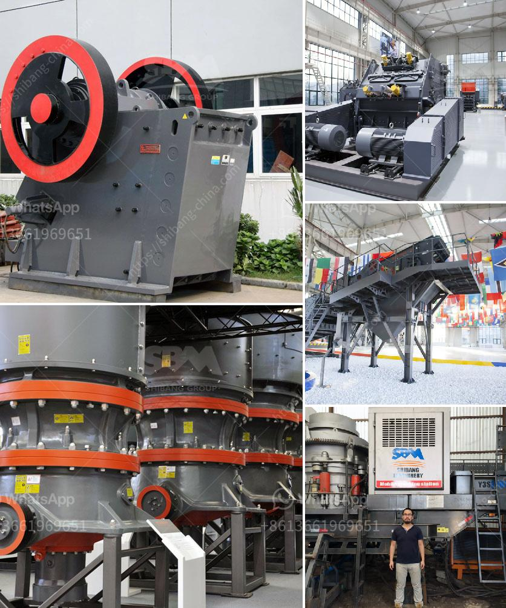

<h3>What is "tpd" in stone crusher plant capacity?</h3>
TPD stands for Tons Per Day. In relation to stone crusher plant, it refers to the amount of material crushed in a day's time. Now, we can talk about the factors that affect the capacity of stone crusher plant.

Stone crushing production line (stationary stone crusher plant),also known as stone crushing screening plant, mainly consists of vibrating feeder, jaw crusher, cone crusher/impact crusher, vibrating screen, belt conveyor, electric control panel,dust removal equipment,etc. In the whole production line, jaw crusher and cone crusher will be commonly used for primary/coarse crushing and impact crusher or cone crusher is used for secondary and fine crushing.

The capacity range of stone crusher plant can be 50-800 tons per hour. The better and best stone crusher starts from the quarry site. Contrary to popular belief, it comes in a form of experienced and good blast designers/ engineers. Emphasized by a former lecturer of mine, who was a mining engineer in the 1980s-90s. He has worked at several types of mines and practised this understanding himself when designing blasting patterns on-site.

It can be crushed limestone, marble, granite, basalt, river pebble, etc. In the process of actual production, the type of material also has a great influence on the capacity of the crusher.

The size of the material is an important factor to consider when choosing the stone crusher plant. It needs proper feed size in order to get the desired product size and increase the capacity of the crusher.

This refers to the maximum capacity of the crusher. In terms of input and output granular size, crushing cavity designed for high capacity ensures the final products size consistence and size proportion range of the finished product.

Regular maintenance plays a vital role in maintaining the performance of the stone crusher plant. It is recommended to regularly check the wear parts, replace if necessary and ensure proper lubrication of the machine to enhance its overall performance.

Environmental factors, such as location, altitude, and weather can also affect the capacity of the stone crusher plant. It is recommended to consider these factors when evaluating the capacity of the crusher plant.

Choosing a suitable stone crusher plant can be challenging and requires a lot of careful exploration and evaluation. Above factors are considered regarding capacity, feed size, output size, application, and so on. Stone crusher plant is a profitable venture for new entrepreneurs. The demand for quality stone chips is increasing day-by-day.
<h3>Contact us</h3><ul><li><strong>Whatsapp:&nbsp;<a href="https://wa.me/8613661969651">+8613661969651</a></strong></li><li><a href="https://swt.shibang-china.com/?git&amp;zhl&amp;What is tpd in stone crusher plant capacity"><strong>Online Service(chat now)</strong></a></li></ul><h3>Related</h3><ul><li><a href='What does aggregate crusher mean.md'>What does "aggregate crusher" mean?</a></li><li><a href='What is the flywheel size and weight in a jaw crusher.md'>What is the flywheel size and weight in a jaw crusher?</a></li><li><a href='What are the specifications of the crusher for crushing concrete.md'>What are the specifications of the crusher for crushing concrete?</a></li><li><a href='What is the functions of crusher .md'>What is the functions of crusher ?</a></li><li><a href='What are the advantages of hammer mills used in the mining industry？.md'>What are the advantages of hammer mills used in the mining industry？</a></li></ul>