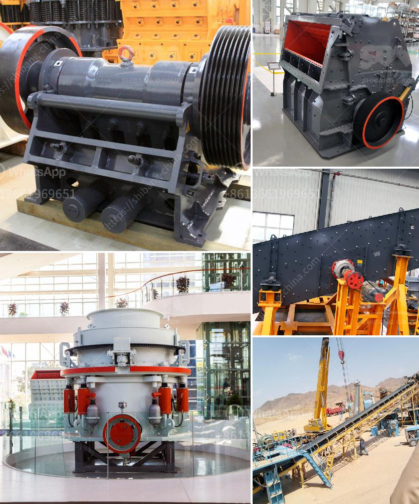

<h3>What is vsi in mobile stone jaw crusher</h3>
With the increasing demand for aggregate in the construction industry and the shortage of natural sand, artificial sand is being used widely. There is a variety of stones that can be used as aggregate. Some stones are brittle and hence not suitable for using in construction activities. To overcome this issue, VSI (Vertical Shaft Impact) crushers are becoming increasingly popular in the market.

VSI crushers are designed to crush hard and abrasive stones. The ultimate goal of the machine is to provide high-quality aggregate for construction purposes. Power and durability make VSI crushers popular for crushing stones. Output sizes for VSI crushers range from 0-40mm, depending on the model being used.

VSI crushers are particularly well-suited for producing manufactured sand. With a high percentage of fines, they are able to consistently produce high-quality sand. This makes them perfect for producing sand for concrete, asphalt, and other construction purposes.

One of the key features of VSI crushers is the ability to control product grading by adjusting rotor speed and cascade ratio. Depending on the desired application, the rotor can be configured as an open or closed rotor. An open rotor allows larger feed sizes, while a closed rotor produces finer output particles. This flexibility allows the machine to be used in various applications with different requirements.

VSI crushers are also known for their ability to produce cubical-shaped end products. This is achieved through the crushing process, where the stones are thrown against anvils that line the crushing chamber. The stone-on-stone crushing action ensures that all particles are thoroughly broken and reshaped, resulting in a uniform and well-graded product.

The mobility of VSI crushers is another significant advantage. They can be easily transported to different job sites, making them ideal for on-site crushing operations. This eliminates the need for costly transportation of materials.

Furthermore, VSI crushers are equipped with advanced automation systems that enhance their overall performance. These systems monitor and adjust operational parameters, such as rotor speed and feed rate, to optimize crushing efficiency and maximize production.

In conclusion, VSI crushers are widely used in the construction industry to produce high-quality aggregate and manufactured sand. The ability to control product grading, produce cubical-shaped end products, and provide mobility make them a preferred choice for many contractors. With the growing demand for artificial sand, VSI crushers continue to play a crucial role in meeting the requirements of the industry.
<h3>Contact us</h3><ul><li><strong>Whatsapp:&nbsp;<a href="https://wa.me/8613661969651">+8613661969651</a></strong></li><li><a href="https://swt.shibang-china.com/?git&amp;zhl&amp;What is vsi in mobile stone jaw crusher"><strong>Online Service(chat now)</strong></a></li></ul><h3>Related</h3><ul><li><a href='What equipment is used to mine tungsten stone crusher.md'>What equipment is used to mine tungsten stone crusher?</a></li><li><a href='What is the cost of a 32ton per hour aggregate crusher in China.md'>What is the cost of a 32-ton per hour aggregate crusher in China?</a></li><li><a href='What is the application of a ball mill.md'>What is the application of a ball mill?</a></li><li><a href='What is a beneficiation plant primary mill.md'>What is a beneficiation plant primary mill?</a></li><li><a href='What can dolomite be used for when constructing highways.md'>What can dolomite be used for when constructing highways?</a></li></ul>