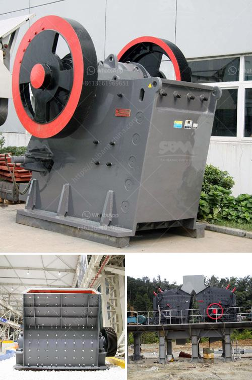

<h3>What is white silica sand used for ?</h3>
White silica sand is a versatile material that has a plethora of uses in various industries. Derived from silicon dioxide, white silica sand is an ultra-fine granular material composed of quartz crystals. Its unique properties make it a valuable resource for numerous applications, ranging from glass manufacturing to water filtration.

One of the most prevalent uses of white silica sand is in the production of glass. When combined with soda ash and limestone, silica sand acts as the primary ingredient in glass manufacturing. Its high silica content enhances the transparency and durability of the glass, making it an essential component in the construction of windows, mirrors, bottles, and other glass products.

In addition to its role in glass production, white silica sand has found its place in the construction industry. Due to its high silica content, this sand is commonly used as a key component in the production of concrete. By adding white silica sand to the cement mixture, the resulting concrete becomes stronger, more durable, and less prone to cracking. Its superior binding properties make it an ideal choice for various construction applications, such as foundations, walls, and pavements.

The unique properties of white silica sand also make it an excellent material for water filtration. When used in water treatment plants, the sand acts as a filter media, effectively removing impurities, sediments, and other particles from the water. Its high purity and low iron content make it incredibly efficient in the filtration process, while also providing a cost-effective solution for maintaining water purity and quality.

Moreover, white silica sand is extensively used in the production of ceramics and pottery. In this context, it serves as a clay additive, improving the texture, workability, and strength of the clay. Its low thermal expansion and high melting point make it an ideal material for kiln shelves and molds, ensuring that the ceramic products maintain their shape during the firing process.

Beyond these industrial applications, white silica sand also has uses in the leisure and sports industry. It forms the base material for sand volleyball courts, providing a soft and supportive surface for players. In addition, its texture and heat resistance make it a popular choice for sandblasting, a technique used to clean or etch surfaces by propelling small particles at high speed.

In conclusion, white silica sand plays an integral role in various industries, thanks to its unique properties that enhance the quality, durability, and functionality of numerous products. From glass manufacturing to water filtration, construction to ceramics, this versatile material continues to be a vital resource. With its diverse range of applications, it is no surprise that white silica sand is in high demand worldwide.
<h3>Contact us</h3><ul><li><strong>Whatsapp:&nbsp;<a href="https://wa.me/8613661969651">+8613661969651</a></strong></li><li><a href="https://swt.shibang-china.com/?git&amp;zhl&amp;What is white silica sand used for "><strong>Online Service(chat now)</strong></a></li></ul><h3>Related</h3><ul><li><a href='What is a jaw crusher used for.md'>What is a jaw crusher used for?</a></li><li><a href='What does a cone crusher do .md'>What does a cone crusher do ?</a></li><li><a href='what is the best installation for crusher plant production and maintenance？.md'>what is the best installation for crusher plant production and maintenance？</a></li><li><a href='What are the Different Types of Crusher How to choose.md'>What are the Different Types of Crusher? How to choose?</a></li><li><a href='What is the production process of stone aggregates .md'>What is the production process of stone aggregates ?</a></li></ul>