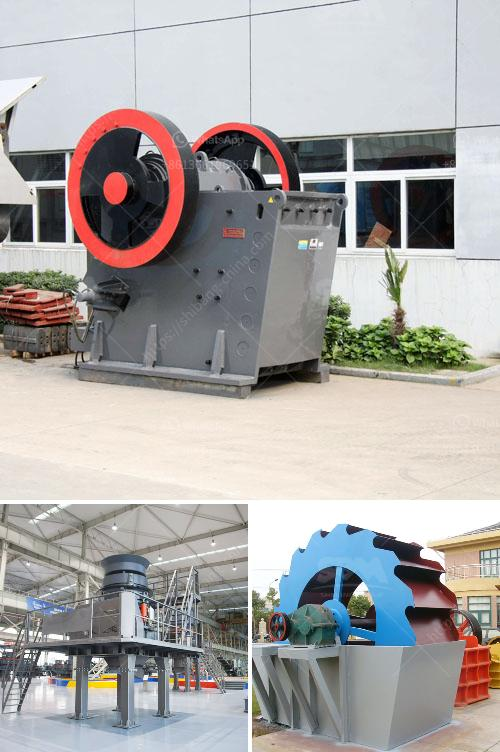

<h3>What kind of crusher is used to create railway ballast?</h3>
Railway ballast is the foundation upon which railway tracks are laid. It is important to choose the correct type of crusher for this work as it will ensure the ballast is durable and long-lasting, capable of withstanding the weight and pressure of passing trains.

One commonly used crusher is the jaw crusher. The jaw crusher is a robust and powerful crushing machine often used in mining, crushing or quarrying applications. The motor drives the belt and pulley to move the jaw plate up and down through an eccentric shaft. When the jaw plate moves towards the fixed jaw plate, the material is crushed, split, and broken. It then falls down and is discharged from the bottom of the machine.

The jaw crusher is suitable for medium-hard to hard and abrasive rock materials, such as granite, limestone, basalt, and other similar materials. It is often used as the primary crusher in combination with cone crushers or impact crushers.

Cone crushers are another common type of crusher used to create railway ballast. They come in various sizes and configurations, and operate with a mantle rotating against a concave or bowl liner. As the rock enters the cone crusher, it becomes wedged and squeezed between the mantle and the bowl liner, crushing it into smaller pieces. The crushed material then exits through the discharge opening at the bottom of the machine.

Cone crushers are known for their high crushing efficiency and capacity, making them ideal for producing railway ballast. Their ability to crush hard and abrasive materials makes them suitable for this application.

Another type of crusher used for railway ballast is impact crushers. These crushers use the principle of fast-moving impact hammers to crush the material. The hammers strike the material at a high velocity, causing it to break upon impact. The crushed material then falls down and is discharged through the bottom of the machine.

Impact crushers are known for their high reduction ratios and can produce excellent shape and size reduction. They are capable of handling various types of rock, including medium-hard or hard materials. Due to their high-speed rotational motion, impact crushers are a popular choice for railway ballast production.

In conclusion, there are several types of crushers used to create railway ballast, each with its own unique characteristics and advantages. The choice of crusher depends on factors such as the type and hardness of the rock, desired end product size, and cost considerations. Jaw crushers, cone crushers, and impact crushers are all suitable options depending on the specific requirements of the project. It is important to select the right crusher to ensure the ballast is of high quality and able to withstand the demands of rail traffic for years to come.
<h3>Contact us</h3><ul><li><strong>Whatsapp:&nbsp;<a href="https://wa.me/8613661969651">+8613661969651</a></strong></li><li><a href="https://swt.shibang-china.com/?git&amp;zhl&amp;What kind of crusher is used to create railway ballast"><strong>Online Service(chat now)</strong></a></li></ul><h3>Related</h3><ul><li><a href='What is a sand sieving machine.md'>What is a sand sieving machine?</a></li><li><a href='What is the final product of columbite.md'>What is the final product of columbite?</a></li><li><a href='What equipment is used in the quarry.md'>What equipment is used in the quarry</a></li><li><a href='What is the difference between a wet and dry coal crusher and a hammer crusher.md'>What is the difference between a wet and dry coal crusher and a hammer crusher?</a></li><li><a href='What are the basic geotechnical issues involved in quarry development.md'>What are the basic geotechnical issues involved in quarry development?</a></li></ul>