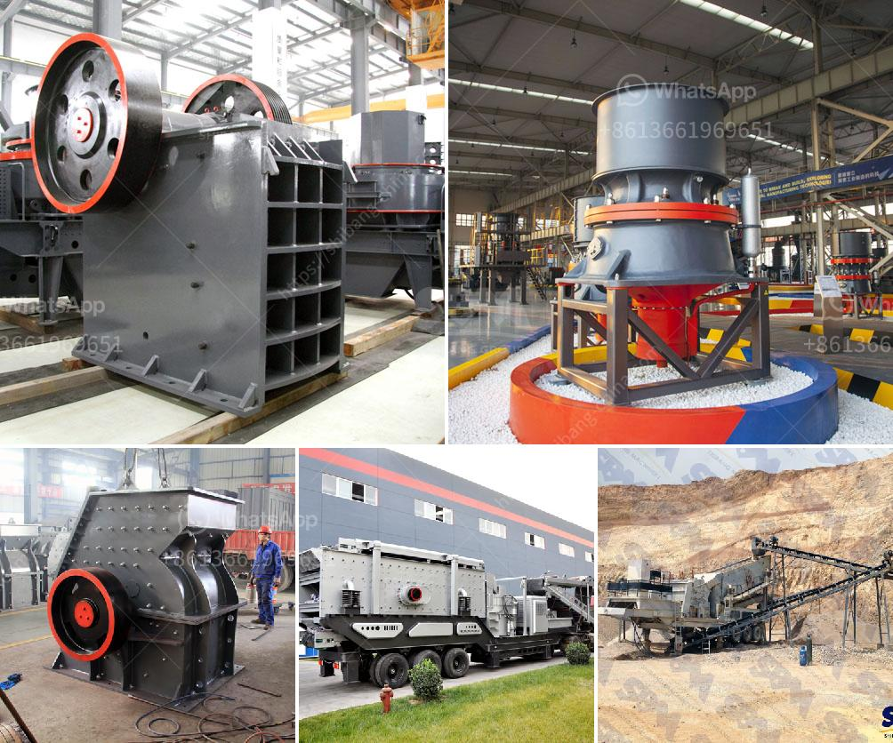

<h3>What kind of crusher is used to produce stone dust?</h3>
Stone dust is a byproduct of crushing natural stone for various purposes, such as construction and landscaping. It is a compacted material that is commonly used as a base or bedding material for pavers and natural stone walkways. The production process of stone dust involves several stages, including crushing, screening, and combined dust collection.

One of the key components in the production of stone dust is the crusher machine. It is a machine that reduces the size of rocks or other materials through the continuous compression breaking of larger pieces into smaller ones. There are various types of crushers used in the production of stone dust, each with its own capabilities, advantages, and applications.

1. Jaw Crusher: This type of crusher is often used for breaking larger stones into smaller ones. It is commonly used in the primary crushing stage and can crush the stones directly into sizes ranging from 50mm to 150mm. Jaw crushers have a high crushing ratio and are known for their durability, making them suitable for heavy-duty applications.

2. Impact Crusher: This type of crusher uses a high-speed impact force to crush materials. It is commonly used in the secondary or tertiary crushing stages and can produce stone dust with a finer particle size compared to jaw crushers. Impact crushers are versatile machines that can handle various types of materials, including soft, medium-hard, and hard rocks.

3. Cone Crusher: Cone crushers are often used for the final crushing stage to produce stone dust with specific particle sizes. They are efficient machines that utilize a rotating cone-shaped chamber to crush the materials. Cone crushers are suitable for both secondary and tertiary crushing, and they are commonly used in applications where a finer product is desired.

4. Hammer Crusher: Hammer crushers are primarily used for the crushing of soft to medium-hard materials. They utilize high-speed rotating hammers to impact and crush the materials, which results in the production of stone dust. Hammer crushers are versatile machines that can handle a wide range of materials, but they are not suitable for crushing hard rocks or abrasive materials.

In addition to the main types mentioned above, there are also specialized crushers designed for specific applications. For instance, mobile crushers are used for on-site crushing operations, while gyratory crushers are commonly used in mining operations. The choice of the crusher type depends on various factors, including the hardness and abrasiveness of the material, desired crushing ratio, and capacity requirements.

In conclusion, stone dust is produced through the crushing process using various types of crushers. Jaw crushers, impact crushers, cone crushers, and hammer crushers are among the commonly used crushers for producing stone dust. Each type has its own features and advantages, which can be considered based on specific requirements and applications. Regardless of the crusher type, proper dust control measures should be implemented to minimize dust emissions during the crushing process.
<h3>Contact us</h3><ul><li><strong>Whatsapp:&nbsp;<a href="https://wa.me/8613661969651">+8613661969651</a></strong></li><li><a href="https://swt.shibang-china.com/?git&amp;zhl&amp;What kind of crusher is used to produce stone dust"><strong>Online Service(chat now)</strong></a></li></ul><h3>Related</h3><ul><li><a href='What type of machine is used in the cement industry.md'>What type of machine is used in the cement industry?</a></li><li><a href='What are the main current crusher and which is good.md'>What are the main current crusher and which is good?</a></li><li><a href='What should be the RPM of a ball mill with a 45inch diameter.md'>What should be the RPM of a ball mill with a 45-inch diameter?</a></li><li><a href='What are the advantages of a jaw crusher over the gyratory crusher .md'>What are the advantages of a jaw crusher over the gyratory crusher ?</a></li><li><a href='what profits from crusher machine in kenya？.md'>what profits from crusher machine in kenya？</a></li></ul>