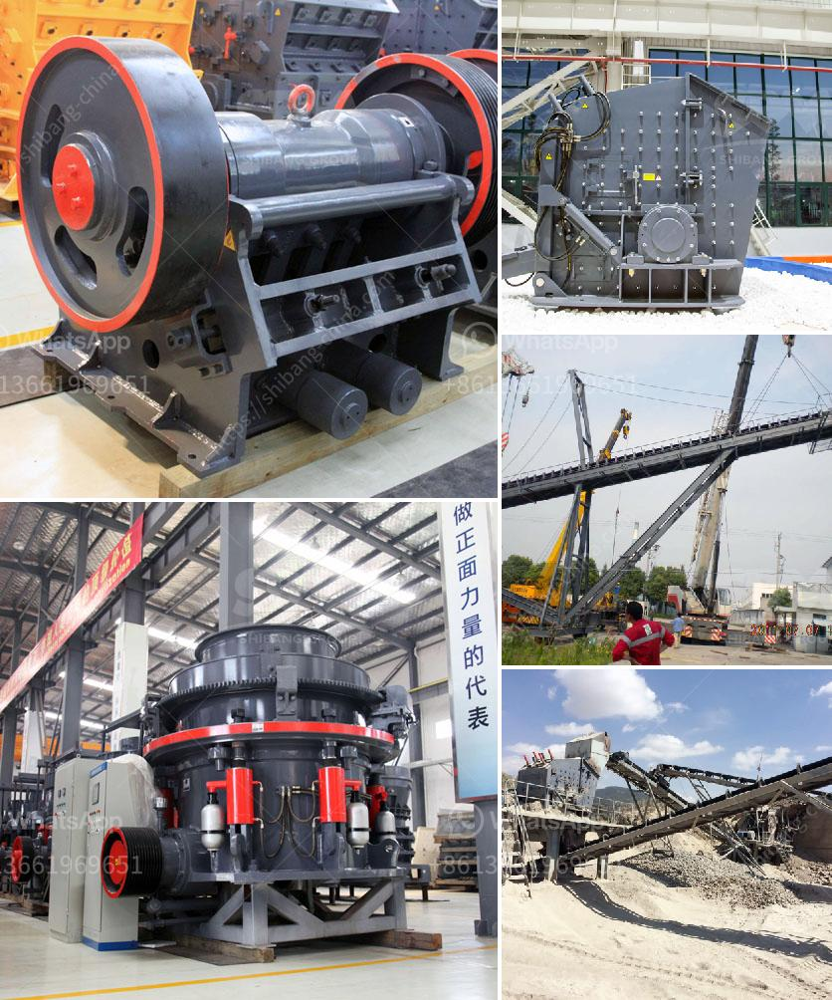

<h3>What kind of crushers can I use for river rocks?</h3>
River rocks, also known as river pebbles or river stones, are a type of rock that is commonly found in rivers, streams, and other water bodies. These smooth and rounded stones come in various sizes, colors, and textures, making them a popular choice for landscaping, construction, and decorative purposes. When it comes to crushing river rocks, there are several types of crushers that can be utilized. In this article, we will explore the different options available.

A jaw crusher is a type of primary crusher that utilizes two jaws to crush river rocks. One jaw is stationary while the other moves back and forth to crush the rocks against a fixed plate. This compression crushing process is ideal for river rocks as it can reduce the size of the rocks to a more manageable and uniform shape. Jaw crushers are reliable and robust machines that can handle both hard and soft materials effectively.

A cone crusher operates on the principle of compression crushing, relying on a mantle and a concave to crush river rocks between them. The rocks are fed into the top of the cone crusher and are crushed as they move towards the bottom, where the crushed material is discharged. Cone crushers are suitable for various types of river rocks and are used extensively in the mining and construction industries.

An impact crusher utilizes impact force to crush river rocks. This powerful machine operates by picking up the rocks and throwing them against a series of anvils or chambers. The impact of the rocks against the anvils or chambers breaks them down into smaller pieces. Impact crushers are versatile and can handle a wide range of river rocks, making them a popular choice for crushing applications.

A VSI crusher is a type of impact crusher that offers a high reduction ratio and excellent shaping capabilities. It utilizes a high-speed rotor with wear-resistant tips or anvils to crush the river rocks against a crushing chamber. The crushed material is discharged through a port opening at the bottom, resulting in superior shaping of the particles. VSI crushers are particularly effective for producing cubical-shaped river rocks for use in concrete and asphalt production.

Mobile crushers are designed for on-site crushing and can be easily transported to different locations. These crushers can be equipped with different types of crushing chambers, such as jaw, cone, or impact, providing flexibility and adaptability for crushing river rocks in various settings. Mobile crushers are commonly used in construction projects, where crushing river rocks on-site is required.

In conclusion, there are several types of crushers that can be used for crushing river rocks depending on the specific requirements of the project. Jaw crushers, cone crushers, impact crushers, vertical shaft impactors, and mobile crushers are all effective options. The choice of crusher will depend on factors such as the size and hardness of the river rocks, desired particle size, and the final application of the crushed material. It is recommended to consult with a professional to determine the most suitable crusher for your specific needs.
<h3>Contact us</h3><ul><li><strong>Whatsapp:&nbsp;<a href="https://wa.me/8613661969651">+8613661969651</a></strong></li><li><a href="https://swt.shibang-china.com/?git&amp;zhl&amp;What kind of crushers can I use for river rocks"><strong>Online Service(chat now)</strong></a></li></ul><h3>Related</h3><ul><li><a href='what are the equipment in iron ore crusher？.md'>what are the equipment in iron ore crusher？</a></li><li><a href='What are the models of Raymond mill.md'>What are the models of Raymond mill?</a></li><li><a href='What are some applications of bauxite .md'>What are some applications of bauxite ?</a></li><li><a href='What is the ore crusher discharge port size.md'>What is the ore crusher discharge port size?</a></li><li><a href='How oftenwhat maintenance needs to be done on crushing plant.md'>How often/what maintenance needs to be done on crushing plant</a></li></ul>