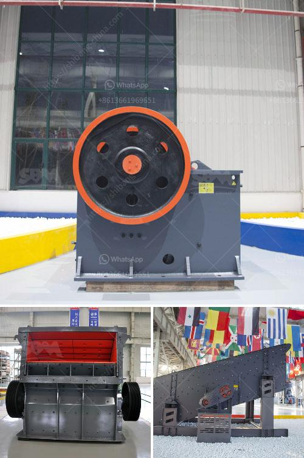

<h3>What kind of equipment is used for fine crushed stone？</h3>
Fine crushed stone is commonly used for a variety of construction purposes, including making concrete, filling driveways and pathways, and creating a solid base for construction projects. To produce fine crushed stone, various types of equipment are used to break down the larger stones into smaller, more usable sizes.

One essential piece of equipment for fine crushed stone production is a rock crusher. This powerful machine is used to reduce the size of larger rocks into small, manageable pieces. There are several types of rock crushers available, including jaw crushers, gyratory crushers, and cone crushers. Each type has its own unique qualities and is suited for different types of rocks and crushing requirements.

Jaw crushers are commonly used in the mining and construction industries. They consist of two plates, one stationary and one movable. The movable plate moves back and forth against the stationary plate, crushing the rocks between them. Jaw crushers are known for their high production capacity and efficiency. They can handle a wide range of materials, including hard and abrasive rocks.

Gyratory crushers are also commonly used for fine crushed stone production. They are similar to jaw crushers but have a different design. The crushing chamber in a gyratory crusher is shaped like an inverted cone, with the rocks being crushed between the cone and the walls of the chamber. Gyratory crushers are known for their ability to handle large rocks and produce consistently sized output.

Cone crushers are another type of rock crusher commonly employed for fine crushed stone production. They have a cone-shaped crushing chamber, where the rocks are crushed by a rotating mantle. Cone crushers are highly versatile and can be used for a variety of crushing applications, from hard rocks to softer materials.

In addition to rock crushers, other equipment is used to produce fine crushed stone. Vibrating screens are used to separate the crushed stone into different sizes. They consist of a mesh-like screen that vibrates to sort the stones based on their size. This ensures that the final product is of consistent size and quality.

Conveyor belts are also an essential part of the equipment used for fine crushed stone production. They transport the crushed stone from one stage of the crushing process to another, ensuring a continuous flow of materials. Conveyor belts are available in various sizes and designs, depending on the specific requirements of the operation.

Overall, a combination of rock crushers, vibrating screens, and conveyor belts is used to produce fine crushed stone. The specific type of equipment used depends on factors such as the size and hardness of the rocks being crushed, as well as the desired output size and production capacity.

In conclusion, the equipment used for fine crushed stone production plays a crucial role in the construction industry. Rock crushers, vibrating screens, and conveyor belts are among the most common types of equipment used. Each piece of equipment has its own unique qualities and is suited for different types of rocks and crushing requirements. By using the right equipment, construction professionals can efficiently produce high-quality fine crushed stone for various applications.
<h3>Contact us</h3><ul><li><strong>Whatsapp:&nbsp;<a href="https://wa.me/8613661969651">+8613661969651</a></strong></li><li><a href="https://swt.shibang-china.com/?git&amp;zhl&amp;What kind of equipment is used for fine crushed stone？"><strong>Online Service(chat now)</strong></a></li></ul><h3>Related</h3><ul><li><a href='What type of crusher do I need for gold.md'>What type of crusher do I need for gold?</a></li><li><a href='What are the limitations affecting the ball mill feed.md'>What are the limitations affecting the ball mill feed?</a></li><li><a href='What is the capacity of the mobile crushers.md'>What is the capacity of the mobile crushers?</a></li><li><a href='What machines do stone crushing plants need？.md'>What machines do stone crushing plants need？</a></li><li><a href='What is the cost of roller mills.md'>What is the cost of roller mills?</a></li></ul>