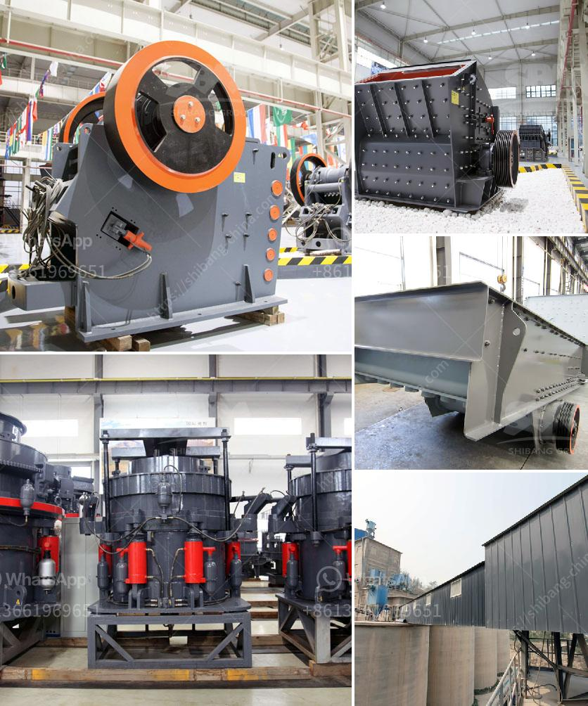

<h3>What kind of machine is needed to grind ore into fine powder？</h3>
Ores are valuable geological materials that contain minerals, which are naturally occurring compounds that have economic significance. In order to extract these minerals and obtain their full value, the ores need to undergo a series of processing steps. One crucial step in this process is grinding the ore into a fine powder. This article will explore the kind of machine required to accomplish this task efficiently.

Grinding ore into fine powder is a complex physical and mechanical process. It involves breaking down the ore into smaller particles through various means, such as crushing and milling. The end goal is to obtain particles of uniform size, which allows for optimal separation of valuable minerals from the unwanted gangue material.

To achieve this, a specialized machine known as a grinding mill is used. A grinding mill is a large industrial machinery that uses abrasive mechanisms to grind ore into fine particles. There are several types of grinding mills available, each with its own unique features and advantages. Here, we will discuss some commonly used grinding mills in the mining industry.

The first type of grinding mill is the ball mill. This is a cylindrical device that rotates around its axis and uses steel balls or other grinding media to break the ore into fine powder. The balls collide with the ore, breaking it apart and reducing its size. Ball mills are commonly used in the mining industry due to their simplicity and versatility. They can grind both wet and dry materials and are efficient for grinding fragile or heat-sensitive ores.

Another commonly used grinding mill is the rod mill. Similar to the ball mill, the rod mill also uses steel rods as grinding media. However, the rods are longer and can perform a more effective grinding action by cascading and tumbling the ore. Rod mills are particularly suitable for coarse grinding and can handle large feed sizes. They are often used in mineral processing plants to reduce the ore to the desired size before further processing.

For ultra-fine grinding, there are specialized mills available. One such example is the jet mill, which uses high-speed compressed air or gas to impact the ore. The particles are accelerated and collide with each other, resulting in size reduction. Jet mills are extremely efficient for grinding to very fine particle sizes, but they may require additional equipment for air filtration and containment.

In addition to these mills, there are also autogenous mills and semi-autogenous mills. These mills rely on the ore itself to provide the grinding media, eliminating the need for additional steel balls or rods. Autogenous mills are suited for large ore bodies and can grind the ore directly, while semi-autogenous mills use a mixture of ore and steel balls.

In conclusion, grinding ore into fine powder requires specialized machinery known as grinding mills. These mills use various mechanisms such as steel balls, rods, or compressed air to break down the ore into smaller particles. Different types of mills are available, each with its own advantages and applications. Choosing the appropriate grinding mill depends on factors such as the ore type, desired particle size, and processing requirements.
<h3>Contact us</h3><ul><li><strong>Whatsapp:&nbsp;<a href="https://wa.me/8613661969651">+8613661969651</a></strong></li><li><a href="https://swt.shibang-china.com/?git&amp;zhl&amp;What kind of machine is needed to grind ore into fine powder？"><strong>Online Service(chat now)</strong></a></li></ul><h3>Related</h3><ul><li><a href='What is the difference between a standard and shorthead cone crusher.md'>What is the difference between a standard and shorthead cone crusher?</a></li><li><a href='What is cone crusher .md'>What is cone crusher ?</a></li><li><a href='What is the process that coal goes through to become a finished product.md'>What is the process that coal goes through to become a finished product?</a></li><li><a href='What is the purpose of using hydraulic cylinders in cone crushers.md'>What is the purpose of using hydraulic cylinders in cone crushers?</a></li><li><a href='What equipment is used to mine tungsten stone crusher.md'>What equipment is used to mine tungsten stone crusher?</a></li></ul>