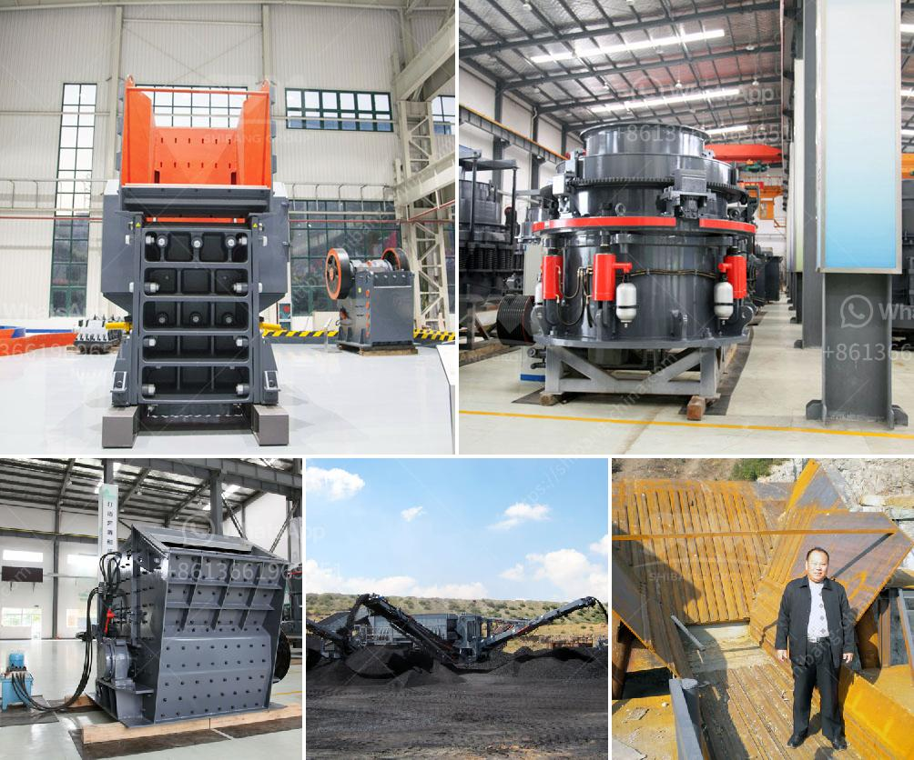

<h3>What kind of mining crusher has a good high yield?</h3>
In the mining industry, crushers play a crucial role in breaking down large rocks and ores into smaller and more manageable sizes. The efficiency and effectiveness of the crushing process directly impact the overall productivity and profitability of mining operations. Therefore, it is essential to choose a mining crusher that can provide a good high yield. 

Several factors contribute to achieving a high-yielding mining crusher. Firstly, the type and design of the crusher greatly influence its performance. Jaw crushers, cone crushers, impact crushers, and gyratory crushers are among the most commonly used types in mining operations. Each type has its specific advantages and disadvantages, enabling users to select the most suitable crusher for their needs.

Jaw crushers are known for their high crushing capacity and robustness. They are capable of handling large feed sizes and can process a wide range of materials. However, jaw crushers have a relatively low reduction ratio, which means they may not be the best choice for finely crushing materials, especially in the production of high-quality aggregates.

Cone crushers, on the other hand, excel in producing a more uniform product with better particle shape. They are particularly well-suited for secondary and tertiary crushing stages. Cone crushers have a high reduction ratio, enabling efficient processing of materials. However, they may have a lower throughput compared to jaw crushers.

Impact crushers are known for their high production capacity and excellent particle shape. They are versatile and suitable for both primary and secondary crushing. Impact crushers utilize impact force to break down the material, which can be advantageous in reducing the susceptibility to abrasive wear. However, impact crushers may generate higher fines than other crushers, which may be undesirable in certain applications.

Gyratory crushers are primarily used for primary crushing and have a high capacity compared to other crusher types. They have a large feed opening and a concave surface that enables efficient crushing of hard and abrasive materials. However, gyratory crushers are more expensive to operate and maintain compared to other crushers.

Apart from the type of crusher, several other factors contribute to achieving a good high yield. The size and hardness of the material being crushed, the crusher's speed and eccentric throw, and the feed arrangement are all crucial considerations. Additionally, the proper selection and optimization of wear parts, such as liners and blow bars, can significantly impact the crusher's performance and overall yield.

In conclusion, choosing a mining crusher that offers a good high yield is essential for the productivity and profitability of mining operations. Different types of crushers have their unique advantages and disadvantages, suitable for various crushing requirements. When selecting a crusher, factors such as the type and design of the crusher, material characteristics, and operational parameters should be carefully considered. Furthermore, proper maintenance and optimization of wear parts are crucial to ensuring maximum crusher efficiency and achieving a good high yield.
<h3>Contact us</h3><ul><li><strong>Whatsapp:&nbsp;<a href="https://wa.me/8613661969651">+8613661969651</a></strong></li><li><a href="https://swt.shibang-china.com/?git&amp;zhl&amp;What kind of mining crusher has a good high yield"><strong>Online Service(chat now)</strong></a></li></ul><h3>Related</h3><ul><li><a href='What is the bearing specification for an impact crusher.md'>What is the bearing specification for an impact crusher?</a></li><li><a href='What are the different parts of a crusher in a power plant.md'>What are the different parts of a crusher in a power plant?</a></li><li><a href='What equipment do you need for coal mining.md'>What equipment do you need for coal mining?</a></li><li><a href='What type of crusher produces the least amount of fines.md'>What type of crusher produces the least amount of fines?</a></li><li><a href='What equipment is used on a bauxite site.md'>What equipment is used on a bauxite site?</a></li></ul>