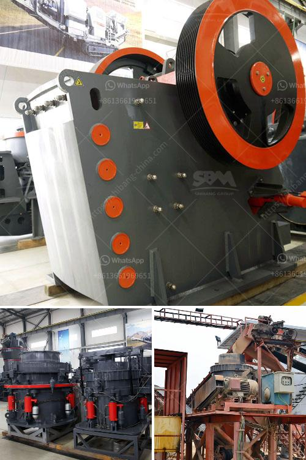

<h3>What kind of quartz can be used in the paint industry and how to get it?</h3>
Quartz, a mineral composed of silicon and oxygen atoms, is widely used in various industries due to its abundance and versatile nature. One such industry that utilizes quartz is the paint industry. Quartz can be used as a key ingredient in paint formulations, providing durability, color stability, and improved resistance to weathering. However, not all types of quartz are suitable for this purpose, and obtaining the right kind of quartz requires a careful selection process.

One of the critical characteristics of quartz used in the paint industry is its purity. Impurities in quartz, such as iron oxide or other minerals, can negatively impact the appearance and performance of paint. Therefore, high-purity quartz is preferred for paint applications. Pure quartz is often referred to as industrial-grade or ultra-high-purity quartz. It typically has a content of 99.9% silicon dioxide (SiO2) or higher, making it ideal for the paint industry.

Another crucial factor to consider when selecting quartz for the paint industry is particle size. Different paint formulations require different particle size distributions to achieve the desired results. Fine particle sizes, such as those in the micron or sub-micron range, are often preferable as they provide better color development and smoother finishes. Coarser particle sizes can cause issues like rough textures or poor color dispersion. Therefore, the paint industry typically requires quartz with finely controlled particle size distributions.

There are several methods to obtain quartz suitable for the paint industry. One primary source of quartz is natural deposits, which can be found in various parts of the world. Quartz mining operations extract the mineral from these deposits using techniques such as open-pit mining or underground mining. Once the quartz is extracted, it goes through a refining process to remove impurities and produce high-purity quartz suitable for the paint industry.

Another method to obtain quartz for paint applications is through synthetic production. By using chemical processes, synthetic quartz can be created with specific characteristics tailored for paint formulations. This method allows for more control over the properties of the quartz, such as purity and particle size distribution. Synthetic quartz production is often preferred when a consistent and specialized quartz material is required for paint manufacturing.

To get quartz suitable for the paint industry, it is essential to work with reliable suppliers and manufacturers. Companies specializing in minerals and industrial materials often offer different grades and types of quartz specifically tailored for various industries, including the paint industry. These suppliers can provide the required high-purity quartz with customized particle size distributions, ensuring its suitability for paint formulations.

In conclusion, high-purity quartz with controlled particle size distributions is essential for the paint industry. Its durability, color stability, and weathering resistance make it an ideal ingredient for paint formulations. Obtaining the right kind of quartz can be achieved through natural deposits or synthetic production, both of which require careful processing and refining. Working with reputable suppliers is crucial to ensure the quality and suitability of quartz for paint applications.
<h3>Contact us</h3><ul><li><strong>Whatsapp:&nbsp;<a href="https://wa.me/8613661969651">+8613661969651</a></strong></li><li><a href="https://swt.shibang-china.com/?git&amp;zhl&amp;What kind of quartz can be used in the paint industry and how to get it"><strong>Online Service(chat now)</strong></a></li></ul><h3>Related</h3><ul><li><a href='What type of crusher is good for bentonite and dolomite.md'>What type of crusher is good for bentonite and dolomite?</a></li><li><a href='What is a hammermill crusher machine.md'>What is a hammermill crusher machine?</a></li><li><a href='What machine is required for a cement plant.md'>What machine is required for a cement plant?</a></li><li><a href='What is the yield in mineral processing.md'>What is the yield in mineral processing?</a></li><li><a href='What is a Raymond mill.md'>What is a Raymond mill?</a></li></ul>