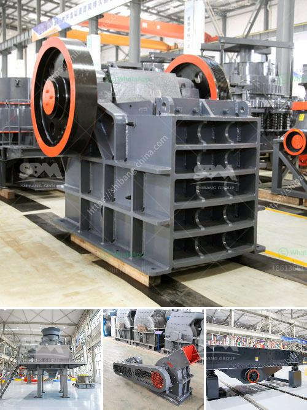

<h3>What kinds of jaw crushers?</h3>
Jaw crushers are widely used in many industries, including mining, quarrying, construction, and recycling. They are an essential piece of machinery for these industries as they can crush a variety of materials of different sizes and shapes. There are several types of jaw crushers available, each with its own unique features and advantages. In this article, we will explore the different kinds of jaw crushers.

1. Blake Jaw Crusher: The Blake jaw crusher is one of the most commonly used jaw crushers. Its basic principle is to swing the jaw while crushing the material. The movable jaw is hinged at the top, allowing it to move up and down. When the movable jaw pushes the material towards the fixed jaw plate, it crushes the material, and the crushed material exits through the bottom opening.

2. Dodge Jaw Crusher: The Dodge jaw crusher is similar in design to the Blake jaw crusher but has a movable jaw that is hinged at the bottom instead of the top. This allows the material to be crushed more efficiently, as the movement of the movable jaw is increased. The Dodge jaw crusher has a variable feed area and a fixed discharge area, which helps in achieving a higher reduction ratio.

3. Universal Jaw Crusher: The universal jaw crusher is a versatile machine that can crush different types of materials, including hard and abrasive ones. It is similar to the Blake jaw crusher but has a fixed feed area and a variable discharge area. This allows the crusher to be adjusted to different sizes of the material, ensuring efficient crushing performance.

4. Single Toggle Jaw Crusher: The single toggle jaw crusher is a compact and simple machine that uses an eccentric shaft to move the jaw. It has a fixed jaw plate and a movable jaw plate, with the motion of the eccentric shaft causing the movable jaw to move back and forth. This type of jaw crusher is suitable for crushing hard and brittle materials, such as granite and basalt.

5. Double Toggle Jaw Crusher: The double toggle jaw crusher has a swinging motion, similar to the Blake jaw crusher, but with two movable jaws instead of one. The two jaws are driven by an eccentric shaft, causing them to move in a circular motion towards each other. This provides a squeezing action, which helps in reducing the size of the material.

In conclusion, there are several types of jaw crushers available, each designed for specific applications and crushing requirements. Whether it's the Blake jaw crusher, Dodge jaw crusher, universal jaw crusher, single toggle jaw crusher, or double toggle jaw crusher, all these machines play a crucial role in the primary crushing stage. It is important to choose the right type of jaw crusher for the job to ensure efficient and reliable crushing of the materials.
<h3>Contact us</h3><ul><li><strong>Whatsapp:&nbsp;<a href="https://wa.me/8613661969651">+8613661969651</a></strong></li><li><a href="https://swt.shibang-china.com/?git&amp;zhl&amp;What kinds of jaw crushers"><strong>Online Service(chat now)</strong></a></li></ul><h3>Related</h3><ul><li><a href='What plate is used for the curtain in an impact crusher.md'>What plate is used for the curtain in an impact crusher?</a></li><li><a href='What are the cement mill precrushing equipment .md'>What are the cement mill pre-crushing equipment ?</a></li><li><a href='what does a raymond coal mill cost？.md'>what does a raymond coal mill cost？</a></li><li><a href='what is a bench berm in mining.md'>what is a bench berm in mining?</a></li><li><a href='What are gravel ores that can be crushed by a mobile crusher.md'>What are gravel ores that can be crushed by a mobile crusher?</a></li></ul>