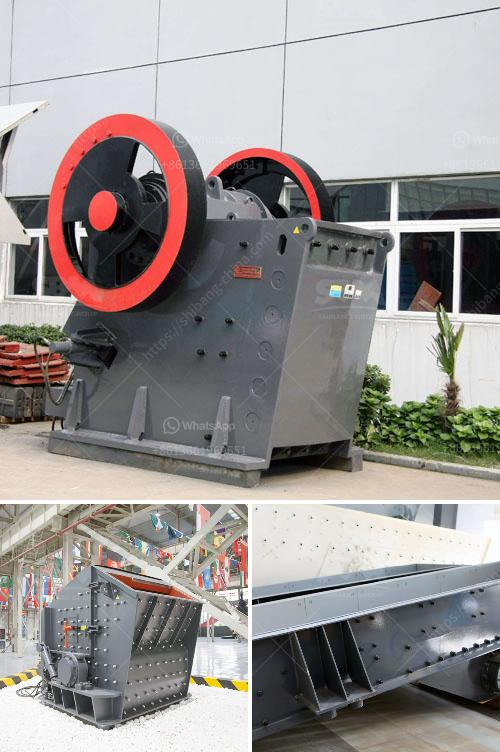

<h3>What machine crushes talcum powder for building stone？</h3>
Talcum powder is widely used in various industries, ranging from personal care products to building materials. One of its important applications is in the production of building stone. To convert raw talc into fine powder used for construction purposes, a specific type of machine is required. This article will explore the machine that crushes talcum powder for building stone.

Before delving into the machine used for crushing talcum powder, let us first understand the importance of talc in the building stone industry. Talc is a naturally occurring mineral composed primarily of magnesium, silicon, and oxygen. It is known for its unique properties, such as its softness, low abrasiveness, and high heat resistance. These characteristics make talc an excellent additive in the production of building stone.

When crushed into a fine powder, talc acts as a filler material, enhancing the compressive strength, surface texture, and workability of building stone. It provides a smooth finish and improves the weathering resistance of the final product. Therefore, the crushing process plays a crucial role in transforming raw talc into the desired powder form.

The machine most commonly used for crushing talcum powder for building stone is the jaw crusher. Jaw crushers consist of a fixed jaw plate and a movable jaw plate that facilitate the crushing process. The raw talc is fed into the jaw crusher through a vibrating feeder, where it is crushed and then discharged onto a conveyor belt for further processing.

The jaw crusher applies compressive force to break down the raw talc into smaller sizes. It operates by moving the jaw plates in a reciprocating motion, applying pressure on the talc and gradually reducing its size. As the talc particles are crushed, they are expelled from the bottom of the crusher, resulting in the desired fine powder.

Another machine used in the talcum powder crushing process is the impact crusher. Impact crushers work by applying high-speed impact force to break down the talc into smaller particles. Unlike the jaw crusher, which uses compression, the impact crusher uses collision and attrition between the talc particles and the hammer or blow bars to achieve the desired size reduction.

In addition to jaw crushers and impact crushers, cone crushers can also be used for crushing talcum powder. Cone crushers are versatile machines that are commonly used in the mining and construction industries. They work by squeezing the talc between an eccentrically rotating mantle and a stationary concave, resulting in a finer powder form. However, cone crushers are less commonly used for talc crushing compared to jaw and impact crushers.

In conclusion, the machine that crushes talcum powder for building stone primarily includes jaw crushers, impact crushers, and occasionally cone crushers. The choice of the machine depends on various factors, including the desired particle size, production capacity, and specific requirements of the building stone industry. Regardless of the machine used, the crushing process is crucial in transforming raw talc into the fine powder required for building stone applications.
<h3>Contact us</h3><ul><li><strong>Whatsapp:&nbsp;<a href="https://wa.me/8613661969651">+8613661969651</a></strong></li><li><a href="https://swt.shibang-china.com/?git&amp;zhl&amp;What machine crushes talcum powder for building stone？"><strong>Online Service(chat now)</strong></a></li></ul><h3>Related</h3><ul><li><a href='What is aggregates in mining .md'>What is aggregates in mining ?</a></li><li><a href='What is the cost of artificial sand projects.md'>What is the cost of artificial sand projects?</a></li><li><a href='What are the models of Raymond mill.md'>What are the models of Raymond mill?</a></li><li><a href='What is the difference between impact crusher and jaw crusher.md'>What is the difference between impact crusher and jaw crusher?</a></li><li><a href='What are equipments used in a cement plant .md'>What are equipments used in a cement plant ?</a></li></ul>