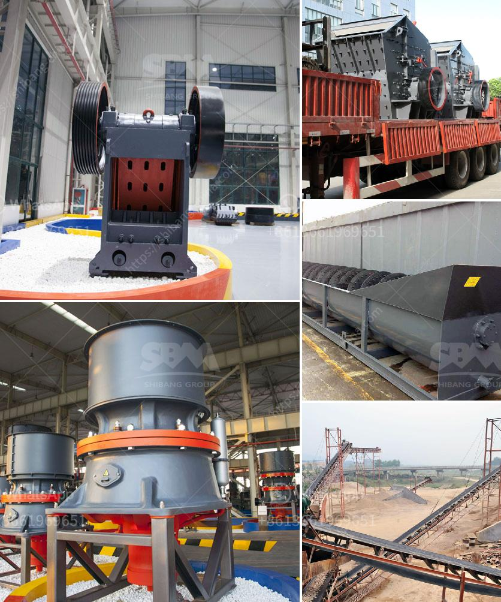

<h3>What machine is required for a cement plant?</h3>
The cement industry is a vital sector for economic growth and development, as it plays a significant role in the construction industry. With advancements in technology, cement plants have become more efficient and require various machines for a seamless production process. Let's explore the essential machinery required for a cement plant.

1. Crushers: In cement plants, crushers play a crucial role in the initial stages of raw material preparation. These machines break larger-sized materials into smaller, more manageable pieces, enabling a smoother flow of materials into the next steps of the production process. Crushers such as jaw crushers, impact crushers, and cone crushers are commonly used for this purpose.

2. Raw Material Milling: The next crucial stage in cement production involves milling the raw materials into a fine powder. To accomplish this, cement plants utilize ball mills, vertical roller mills, or roller presses. These mills grind the raw materials to the desired fineness to be used as raw material for producing cement.

3. Kilns: Kilns are the heart of a cement plant, where the raw materials are transformed into clinker through high-temperature processes. Rotary kilns are commonly used in cement plants for this purpose. They are cylindrical structures that rotate slowly to ensure a consistent and efficient conversion of raw materials into clinker.

4. Clinker Grinding: After the clinker is produced in the kiln, it needs to be finely ground to produce cement. Cement plants use ball mills, vertical roller mills, or roller presses for clinker grinding. These grinding machines pulverize the clinker before it is mixed with other materials, such as gypsum, to produce cement.

5. Storage and Packaging: Once the cement is produced, it needs to be stored and packaged before it can be transported to construction sites. Silos and storage tanks are used to store the final product. Additionally, packaging machines, such as bagging machines or bulk loading systems, are utilized to package the cement into bags or bulk containers for easy transportation.

6. Pollution Control Equipment: Cement plants also require various pollution control equipment to mitigate the environmental impact of their operations. Dust collectors, electrostatic precipitators, and bag filters are commonly used to control and capture particulate matter and emissions from the cement plant.

7. Conveyors and Elevators: To ensure a seamless flow of materials and finished products throughout the plant, conveyors and elevators are integral to the cement production process. They transport materials such as limestone, clay, and gypsum from one stage to another, as well as move the final product to the storage and packaging area.

In conclusion, a cement plant requires a wide range of machines to ensure a smooth and efficient production process. Crushers, milling machines, kilns, clinker grinding equipment, storage and packaging machines, pollution control equipment, and conveyors and elevators are some of the essential machines used in a cement plant. Each machine has its specific purpose and contributes to the overall success of the plant. With advancements in technology, cement plants continue to evolve, becoming more efficient and environmentally friendly.
<h3>Contact us</h3><ul><li><strong>Whatsapp:&nbsp;<a href="https://wa.me/8613661969651">+8613661969651</a></strong></li><li><a href="https://swt.shibang-china.com/?git&amp;zhl&amp;What machine is required for a cement plant"><strong>Online Service(chat now)</strong></a></li></ul><h3>Related</h3><ul><li><a href='What is the waste from an orecrushing plant.md'>What is the waste from an ore-crushing plant?</a></li><li><a href='What is the difference between mining and crushing.md'>What is the difference between mining and crushing?</a></li><li><a href='What equipment is used in salt mining.md'>What equipment is used in salt mining?</a></li><li><a href='What is a construction waste crusher ？.md'>What is a construction waste crusher ？</a></li><li><a href='What can dolomite be used for when constructing highways.md'>What can dolomite be used for when constructing highways?</a></li></ul>