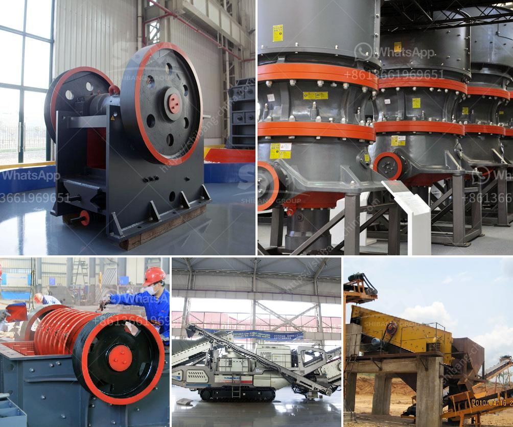

<h3>What machinery is used to mine zinc ?</h3>
Zinc, a bluish-white metallic element, is one of the most commonly used metals worldwide. Its diverse applications in various industries make it a valuable commodity. The process of mining zinc involves the extraction of zinc-containing ores from underground or open-pit mines. These ores are then refined to obtain pure zinc. To accomplish this task efficiently, several types of machinery are used in the zinc mining process.

One of the most crucial pieces of equipment used in the zinc mining process is a blast furnace. The blast furnace is responsible for extracting zinc from its ore by heating it at high temperatures. The chemical reactions within the furnace result in the release of pure zinc vapor, which is then collected, cooled, and further processed.

To reach the zinc-containing ores, miners depend on drilling machinery. These machines are equipped with diamond drill bits capable of penetrating even the hardest rocks. The drills are operated by skilled workers who create boreholes into the ground at specified locations based on geological surveys. Once the boreholes are complete, explosives may be used to break up the rocks and allow for easier extraction of the zinc ore.

Another essential tool used in the zinc mining process is the loader. This heavy-duty machinery is responsible for moving large amounts of materials, including both mined ores and waste rock. Loaders come in various sizes and configurations, such as front-end loaders or underground loaders, depending on the mining operation. Their role is to transport the extracted zinc ore from the mining site to storage areas or to the next stage of processing.

Conveyors are also integral to the zinc mining process. These machines utilize belts or chains to transport the extracted material over long distances. Conveyors are commonly used in open-pit mining operations to transport zinc ore from the mining face to a centralized processing plant. They eliminate the need for manual handling and improve efficiency by facilitating the continuous flow of material.

In addition to the aforementioned machinery, crushers and grinders are also used in the zinc mining process. These machines are used to break down large blocks of ore into smaller pieces, which are then sent for further processing. Crushers reduce the size of the material by applying mechanical force, while grinders use rotating blades or other devices to break it down.

Modern advancements in technology have led to the use of automation and robotics in the zinc mining industry. For instance, autonomous drilling rigs can be programmed to follow predetermined patterns, significantly reducing the need for human intervention. This automation increases safety and efficiency in the mining process.

In conclusion, the machinery used in the zinc mining process plays a crucial role in the extraction, transportation, and refinement of zinc. From drills and loaders to conveyors and crushers, each piece of equipment serves a purpose in ensuring the efficiency and safety of the mining operation. As technology continues to advance, the use of automation in zinc mining is likely to increase, revolutionizing the industry further.
<h3>Contact us</h3><ul><li><strong>Whatsapp:&nbsp;<a href="https://wa.me/8613661969651">+8613661969651</a></strong></li><li><a href="https://swt.shibang-china.com/?git&amp;zhl&amp;What machinery is used to mine zinc "><strong>Online Service(chat now)</strong></a></li></ul><h3>Related</h3><ul><li><a href='What are the fields of coal crushing equipment .md'>What are the fields of coal crushing equipment ?</a></li><li><a href='What is aggregates in mining .md'>What is aggregates in mining ?</a></li><li><a href='What are the main current crusher and which is good.md'>What are the main current crusher and which is good?</a></li><li><a href='What is the price of a cone crusher in Venezuela.md'>What is the price of a cone crusher in Venezuela?</a></li><li><a href='What is quarry crushing .md'>What is quarry crushing ?</a></li></ul>