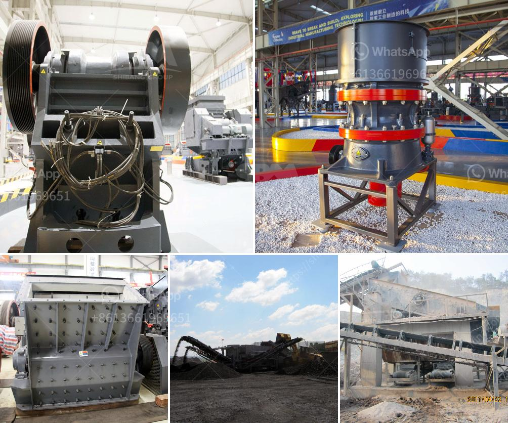

<h3>What machines are required for a limestone powder factory?</h3>
Limestone is a common sedimentary rock found all over the world. It is formed by the deposition of different materials on the ocean floor over millions of years. Limestone has various uses in industries such as construction, agriculture, and even cosmetics. One of the primary applications of limestone is in the manufacturing of limestone powder, which is used in various industries and products. To set up a limestone powder factory, certain machines and equipment are required. Let's explore the essential machines needed for operating a limestone powder factory.

First and foremost, a quarry is necessary to obtain the limestone rock. This quarry is usually an open-pit mine where high-quality limestone deposits are extracted. Powerful excavators, bulldozers, and drilling machines are used to blast and extract the limestone from the quarry. These machines ensure the safe and efficient extraction of the limestone rocks.

Once the limestone rocks are extracted from the quarry, they are transported to a crushing facility. Crushers are the primary machines used to reduce the size of the limestone rocks into smaller fragments. Different types of crushers, such as jaw crushers, impact crushers, or cone crushers, can be used depending on the required size and the specific application of the limestone powder.

After crushing, the limestone rocks are further processed in a grinding mill. A grinding mill is a machine that grinds the crushed limestone into a fine powder. The most common types of grinding mills used in limestone powder production include ball mills, Raymond mills, and vertical roller mills. These mills efficiently reduce the limestone particles to the desired size, enhancing its usability and applicability.

To ensure the quality and consistency of the limestone powder, it is necessary to separate and remove impurities and undesirable components. This is achieved through a process called beneficiation, which involves various machines. One of the essential machines used in limestone beneficiation is a magnetic separator. It removes magnetic materials present in the limestone, ensuring a high-purity final product. In addition, other machines like classifiers and filtering equipment may be used to further refine and purify the limestone powder.

Once the beneficiation process is complete, the final product is packed and ready for distribution. Packing machines are used to efficiently package the limestone powder into bags or containers, ensuring proper storage and transportation. These machines can automatically weigh, fill, and seal the bags, reducing manual labor and increasing productivity.

In conclusion, setting up a limestone powder factory requires several essential machines and equipment. From the extraction of limestone rocks in the quarry, to the crushing, grinding, and beneficiation processes, each step requires specialized machines to ensure efficiency, quality, and consistency of the final product. Investing in high-quality machines and equipment is crucial for a limestone powder factory to operate smoothly and produce a superior limestone powder that meets the industry standards and requirements.
<h3>Contact us</h3><ul><li><strong>Whatsapp:&nbsp;<a href="https://wa.me/8613661969651">+8613661969651</a></strong></li><li><a href="https://swt.shibang-china.com/?git&amp;zhl&amp;What machines are required for a limestone powder factory"><strong>Online Service(chat now)</strong></a></li></ul><h3>Related</h3><ul><li><a href='What is a hydraulic cone crusher What are the advantages.md'>What is a hydraulic cone crusher? What are the advantages?</a></li><li><a href='what does a raymond coal mill cost？.md'>what does a raymond coal mill cost？</a></li><li><a href='What is the role of impact crusher .md'>What is the role of impact crusher ?</a></li><li><a href='what is hammer crusher pakistan？.md'>what is hammer crusher pakistan？</a></li><li><a href='What is the purpose of secondary crushing in the production of lime.md'>What is the purpose of secondary crushing in the production of lime?</a></li></ul>