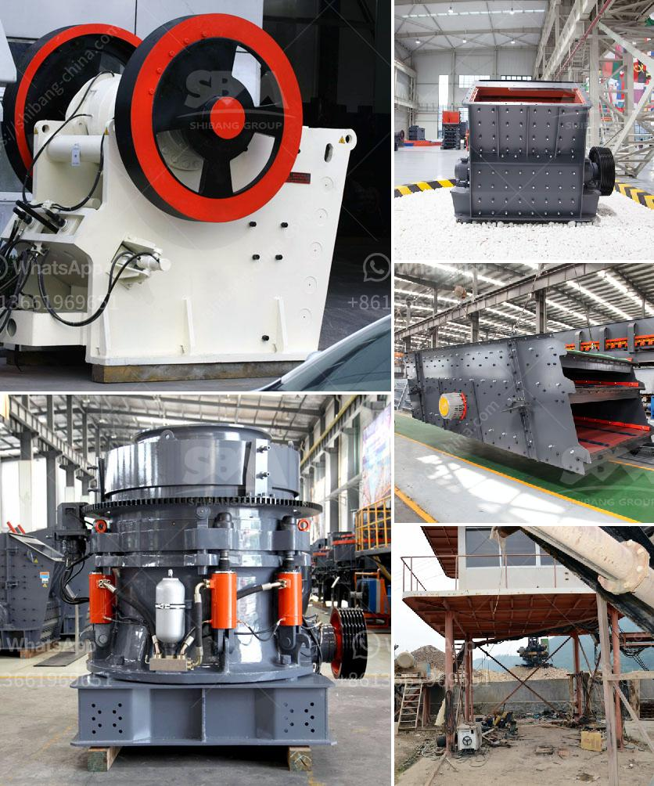

<h3>What machines are used in a crushing plant？</h3>
In the mining industry, a crushing plant is a very common sight. Crushing plants consist of various machines that work together to accomplish different tasks. These machines are selected based on the type of material that needs to be crushed, the size of the material, and the desired output size.

One of the most common machines used in a crushing plant is a jaw crusher. This machine is designed to reduce large rocks into smaller rocks or particles of varying sizes. Jaw crushers consist of a fixed jaw and a movable jaw. The movable jaw is mounted on a pitman that has a reciprocating motion, allowing it to crush rocks by moving back and forth against the fixed jaw. Jaw crushers are often used in aggregate production, mining operations, and recycling applications.

Another machine commonly used in a crushing plant is an impact crusher. These machines are designed to crush rocks of medium hardness and above. Impact crushers use impact force to break rocks, similar to how a hammer works. When the material enters the crusher, it is struck by a high-speed rotor and gets thrown against the aprons on the rotor. This impact causes the material to break into smaller pieces. Impact crushers are used in various industries, including quarrying, mining, and construction.

Cone crushers are also commonly used in crushing plants. These machines are suitable for crushing hard and abrasive materials. Cone crushers have a conical-shaped crushing chamber lined with wear-resistant and hard material. When the material enters the chamber, it gets compressed between the mantle and the concave. This compression causes the material to break and results in the desired product size. Cone crushers are commonly used in the mining and aggregate industries.

In addition to these primary crushers, there are also secondary and tertiary crushers in a crushing plant. Secondary crushers are used to further reduce the size of the material after it has been initial crushed by the primary crusher. Tertiary crushers, on the other hand, are used to produce the final product size and shape. They are often used in fine crushing applications.

Other machines commonly found in a crushing plant include vibrating feeders, screens, and conveyors. Vibrating feeders are used to continuously and evenly feed materials into the crushers. Screens are used to separate different sized particles, allowing for more efficient crushing. Conveyors are used to move the crushed material from one machine to another or transport it to different areas within the plant.

In conclusion, a crushing plant consists of various machines that work together to crush and process different types of materials. These machines include jaw crushers, impact crushers, cone crushers, as well as vibrating feeders, screens, and conveyors. Each machine plays a vital role in the overall operation of the plant, contributing to its efficiency and productivity. Whether it is in mining, construction, or recycling, crushing plants are essential for processing raw materials and producing the desired end product.
<h3>Contact us</h3><ul><li><strong>Whatsapp:&nbsp;<a href="https://wa.me/8613661969651">+8613661969651</a></strong></li><li><a href="https://swt.shibang-china.com/?git&amp;zhl&amp;What machines are used in a crushing plant？"><strong>Online Service(chat now)</strong></a></li></ul><h3>Related</h3><ul><li><a href='What type of motor is used in cement mills.md'>What type of motor is used in cement mills?</a></li><li><a href='What is a cement plants tertiary crusher.md'>What is a cement plant's tertiary crusher?</a></li><li><a href='What is the iron ore thickening process.md'>What is the iron ore thickening process?</a></li><li><a href='What is the input and output of a crusher machine.md'>What is the input and output of a crusher machine?</a></li><li><a href='What is the minimum possible crushing size of limestone after it has been crushed in a crusher.md'>What is the minimum possible crushing size of limestone after it has been crushed in a crusher?</a></li></ul>