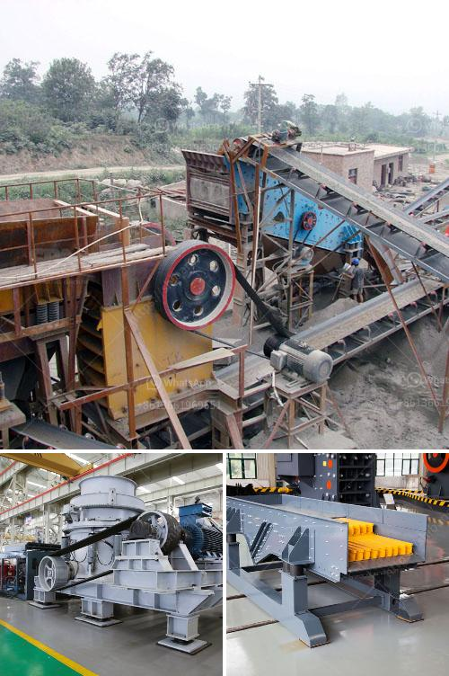

<h3>What machines are used in mines?</h3>
Mining plays a crucial role in extracting valuable resources from the Earth's crust. However, this process requires heavy machinery to ensure both efficiency and safety. From digging, drilling, and hauling to crushing, conveying, and processing, there are several types of machines used in mines. Here, we discuss some of the essential machines that are commonly found in mining operations.

Excavators are one of the most versatile and commonly used machines in mines. These massive machines have a bucket attached to a hydraulic arm that allows them to dig and remove large quantities of soil, rocks, or minerals. Excavators are utilized to create the necessary space for mining activities, such as building tunnels or removing overburden, which is the non-valuable material covering the desired resource.

Drilling machines are essential in underground and surface mining operations. Using drill bits, these machines are used to bore holes into the Earth's surface to access the resource deposits. There are various types of drilling machines available, including blasthole drills, directional drills, and rotary drills. Blasthole drills are often used to create holes for explosives, which break down the rock for easier removal.

Haul trucks are heavy-duty vehicles that transport extracted materials from mining sites to processing plants or storage areas. These trucks are specifically designed to handle the weight and rough terrain often encountered in mining operations. Haul trucks are commonly used to transport coal, iron ore, or other minerals. Some of the largest haul trucks can carry up to 400 tons of material in a single load.

Crushers are machines designed to reduce the size of mined materials into smaller, more manageable pieces. Their basic function is to extract valuable minerals from the raw materials by breaking them down. Jaw crushers and cone crushers are commonly used for primary and secondary crushing, while impact crushers are often used for tertiary and quaternary crushing. Crushing machines play an essential role in the mining process by reducing the size of larger materials and preparing them for further processing.

Conveyor belts are crucial for efficient material handling in mining operations. These belts transport extracted materials from one location to another, eliminating the need for manual labor or additional machinery. Conveyor belts can be used to transport various materials, including coal, ores, rocks, and even heavy equipment. They are versatile, reliable, and can be customized to fit the unique needs and space constraints of each mining site.

In addition to the machines mentioned above, there are numerous other machines used in mines, such as loaders, draglines, graders, and bulldozers. Each machine serves a specific purpose and contributes to the overall efficiency of mining operations.

It is worth noting that with technological advancements, more automated and autonomous machines are being introduced in mining. These machines are equipped with sensors, artificial intelligence, and remote control capabilities, enabling them to operate with minimal human intervention and enhance safety.

In conclusion, mining operations heavily rely on various machines to extract, process, and transport valuable resources from the Earth's crust. Excavators, drilling machines, haul trucks, crushers, conveyor belts, and many others are crucial components of the mining industry. As technology continues to evolve, the mining sector can expect the integration of more advanced and automated machines to further improve efficiency and safety.
<h3>Contact us</h3><ul><li><strong>Whatsapp:&nbsp;<a href="https://wa.me/8613661969651">+8613661969651</a></strong></li><li><a href="https://swt.shibang-china.com/?git&amp;zhl&amp;What machines are used in mines"><strong>Online Service(chat now)</strong></a></li></ul><h3>Related</h3><ul><li><a href='What machine is required for a cement plant.md'>What machine is required for a cement plant?</a></li><li><a href='What equipment is used to extract iron ore .md'>What equipment is used to extract iron ore ?</a></li><li><a href='What is an impact crusher and what is its working principle.md'>What is an impact crusher and what is its working principle?</a></li><li><a href='what is the best installation for crusher plant production and maintenance？.md'>what is the best installation for crusher plant production and maintenance？</a></li><li><a href='What was the magnetic ore separator used for.md'>What was the magnetic ore separator used for?</a></li></ul>