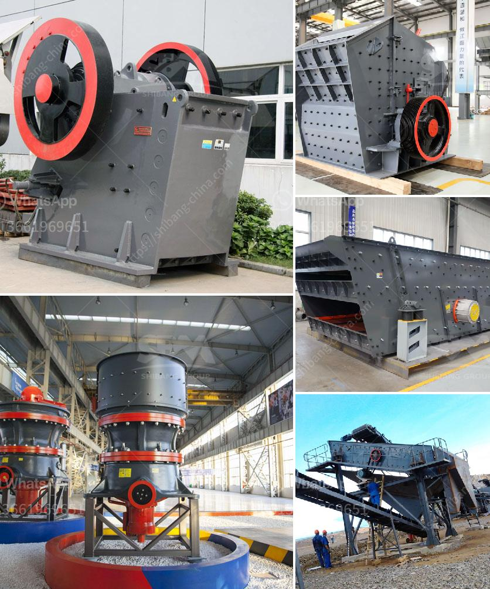

<h3>What machines do stone crushing plants need？</h3>
Stone crushing plants are complete facilities used to crush and screen quarry rocks and stones. These plants consist of various machines and equipment that are essential for efficient and productive crushing operations. In this article, we will explore the machines that stone crushing plants need to operate effectively.

1. Jaw Crusher: The jaw crusher is an essential machine in the stone crushing plant. It is used for primary crushing of various types of stones and rocks. It has a large feed opening and a high reduction ratio, which helps to achieve efficient crushing. It is equipped with a powerful motor and durable jaw plates that ensure reliable performance.

2. Impact Crusher: The impact crusher is another important machine used in the stone crushing plant. It is mainly used for secondary crushing of various types of rocks and stones. The impact crusher works by impacting the rock with hammers that are fixed on a spinning rotor. This process breaks the rock into smaller pieces, making it suitable for further processing.

3. Vibrating Feeder: The vibrating feeder is a machine that continuously and uniformly feeds the stone into the jaw crusher or impact crusher. It plays a crucial role in the smooth operation of the crushing plant. The vibrating feeder has a vibrating motor that generates vibration, which helps in the transfer of the material from the hopper to the crusher.

4. Vibrating Screen: The vibrating screen is a machine used for screening the crushed material. It separates the stones into different sizes based on their particle size. The vibrating screen consists of multiple layers of screens, each with different-sized openings. This helps in grading the material and separating it into different fractions.

5. Belt Conveyor: The belt conveyor is responsible for the transportation of the crushed material within the stone crushing plant. It is a vital component of the plant as it ensures a continuous flow of material from one machine to another. The conveyor belts are durable and designed to withstand heavy loads and harsh conditions.

6. Sand Making Machine: In some stone crushing plants, sand making machines are also used. These machines are used to produce artificial sand from stones or rocks. The sand produced by these machines is used in construction and other industries.

7. Control Panel: The control panel is an essential part of the stone crushing plant. It is used to control and monitor the entire crushing process. The control panel allows operators to adjust the settings of various machines, monitor the flow of material, and troubleshoot any issues that may arise.

In conclusion, stone crushing plants require a variety of machines and equipment to operate efficiently. These machines, such as jaw crushers, impact crushers, vibrating feeders, vibrating screens, belt conveyors, sand making machines, and control panels, all play a significant role in ensuring the smooth operation of the plant. Investing in high-quality and reliable machines is essential for the success of the stone crushing plant.
<h3>Contact us</h3><ul><li><strong>Whatsapp:&nbsp;<a href="https://wa.me/8613661969651">+8613661969651</a></strong></li><li><a href="https://swt.shibang-china.com/?git&amp;zhl&amp;What machines do stone crushing plants need？"><strong>Online Service(chat now)</strong></a></li></ul><h3>Related</h3><ul><li><a href='What equipment do you need for coal mining.md'>What equipment do you need for coal mining?</a></li><li><a href='What can I use to crush rocks or granite.md'>What can I use to crush rocks or granite?</a></li><li><a href='What method of mining is used to obtain calcite.md'>What method of mining is used to obtain calcite?</a></li><li><a href='What is the common ore crusher for aluminum.md'>What is the common ore crusher for aluminum?</a></li><li><a href='What type of crusher produces the least amount of fines.md'>What type of crusher produces the least amount of fines?</a></li></ul>