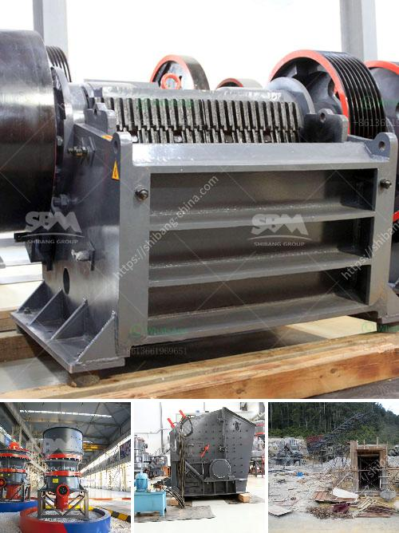

<h3>What material is generally broken by a cone crusher?</h3>
Cone crushers are widely used in the mining and aggregates industries to reduce the size of materials such as granite, basalt, limestone, and other similar materials. However, there are certain materials that are not favorable for cone crushers to crush. In this article, we will discuss the materials that are generally broken by a cone crusher.

One of the key factors that determine the overall crushing performance of a cone crusher is the feed material. The properties of the feed material directly affect the crushing efficiency, capacity, and wear of the crusher liners. Therefore, it is important to select the appropriate feed material for cone crushers.

1. Hard and abrasive materials: Cone crushers are mainly designed to crush hard and abrasive materials such as granite, basalt, and quartzite. These materials have high compressive strength and are resistant to wear and tear. However, if the material is too hard and abrasive, it can cause excessive wear on the crushing chamber and crushing liners of the cone crusher, leading to reduced crusher performance and increased maintenance costs.

2. Wet and sticky materials: Cone crushers are not suitable for crushing wet and sticky materials such as clay, soil, or mud. These materials can clog the crushing chamber and cause the crusher to choke. Additionally, the adhesion of wet and sticky materials can cause the crusher to experience blockages, resulting in downtime and reduced productivity.

3. Soft and low-abrasive materials: Cone crushers are designed to crush materials with high hardness and abrasiveness. Therefore, soft and low-abrasive materials such as coal, limestone, and gypsum may not be suitable for cone crushers. These materials are better suited for other types of crushers such as impact crushers or jaw crushers.

4. Materials with high moisture content: Cone crushers are not recommended for crushing materials with high moisture content. The presence of moisture can cause the material to stick together and form lumps, leading to reduced crushing efficiency and increased wear on the crusher components. It is important to properly dry the material before feeding it into the cone crusher.

In conclusion, cone crushers are effective in crushing a wide range of materials, but there are certain materials that are not suitable for cone crushers. Hard and abrasive materials, wet and sticky materials, soft and low-abrasive materials, and materials with high moisture content are generally not favorable for cone crushers. It is crucial to consider the properties of the feed material and select the appropriate crusher type and settings to ensure optimal crushing performance and maximize the lifespan of the crusher.
<h3>Contact us</h3><ul><li><strong>Whatsapp:&nbsp;<a href="https://wa.me/8613661969651">+8613661969651</a></strong></li><li><a href="https://swt.shibang-china.com/?git&amp;zhl&amp;What material is generally broken by a cone crusher"><strong>Online Service(chat now)</strong></a></li></ul><h3>Related</h3><ul><li><a href='What is a Jaw Crusher What type of stone is broken.md'>What is a Jaw Crusher? What type of stone is broken?</a></li><li><a href='What machine crushes talcum powder for building stone？.md'>What machine crushes talcum powder for building stone？</a></li><li><a href='What is the cost of artificial sand projects.md'>What is the cost of artificial sand projects?</a></li><li><a href='what equipment are used in the production of bentonite？.md'>what equipment are used in the production of bentonite？</a></li><li><a href='What is a single toggle jaw crusher.md'>What is a single toggle jaw crusher?</a></li></ul>