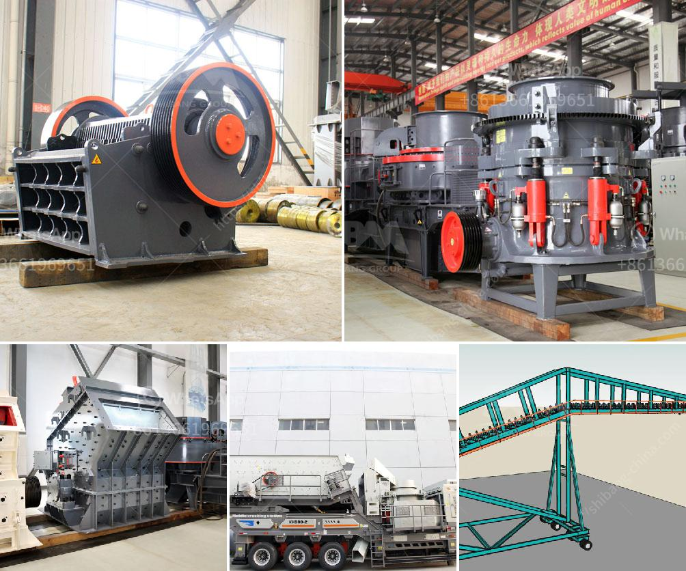

<h3>What material is the jaw crusher tooth plate?</h3>
The jaw crusher is an integral part of the crushing equipment, commonly known as "jaw crushing". Its job is to crush ore and minerals of different hardness levels into smaller pieces, including dust and gravel. With its powerful motion, the jaw crusher is widely used in a variety of fields, to efficiently break down stones or rocks.

One crucial component of the jaw crusher is the tooth plate, also known as the smashing plate. It is divided into two types: the movable tooth plate and the fixed tooth plate. Depending on the type of jaw crusher, the tooth plate can either be replaced or repaired when worn out.

The material used for the tooth plate has a significant impact on its performance, durability, and longevity. Here are some common materials used in the manufacturing of jaw crusher tooth plates:

1. High Manganese Steel: This is the most commonly used material for tooth plates. It has high toughness and good wear resistance, allowing it to withstand the most severe working conditions. However, due to its high cost and low hardness, it is not suitable for all applications.

2. High Chrome Steel: This material is known for its excellent wear resistance and hardness. It is commonly used in abrasive and high-impact applications. However, it is more brittle than high manganese steel, making it prone to cracking under excessive stress.

3. Tungsten Carbide: This material is widely used in the mining industry due to its exceptional hardness and wear resistance. It is often used in combination with other materials to enhance the performance of the tooth plate. Tungsten carbide tooth plates are expensive but offer extended service life.

4. Composite Material: Some manufacturers use composite materials, such as ceramics or polymers, to create tooth plates with improved wear resistance and reduced weight. These materials are often used in specific applications where high wear resistance is essential.

Choosing the right material for the jaw crusher tooth plate depends on various factors, including the characteristics of the ore, the operating conditions, and the required crushing efficiency. It is crucial to consult with the manufacturer or a qualified engineer to ensure the right material is selected for each specific application.

Regular inspection and maintenance of the jaw crusher tooth plate are also necessary to ensure its optimal performance. Excessive wear or damage to the tooth plate can affect the crushing capacity and efficiency of the jaw crusher. Therefore, it is recommended to replace or repair the tooth plate when it reaches its wear limit or shows signs of damage.

In conclusion, the material used for the jaw crusher tooth plate plays a vital role in its performance and durability. High manganese steel, high chrome steel, tungsten carbide, and composite materials are some of the commonly used materials. Selecting the right material and conducting regular maintenance are essential to ensure the jaw crusher operates efficiently and successfully completes its crushing tasks.
<h3>Contact us</h3><ul><li><strong>Whatsapp:&nbsp;<a href="https://wa.me/8613661969651">+8613661969651</a></strong></li><li><a href="https://swt.shibang-china.com/?git&amp;zhl&amp;What material is the jaw crusher tooth plate"><strong>Online Service(chat now)</strong></a></li></ul><h3>Related</h3><ul><li><a href='What is the process for mining manganese ore.md'>What is the process for mining manganese ore?</a></li><li><a href='What is the definition of crushing in mining.md'>What is the definition of crushing in mining?</a></li><li><a href='Which crusher discharges the most uniform material.md'>Which crusher discharges the most uniform material?</a></li><li><a href='What are some good ways to improve the capacity of a cement ball mill.md'>What are some good ways to improve the capacity of a cement ball mill?</a></li><li><a href='What is a Jaw Crusher What type of stone is broken.md'>What is a Jaw Crusher? What type of stone is broken?</a></li></ul>