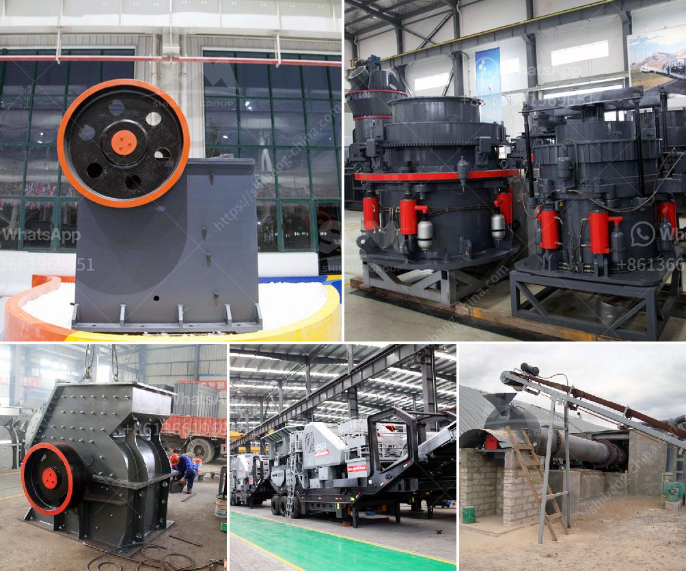

<h3>What materials are used in concrete alternatives to sand?</h3>
Concrete is one of the most widely used construction materials in the world, primarily due to its strength and durability. However, the production of concrete requires a significant amount of sand, which is becoming increasingly scarce in many regions. As a result, researchers and engineers have been exploring alternative materials that can replace or reduce the usage of sand in concrete production. In recent years, several innovative options have emerged as viable alternatives.

One such alternative material is crushed rock dust, also known as quarry dust or stone dust. It is a byproduct of granite or limestone quarries and has similar properties to sand. Crushed rock dust can be used as a partial replacement for sand in concrete, as it possesses good strength and workability. It also improves the overall durability of concrete, making it more resistant to cracking and shrinkage. Additionally, using crushed rock dust as a sand substitute reduces the environmental impact associated with sand mining.

Another promising alternative to sand is the use of recycled concrete aggregate (RCA). RCA consists of crushed concrete debris obtained from demolished structures. This material can be crushed into various sizes to replace both sand and coarse aggregates in concrete mixtures. When properly processed, RCA exhibits similar properties to natural aggregates and enhances the strength and durability of concrete. The use of RCA not only reduces the demand for sand but also diverts construction waste from landfills, promoting sustainability.

Industrial byproducts such as fly ash and slag have also gained attention as sand alternatives in concrete production. Fly ash is a fine powder produced from coal combustion in power plants, while slag is a byproduct of steel production. Both materials can be used as partial replacements for sand, offering additional benefits such as improved workability and reduced heat generation during curing. Incorporating these industrial byproducts into concrete not only conserves sand but also reduces greenhouse gas emissions associated with their disposal.

In recent years, nanomaterials have emerged as another intriguing option for reducing the reliance on sand in concrete. Nanosilica, for example, is a nanomaterial derived from the combustion of rice husks. When added to concrete, it acts as a densifying agent, enhancing its mechanical properties. Nanosilica not only reduces the need for sand but also improves the overall performance of concrete, making it more durable and resistant to chemical attacks.

While these alternative materials to sand show promising results, it is important to note that their usage may vary depending on factors such as local availability, technical requirements, and cost implications. Additionally, extensive research and testing are necessary to ensure their optimal performance and compatibility with different concrete mix designs and applications.

In conclusion, the scarcity of sand and its environmental impact have prompted the search for alternative materials in concrete production. Crushed rock dust, recycled concrete aggregates, industrial byproducts, and nanomaterials like nanosilica are among the promising options being explored. These materials not only reduce the demand for sand but also offer additional benefits such as improving the strength, durability, and sustainability of concrete. As construction practices evolve, finding efficient and effective alternatives to sand will be crucial for the future of the construction industry.
<h3>Contact us</h3><ul><li><strong>Whatsapp:&nbsp;<a href="https://wa.me/8613661969651">+8613661969651</a></strong></li><li><a href="https://swt.shibang-china.com/?git&amp;zhl&amp;What materials are used in concrete alternatives to sand"><strong>Online Service(chat now)</strong></a></li></ul><h3>Related</h3><ul><li><a href='What can I use to crush rocks or granite.md'>What can I use to crush rocks or granite?</a></li><li><a href='What is a ball mill.md'>What is a ball mill?</a></li><li><a href='What is the difference between an impact cone and jaw crusher.md'>What is the difference between an impact, cone, and jaw crusher?</a></li><li><a href='What is the bearing specification for an impact crusher.md'>What is the bearing specification for an impact crusher?</a></li><li><a href='What are the different types of cone crushers.md'>What are the different types of cone crushers?</a></li></ul>