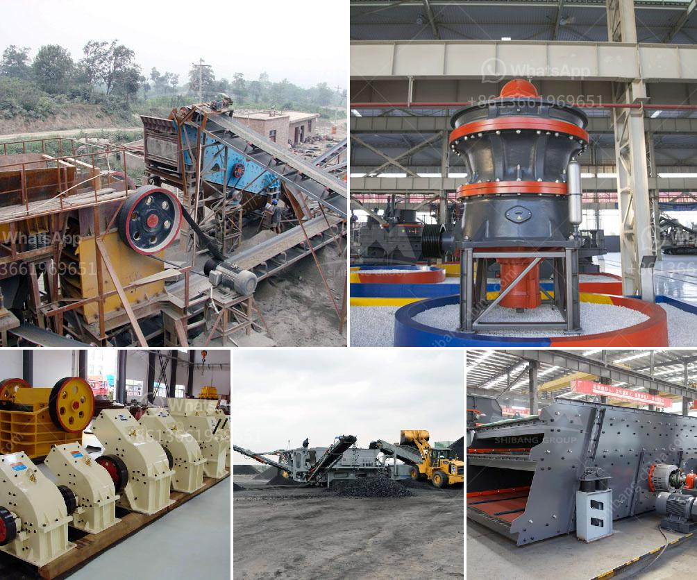

<h3>What materials can the vertical roller mill grind?</h3>
The vertical roller mill is a grinding equipment that has both the functions of crushing and grinding, and uses the material to be ground to work as a medium. The slag vertical mill is similar to the ball mill, but the vertical grinding principle and structure are quite different from those of the ball mill. In the following, the vertical mill manufacturer chaeng will analyze the difference with you.

The equipment composition of the vertical roller mill is mainly composed of separator, grinding roller, grinding disc, hydraulic system, reducer, motor and other parts. The separator is an important component for ensuring the fineness of the powder and it has the ability to collect the particles with a particle size of less than 3μm. The separator has the advantages of compact structure, high efficiency of powder selection and energy saving.

The grinding roller is the core part of the vertical roller mill. The grinding roller is mainly composed of roller shaft, bearing, hub, roller sleeve, shaft seal and other components, and the spindle is connected to the bearing through the hollow shaft.

The grinding disc is fixed on the output shaft of the reducer, which is the place where the material is crushed and ground. The grinding disc is composed of a wear-resistant material, which is subjected to continuous grinding and rolling in the grinding chamber.

The vertical roller mill can be used for grinding various types of feed materials with different hardness and moisture content. It is suitable for grinding of coal, petcoke, clay, limestone, quicklime, gypsum, and many other materials in various industries such as cement, power, metallurgy, chemical industry and non-metallic mineral processing.

The material through the feed tube fell into the center of grinding plate, and then the materials outwards the surrounding area of grinding plate at centrifugal force, to forms a certain thick layer of materials bed, at the same time material was crushed by number of vertical mill rollers.

The materials continuous moving to the outer edge of the grinding plate, off the grinding plate materials rising with the hot air which enter from wind ring into the vertical roller mill, through the vertical roller mill shell into the middle of the separator, in this course materials and hot gas got a fully heat exchange, the water quickly evaporates. Separator controls the finished product output size, greater than the specified size are separated and fall back to the plate, while meet the fineness demands are brought through the separator into the finished product warehouse.

In the vertical roller mill process, a large amount of heat will be generated. The main control problem is the overheating of the roller bearing. This phenomenon is very dangerous. If the overheating of the bearing exceeds the specified upper limit temperature, the bearing may be damaged. The bearing temperature is monitored and controlled by the PLC or DCS system. If the temperature is too high or exceeds the specified upper limit temperature, the vertical roller mill will automatically stop. In addition, if the external hot air temperature is too low, the material may overflow over the edge of the grinding disc, which will not only increase the wear of the grinding roller and the liner, but also waste the water and increase the power consumption for the small quantity of fine material.

In conclusion, the vertical roller mill can grind any type of material to the required fineness. With the advantages of small footprint, simple process flow, high grinding efficiency and low energy consumption, the vertical roller mill is an excellent grinding solution for materials with high grinding efficiency and excellent drying capacity.
<h3>Contact us</h3><ul><li><strong>Whatsapp:&nbsp;<a href="https://wa.me/8613661969651">+8613661969651</a></strong></li><li><a href="https://swt.shibang-china.com/?git&amp;zhl&amp;What materials can the vertical roller mill grind"><strong>Online Service(chat now)</strong></a></li></ul><h3>Related</h3><ul><li><a href='What is the applicability of a jaw crusher.md'>What is the applicability of a jaw crusher?</a></li><li><a href='What are the characteristics of the spring cone crusher.md'>What are the characteristics of the spring cone crusher?</a></li><li><a href='What is aggregates in mining .md'>What is aggregates in mining ?</a></li><li><a href='What is a single toggle jaw crusher.md'>What is a single toggle jaw crusher?</a></li><li><a href='What is a ball mill for .md'>What is a ball mill for ?</a></li></ul>