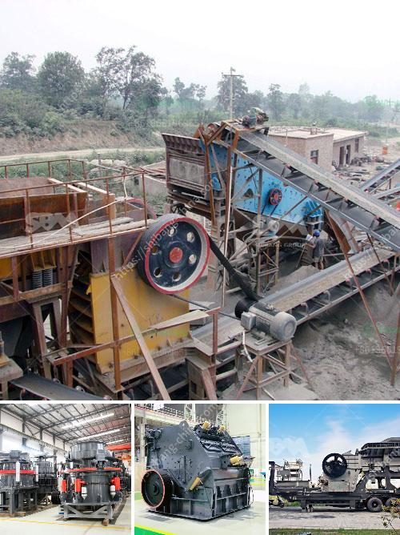

<h3>What mechanical equipment is used to mine copper？</h3>
Copper mining is an essential industry that plays a significant role in economic development worldwide. The process of extracting copper from the earth requires various mechanical equipment to ensure efficiency and productivity. In this article, we will explore the primary mechanical equipment used in mining copper.

1. Excavators: Excavators are heavy-duty machines used to remove overburden or waste rock in open-pit copper mining operations. These machines have a bucket attached to a boom that can dig and load large quantities of material onto trucks for transport. Excavators are essential in creating access roads, digging pits, and extracting ore-bearing rocks.

2. Haul Trucks: Haul trucks are massive vehicles used in copper mining to transport extracted materials. These trucks can carry capacities ranging from 100 to 400 tons, depending on the size of the operation. They are designed to transport both overburden material and ore from the mining site to the processing plant. Haul trucks are equipped with powerful engines and durable tires to withstand the rugged terrain typically found in copper mines.

3. Drills: Drilling is a crucial step in the copper mining process, as it helps create holes in the earth's surface to extract copper-bearing rocks. Rotary and percussion drills are commonly used in copper mining. Rotary drills use a rotating motion to bore holes, while percussion drills use repeated hammering actions. Drills can reach depths of several thousand feet and are equipped with diamond or tungsten carbide-tipped bits to penetrate hard rock.

4. Crushers: Once the copper-bearing rocks are extracted from the ground, they need to be crushed into smaller particles for further processing. Crushers are mechanical equipment that reduce the size of the ore by applying compressive forces. Jaw crushers and cone crushers are commonly used in copper mining operations to crush large ore chunks into smaller pieces.

5. Grinding Mills: After the initial crushing process, grinding mills are used to further refine and process the copper ore. Grinding mills reduce the size of the ore particles through friction and impact, and they typically operate using a rotating cylindrical shell containing steel balls or rods. The finely ground ore is then sent to flotation cells or leaching tanks to separate copper minerals from the gangue material.

6. Flotation Cells: Flotation cells are crucial equipment in the copper mining process used to separate copper minerals from the gangue material. The mixture of finely ground ore and water is added to flotation cells, where air is injected into the solution. Air bubbles attach to the copper minerals, allowing them to float to the top while the gangue material sinks to the bottom. This process helps concentrate the copper and separate it from impurities.

In conclusion, copper mining requires a range of mechanical equipment to extract, transport, and process the copper ore efficiently. Excavators, haul trucks, drills, crushers, grinding mills, flotation cells, and other specialized equipment are used in this process. Each piece of equipment plays a vital role in ensuring the success of copper mining operations worldwide.
<h3>Contact us</h3><ul><li><strong>Whatsapp:&nbsp;<a href="https://wa.me/8613661969651">+8613661969651</a></strong></li><li><a href="https://swt.shibang-china.com/?git&amp;zhl&amp;What mechanical equipment is used to mine copper？"><strong>Online Service(chat now)</strong></a></li></ul><h3>Related</h3><ul><li><a href='What machines are used in quarry mining What is the role of each.md'>What machines are used in quarry mining? What is the role of each?</a></li><li><a href='What are the advantages of a roll crusher compared to other crushers.md'>What are the advantages of a roll crusher compared to other crushers?</a></li><li><a href='What machine is required for a cement plant.md'>What machine is required for a cement plant?</a></li><li><a href='What is a single toggle jaw crusher.md'>What is a single toggle jaw crusher?</a></li><li><a href='What are the requirements for a sand crushing plant.md'>What are the requirements for a sand crushing plant?</a></li></ul>