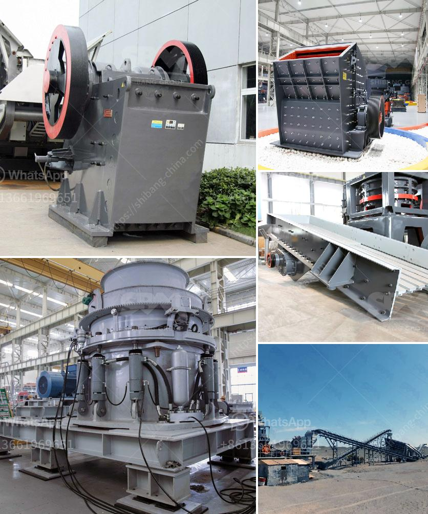

<h3>What method of costing is used for the crusher industry?</h3>
Costing is an essential aspect of any business, enabling them to determine the profitability of their activities. In the crusher industry, where heavy machinery is used to break down large stones into smaller pieces, cost management plays a crucial role in optimizing operations and maintaining profit margins. One method of costing commonly used in the crusher industry is absorption costing.

Absorption costing is a costing method that assigns all manufacturing costs to the cost of a product. Under this method, all direct costs, such as materials and labor, as well as indirect costs, such as factory overheads, are absorbed into the cost of the finished goods. This approach provides a comprehensive view of the total cost incurred in the production process, allowing businesses to accurately calculate their cost per unit.

In the crusher industry, absorption costing is particularly beneficial due to the high proportion of indirect costs involved. Apart from the direct costs of raw materials and direct labor, there are several additional expenses that need to be allocated to the cost of producing crushers. These include overhead expenses like factory rent, utilities, equipment maintenance, depreciation, quality control, and administrative costs. Absorption costing allows all these indirect costs to be included in the overall cost of production, preventing underestimation and ensuring profitability.

One advantage of absorption costing is that it provides a more accurate reflection of the true cost of manufacturing. By including all costs, both fixed and variable, absorption costing offers a holistic view of expenses incurred at each stage of the production process. This helps management make informed decisions about pricing strategies, cost reduction initiatives, and capacity planning. Moreover, absorption costing is also required for external reporting purposes and is generally accepted by accounting standards.

However, absorption costing has its limitations as well. Since all costs are assigned to the units produced, regardless of whether they are sold or not, it can lead to overvaluation of inventory in situations where demand is low. In the crusher industry, where demand fluctuates due to market conditions or the economy, this can result in the accumulation of unsold stock and increased holding costs. To overcome this limitation, some crusher manufacturers also use variable costing.

Variable costing is another method of costing that only includes costs directly associated with production. It excludes fixed overhead costs that do not vary with the level of production. Variable costing provides useful insights into the incremental cost of manufacturing an additional unit, enabling decision-makers to evaluate the impact of changes in volume or sales. Although variable costing is not suitable for external reporting purposes, it is helpful for internal management decisions and can complement absorption costing in the crusher industry.

In conclusion, absorption costing is the method predominantly used in the crusher industry to determine the true cost of manufacturing crushers. It ensures that all direct and indirect costs are assigned to the units produced, providing a comprehensive view of the total cost incurred. However, variable costing can also be employed to analyze the incremental costs associated with changes in production volume. Ultimately, the choice between absorption costing and variable costing depends on the specific needs and circumstances of the crusher industry business.
<h3>Contact us</h3><ul><li><strong>Whatsapp:&nbsp;<a href="https://wa.me/8613661969651">+8613661969651</a></strong></li><li><a href="https://swt.shibang-china.com/?git&amp;zhl&amp;What method of costing is used for the crusher industry"><strong>Online Service(chat now)</strong></a></li></ul><h3>Related</h3><ul><li><a href='What is the effect of ball size in a ball mill.md'>What is the effect of ball size in a ball mill?</a></li><li><a href='What is the cost of roller mills.md'>What is the cost of roller mills?</a></li><li><a href='What are the parts of a mill in a cement plant.md'>What are the parts of a mill in a cement plant?</a></li><li><a href='What are the advantages of a roll crusher compared to other crushers.md'>What are the advantages of a roll crusher compared to other crushers?</a></li><li><a href='What are the different types of cone crushers.md'>What are the different types of cone crushers?</a></li></ul>