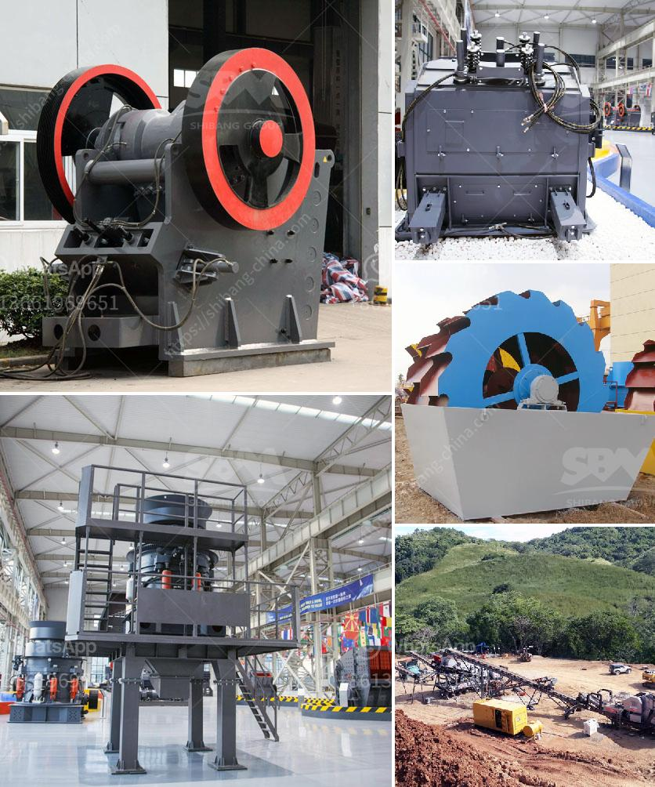

<h3>What method of mining is used to obtain calcite?</h3>
Calcite is a mineral that occurs naturally in the Earth's crust. It is found in abundance and widely distributed throughout the world. Calcite is primarily used in the construction industry as a raw material for cement and as a building stone. It is also commonly used in the manufacturing of glass, paint, and plastic. The mining process of calcite involves various methods, depending on factors such as the depth and quality of the deposit.

One of the most common methods used to mine calcite is open-pit mining. Open-pit mining is a surface mining technique that extracts minerals from an open pit or borrow. This method is used when the deposit is near the surface and extends horizontally. It involves the removal of overburden, which is the soil, rock, and other materials that cover the deposit.

In open-pit mining, large machines known as draglines are used to remove the overburden and expose the calcite deposit. The dragline is equipped with a large bucket attached to a long boom arm. It scoops up the overburden and dumps it into nearby areas, creating overburden piles. Once the overburden is removed, the calcite deposit is drilled, blasted, and excavated.

Another method of mining calcite is underground mining. Underground mining is used when the deposit is deep beneath the surface or when the quality of the deposit is high. This method involves tunneling into the earth to access the calcite deposit.

In underground mining, tunnels, shafts, and adits are created to reach the calcite deposit. Tunnels are horizontal excavations, while shafts are vertical excavations that provide access into the underground mine. Adits are horizontal entrances into the mine, typically dug into the side of a hill or mountain.

Once access is established, the calcite deposit is extracted using various mining techniques. These may include room-and-pillar mining, where pillars of calcite are left behind to support the roof; longwall mining, where a long wall of calcite is extracted in a single slice; or cut-and-fill mining, where the mined-out area is backfilled with waste rock or other materials.

The method of mining used to obtain calcite depends on several factors, including the characteristics of the deposit, the depth of the deposit, the quality and quantity of the calcite, and the economic viability of the mining operation. Each mining method has its advantages and disadvantages, and the choice of method ultimately depends on these factors.

In conclusion, a variety of methods are used to mine calcite, depending on the specific characteristics of the deposit. Open-pit mining is commonly used when the deposit is near the surface, while underground mining is preferred for deeper and higher-quality deposits. These methods are crucial in obtaining the calcite needed for various industries and contribute to the global supply of this valuable mineral.
<h3>Contact us</h3><ul><li><strong>Whatsapp:&nbsp;<a href="https://wa.me/8613661969651">+8613661969651</a></strong></li><li><a href="https://swt.shibang-china.com/?git&amp;zhl&amp;What method of mining is used to obtain calcite"><strong>Online Service(chat now)</strong></a></li></ul><h3>Related</h3><ul><li><a href='What chrome ore used for .md'>What chrome ore used for ?</a></li><li><a href='What does it cost to mill gold ore.md'>What does it cost to mill gold ore?</a></li><li><a href='What equipment is used in salt mining.md'>What equipment is used in salt mining?</a></li><li><a href='What guards should be installed on a jaw crusher.md'>What guards should be installed on a jaw crusher?</a></li><li><a href='What is gradation in a crusher.md'>What is gradation in a crusher?</a></li></ul>