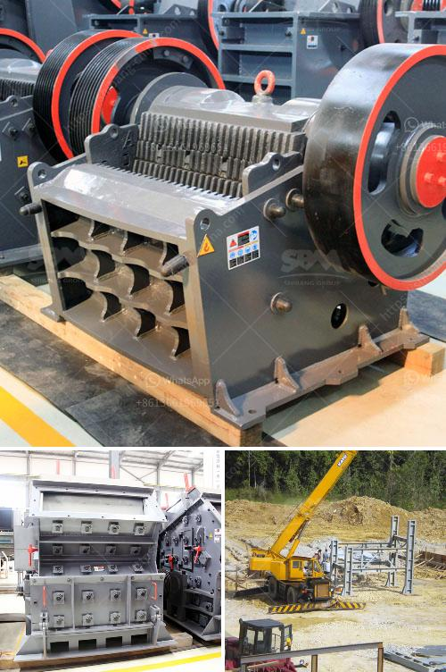

<h3>What mill should be used for crushing rocks?</h3>
When it comes to crushing rocks, selecting the right mill is of utmost importance. The choice of mill will determine the efficiency, speed, and quality of the crushing process. Different types of mills are available in the market, each with its own unique features and capabilities. In this article, we will explore some of the popular mills used for crushing rocks and discuss their advantages and disadvantages.

One common type of mill used for crushing rocks is the jaw crusher. It is a primary crusher that breaks rocks by applying force to them with a fixed and movable jaw plate. The rocks are fed into the crusher through a vibrating grizzly feeder, and the crushed material is discharged through an adjustable discharge opening. Jaw crushers are known for their reliability and high crushing capacity. They are suitable for various rock types, including hard and abrasive rocks. However, jaw crushers are limited in their ability to produce fine particles and may require additional downstream crushing stages.

Another popular option is the impact crusher. It utilizes the principle of impact to crush rocks. The material is fed into a rapidly rotating rotor, where it is accelerated and then struck by hammers, imparting kinetic energy to the rocks. Impact crushers are efficient in producing cubical-shaped particles and are often used for secondary or tertiary crushing stages. However, they may have higher maintenance requirements and produce more fines compared to other mills.

For finer crushing, a cone crusher is a suitable choice. It operates by compressing the rocks between an eccentrically rotating mantle and a concave, allowing for high reduction ratios and fine product sizes. Cone crushers are commonly used in mining and aggregate industries and are capable of handling a wide range of rock types. However, they tend to have a higher upfront cost and consume more power compared to other mills.

Hammer mills are another option for crushing rocks. They consist of a series of hammers rotating at high speed, which impact and fracture the rocks. Hammer mills are versatile and can handle both brittle and fibrous materials. They are often used in industrial applications, such as cement and mining industries. However, hammer mills may generate excessive noise and dust, and their efficiency can be affected by the moisture content of the rocks.

Additional mills used for crushing rocks include roller mills, ball mills, and rod mills. Roller mills utilize cylindrical rollers to crush rocks, offering a high reduction ratio and efficient operation. Ball mills and rod mills use grinding media (balls or rods) to crush and grind rocks, providing finer particles and higher throughput.

In conclusion, choosing the right mill for crushing rocks depends on various factors such as the rock type, required product size, capacity, and operating costs. Each mill has its own advantages and disadvantages, and the selection should be based on the specific needs of the crushing application. Whether it is a jaw crusher, impact crusher, cone crusher, hammer mill, or other options, thorough research and consultation with experts are crucial to ensure optimal crushing performance.
<h3>Contact us</h3><ul><li><strong>Whatsapp:&nbsp;<a href="https://wa.me/8613661969651">+8613661969651</a></strong></li><li><a href="https://swt.shibang-china.com/?git&amp;zhl&amp;What mill should be used for crushing rocks"><strong>Online Service(chat now)</strong></a></li></ul><h3>Related</h3><ul><li><a href='What is the procedure for obtaining a stone quarry license.md'>What is the procedure for obtaining a stone quarry license?</a></li><li><a href='What is froth flotation used for in mines.md'>What is froth flotation used for in mines?</a></li><li><a href='What is chrome ore used for.md'>What is chrome ore used for?</a></li><li><a href='What type of crusher produces the least amount of fines.md'>What type of crusher produces the least amount of fines?</a></li><li><a href='What type of crusher is used for iron ore？.md'>What type of crusher is used for iron ore？</a></li></ul>