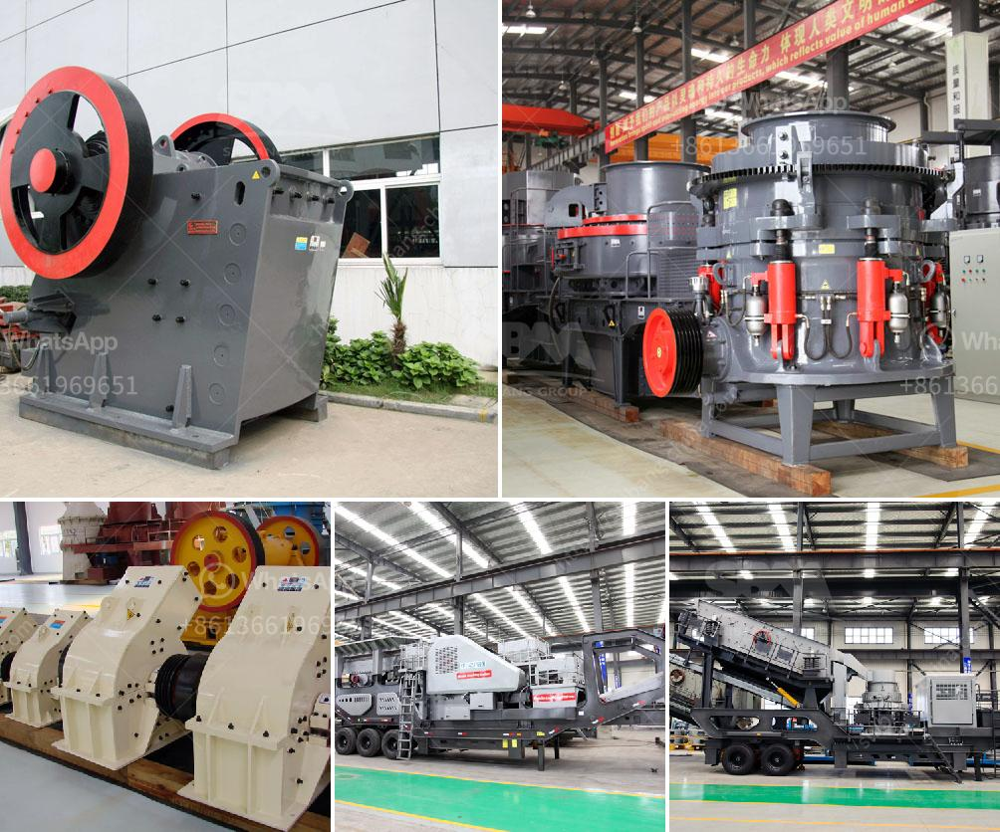

<h3>What mining process is used for zinc extraction?</h3>
Zinc is a vital resource for many industries due to its diverse range of applications. From galvanizing steel to manufacturing batteries, this versatile metal plays a crucial role in various sectors. However, before zinc can be utilized, it needs to be extracted from its ore through an extensive mining process.

The primary source of zinc is sphalerite, a zinc sulfide mineral. Other zinc-bearing minerals include smithsonite, franklinite, and willemite, but they are relatively rare. The mining process for zinc involves a series of steps that begins with the exploration and development of a potential zinc deposit.

Exploration is the first step in discovering zinc ore deposits. In this stage, geological surveys, remote sensing, and geochemical sampling are conducted to assess the potential location of zinc-bearing minerals. Once a promising deposit is identified, the site undergoes further evaluation through drilling and excavating test holes.

Once an economically viable deposit is confirmed, the mining process moves into the next phase, which involves extracting the zinc ore. Open-pit mining and underground mining are the two methods used for zinc extraction, each with its distinct process.

Open-pit mining is the more common method and is particularly suitable for large-scale operations. This method involves mining the ore from an open excavation, similar to an enormous pit, in the earth's surface. Large earth-moving equipment, such as bulldozers and draglines, is used to remove the overburden and access the ore. The ore is then extracted using explosives and transported to a processing plant, where the zinc is separated from the surrounding rock.

Underground mining, as the name suggests, involves extracting the ore from beneath the earth's surface. This method is typically used when the deposit is deep and narrow. To access the ore, tunnels are created, and shafts are drilled vertically. Once underground, specialized mining techniques, such as room and pillar mining or block caving, are employed to extract the zinc ore. Room and pillar mining involves leaving pillars of rock to support the roof while the ore is extracted, whereas block caving involves the controlled collapse of ore-bearing rock from beneath.

After the ore is extracted from either method, it is crushed and milled to a fine powder. Next, it undergoes a process known as froth flotation, where water and chemicals are added to the powdered ore, causing zinc particles to attach to air bubbles that are introduced. These air bubbles rise to the surface, carrying the zinc particles with them, while the waste material sinks to the bottom. The zinc-rich concentrate is then filtered, dried, and refined to produce zinc metal or various zinc compounds.

In conclusion, the extraction of zinc from its ore involves a comprehensive mining process that includes exploration, development, extraction, and refining. Whether through open-pit mining or underground mining, the goal is to access the zinc ore and separate it from the surrounding rock. With its vital role in numerous industries, the extraction process ensures that zinc is responsibly sourced and utilized for various applications worldwide.
<h3>Contact us</h3><ul><li><strong>Whatsapp:&nbsp;<a href="https://wa.me/8613661969651">+8613661969651</a></strong></li><li><a href="https://swt.shibang-china.com/?git&amp;zhl&amp;What mining process is used for zinc extraction"><strong>Online Service(chat now)</strong></a></li></ul><h3>Related</h3><ul><li><a href='What are the specifications of the copper crusher.md'>What are the specifications of the copper crusher?</a></li><li><a href='What is the best iron ore mobile crushing plant？.md'>What is the best iron ore mobile crushing plant？</a></li><li><a href='What is the disk spacing in a jaw crusher known as.md'>What is the disk spacing in a jaw crusher known as?</a></li><li><a href='what are common raw materials for artificial sand.md'>what are common raw materials for artificial sand</a></li><li><a href='what are the by products of producing lead through mining.md'>what are the by products of producing lead through mining</a></li></ul>