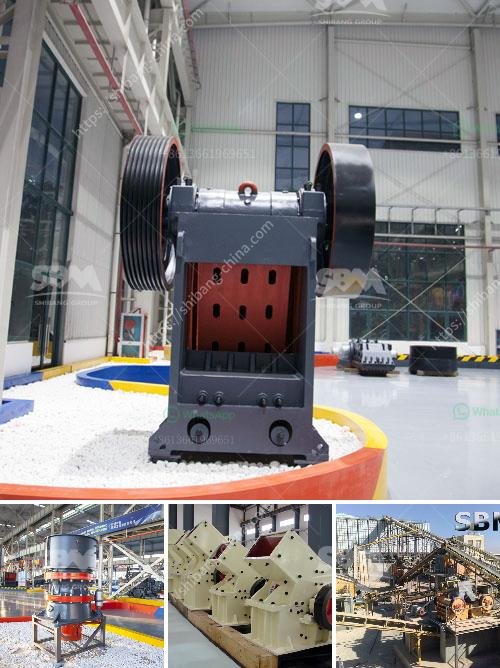

<h3>What parameters should be considered when going to purchase jaw crushers?</h3>
When it comes to choosing the right jaw crusher for your needs, there are several important parameters that should be considered. Jaw crushers are designed to break down hard and abrasive materials, making them suitable for processing materials such as granite, basalt, gravel, and limestone. In order to select the right jaw crusher model, several factors need to be considered.

The first and foremost parameter to consider is the feed opening size. A jaw crusher with a larger feed opening allows for a larger feed size, which in turn can result in higher reduction ratios and overall productivity. It is essential to determine the maximum feed size that the crusher can handle before making a purchase.

Another crucial parameter is the capacity of the jaw crusher. The capacity specifies the maximum amount of material that can be processed by the crusher in a given time frame. The capacity requirement depends on the application and the desired final product size. If the demand requires more tonnage, a larger capacity jaw crusher should be considered.

The stroke is another important parameter to evaluate. The stroke refers to the vertical movement of the jaw plate, and it determines the ability of the crusher to crush and pass the material through the chamber. A longer stroke allows for a higher crushing ratio and better reduction, resulting in a more uniform product size.

The power consumption is also a critical consideration. Jaw crushers require power to operate, usually through an electric motor or diesel engine. It is important to choose a jaw crusher with optimal power consumption to ensure cost-effectiveness and energy efficiency.

The adjustable discharge setting is an essential feature to consider. This parameter determines the final product size range that can be achieved. Different applications may require different discharge settings, so it is crucial to choose a jaw crusher with a wide range of adjustable settings to meet varying needs.

The reliability and durability of the jaw crusher are also fundamental considerations. Look for a jaw crusher that is built with high-quality materials and components to ensure long-lasting performance and minimal downtime. A reputable manufacturer with a track record of producing reliable equipment is a good choice.

Lastly, it is important to consider the maintenance requirements of the jaw crusher. Regular maintenance is necessary to ensure optimal performance and prevent unexpected breakdowns. Choose a jaw crusher with easy access to key components and a simplified maintenance process to save time and reduce the risk of accidents during maintenance activities.

In conclusion, several parameters need to be carefully evaluated when purchasing a jaw crusher. The feed opening size, capacity, stroke, power consumption, adjustable discharge setting, reliability, durability, and maintenance requirements should all be factored in. By considering these parameters, you can make an informed decision and choose the jaw crusher that is best suited for your specific application and production needs.
<h3>Contact us</h3><ul><li><strong>Whatsapp:&nbsp;<a href="https://wa.me/8613661969651">+8613661969651</a></strong></li><li><a href="https://swt.shibang-china.com/?git&amp;zhl&amp;What parameters should be considered when going to purchase jaw crushers"><strong>Online Service(chat now)</strong></a></li></ul><h3>Related</h3><ul><li><a href='What kind of crusher is used to produce stone dust.md'>What kind of crusher is used to produce stone dust?</a></li><li><a href='What are the merits of vibratory screens.md'>What are the merits of vibratory screens?</a></li><li><a href='What is the smallest size of output for a hammer crusher.md'>What is the smallest size of output for a hammer crusher?</a></li><li><a href='What is the best iron ore mobile crushing plant？.md'>What is the best iron ore mobile crushing plant？</a></li><li><a href='What type of crusher is good for bentonite and dolomite.md'>What type of crusher is good for bentonite and dolomite?</a></li></ul>