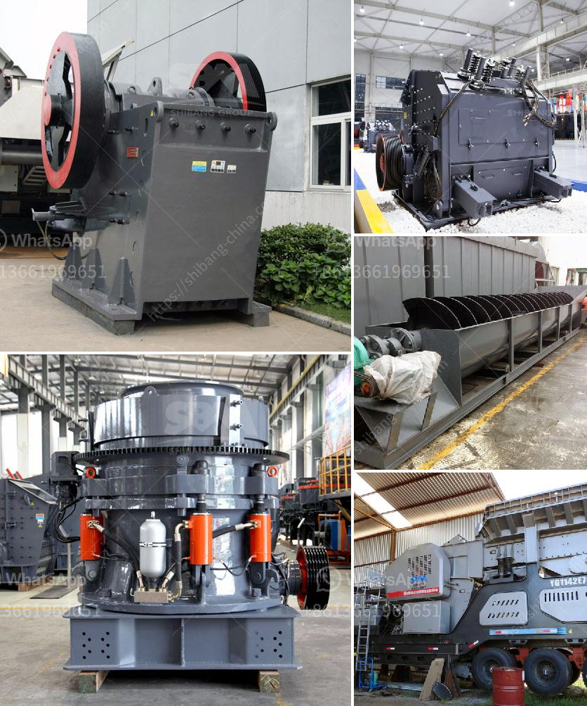

<h3>What plant and equipment are required for a coal extraction project?</h3>
A coal extraction project requires various types of plant and equipment to ensure the smooth operation and productivity of the mine. These equipment play a crucial role in the entire mining process, from extraction to transportation, and are vital for achieving high efficiency and profitability.

One of the essential equipment for coal extraction is the dragline excavator. This massive machine is used to remove the overburden, which is the layer of soil and rocks above the coal seam. Dragline excavators can reach up to 30 stories high and have a huge bucket capacity, allowing them to move a large amount of material in one scoop. Their size and power make them indispensable in open-pit coal mines.

Another crucial piece of equipment is the continuous miner. This machine cuts into the coal seam, extracting the coal while leaving the surrounding rock undisturbed. Continuous miners are equipped with large rotating drums that have cutting teeth, enabling them to cut through the coal and load it onto a conveyor belt. They are especially useful in underground mines where the space is limited.

Coal crushers are also essential in coal extraction projects. These machines are used to crush the coal into smaller particles for further processing. Different types of crushers are available to handle various sizes and types of coal. Some common types include jaw crushers, impact crushers, and cone crushers. Crushing the coal not only helps in handling and transportation but also reduces the overall volume, making it easier to store and process.

Conveyors are an integral part of any coal extraction project. They are used to transport the extracted coal, overburden, and other materials throughout the mine. Belt conveyors are commonly used, as they are efficient, reliable, and have a high carrying capacity. These conveyor systems can be customized to meet specific requirements, such as inclines, declines, and curved paths. They help in streamlining the coal extraction process, minimizing manual labor and increasing productivity.

Additionally, loaders and haul trucks play a significant role in a coal extraction project. Loaders are used to scoop up coal and load it onto trucks or conveyor belts. Haul trucks, on the other hand, are responsible for transporting the coal from the mines to designated areas for processing or further transportation. These trucks vary in size and capacity, depending on the mine's requirements, and are designed to withstand the rugged conditions of coal mining.

In conclusion, a coal extraction project requires a range of plant and equipment to ensure the efficient and safe extraction of coal. Equipment such as dragline excavators, continuous miners, crushers, conveyors, loaders, and haul trucks are essential for various stages of the mining process. By using advanced and reliable equipment, coal mining companies can achieve higher productivity, reduce downtime, and enhance profitability. Ultimately, these machines play a crucial role in meeting global energy demands and driving economic growth.
<h3>Contact us</h3><ul><li><strong>Whatsapp:&nbsp;<a href="https://wa.me/8613661969651">+8613661969651</a></strong></li><li><a href="https://swt.shibang-china.com/?git&amp;zhl&amp;What plant and equipment are required for a coal extraction project"><strong>Online Service(chat now)</strong></a></li></ul><h3>Related</h3><ul><li><a href='What do crusher model letters represent.md'>What do crusher model letters represent?</a></li><li><a href='What is an opencircuit ball mill.md'>What is an open-circuit ball mill?</a></li><li><a href='what does a raymond coal mill cost？.md'>what does a raymond coal mill cost？</a></li><li><a href='What equipment is used for silver mining.md'>What equipment is used for silver mining?</a></li><li><a href='What is an overpressure fan in a cone crusher.md'>What is an overpressure fan in a cone crusher?</a></li></ul>