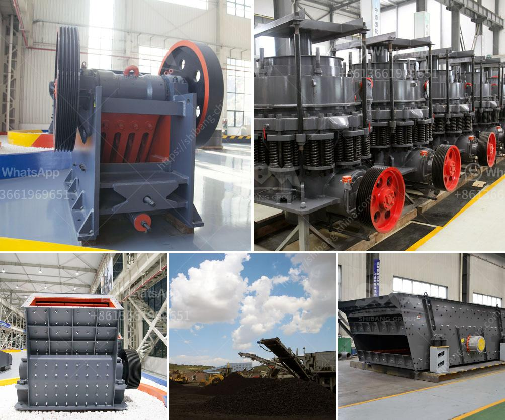

<h3>What plate is used for the curtain in an impact crusher?</h3>
An impact crusher is a type of heavy-duty equipment used to crush and break down materials into smaller pieces. This equipment is widely used in various industries such as mining, construction, and recycling. One of the main components of an impact crusher is the curtain or impact plate. This article will discuss the importance of the curtain plate and the materials used for its construction.

The curtain plate is a stationary component that is mounted on the crushing chamber walls of the impact crusher. Its main purpose is to absorb the impact and shock generated by the incoming material during the crushing process. The curtain plate acts as a barrier that prevents the material from escaping the crushing chamber and directs it towards the rotor for further reduction.

The choice of material for the curtain plate is crucial to ensure its durability and efficiency. The material needs to withstand high impact forces and abrasion from the crushing process. Most commonly, manufacturers use high-strength steel to construct the curtain plate. This type of steel is known for its excellent toughness and resistance to impact and abrasion.

There are different grades of high-strength steel that manufacturers can choose from based on the specific requirements of the impact crusher. Some commonly used grades include manganese steel, chrome-molybdenum steel, and alloy steel. These materials have various alloying elements that enhance their mechanical properties, making them ideal for impact applications.

Manganese steel is a popular choice for curtain plates due to its exceptional toughness and wear resistance. It is known for its ability to work-harden, which means it becomes even harder and stronger after repeated impacts. This property allows the curtain plate to withstand heavy loads and prolong its service life.

Chrome-molybdenum steel, on the other hand, offers excellent tensile strength and high resistance to impact. It contains chromium and molybdenum, which increase its hardness and toughness. This type of steel is particularly suitable for applications where the material being crushed has high abrasive qualities.

Alloy steel is another option for the curtain plate due to its versatility and affordability. It is a combination of multiple alloying elements such as chromium, nickel, and vanadium. Alloy steel offers a good balance between toughness and hardness, making it suitable for various impact crusher applications.

In addition to the choice of material, the design and thickness of the curtain plate also play a crucial role in its performance. The design needs to ensure proper distribution of the impact forces and minimize the risk of material buildup or blockage. The thickness of the plate should be selected based on the expected workload and the size of the material being processed.

In conclusion, the curtain plate is an essential component of an impact crusher. It absorbs the impact and shock generated by the incoming material and directs it towards the rotor for further crushing. High-strength steel, such as manganese steel, chrome-molybdenum steel, and alloy steel, are commonly used to construct the curtain plate due to their excellent toughness and resistance to impact and abrasion. The choice of material and plate design should be based on the specific requirements of the crusher to ensure optimal performance and longevity.
<h3>Contact us</h3><ul><li><strong>Whatsapp:&nbsp;<a href="https://wa.me/8613661969651">+8613661969651</a></strong></li><li><a href="https://swt.shibang-china.com/?git&amp;zhl&amp;What plate is used for the curtain in an impact crusher"><strong>Online Service(chat now)</strong></a></li></ul><h3>Related</h3><ul><li><a href='What is a conetype rock crusher.md'>What is a cone-type rock crusher?</a></li><li><a href='What is the beneficiation technique for marble.md'>What is the beneficiation technique for marble?</a></li><li><a href='What is the problem with ore mining .md'>What is the problem with ore mining ?</a></li><li><a href='What are the advantages of hammer mills used in the mining industry？.md'>What are the advantages of hammer mills used in the mining industry？</a></li><li><a href='what is the difference between tube grinder and ball mill.md'>what is the difference between tube grinder and ball mill</a></li></ul>