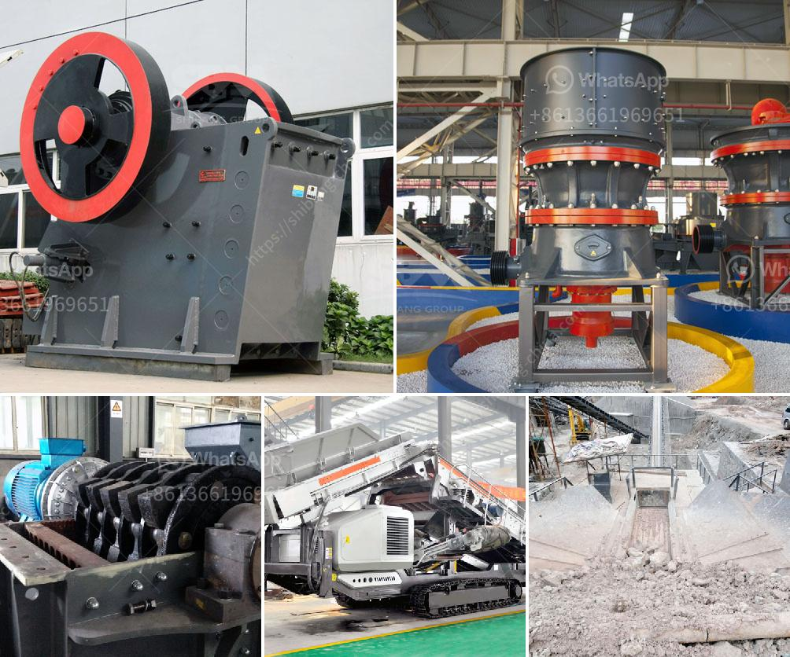

<h3>What points should be checked by a maintenance PM on a ball mill?</h3>
A ball mill is essential machinery for the industrial and raw material grinding processes. It is used to grind raw materials like limestone, coal, and clay into powder form. As a maintenance manager, you need to ensure efficient performance of ball mills, especially when it comes to the reliability and longevity of the equipment.

To achieve this, maintenance PMs (Preventive Maintenance) should be carried out regularly on ball mills. These inspections help identify faults and potential issues that could lead to breakdowns, reducing downtime and increasing productivity. Here are some essential points that should be checked during maintenance PM on a ball mill.

1. Lubrication system: This is perhaps the most critical aspect of ball mill maintenance. The lubrication system should be checked regularly for leaks and proper oil levels. Excessive pressure or inadequate oil levels can cause severe damage to the machine. Also, check if the lubricant is clean and free from any contaminants that may affect the smooth functioning of the machine. A well-maintained lubrication system ensures the ball mill operates at optimal conditions.

2. Mill internal inspections: Regular inspections of the ball mill internals should be performed. Bearings, liner plates, and other wearing parts should be regularly checked for wear and tear. This will help identify potential problems, such as loose or broken parts, damaged bearings, or leaking seals. Early detection of any damage allows for timely repairs or replacements, reducing the risk of larger failures.

3. Drive system: The ball mill drive system is responsible for the proper functioning of the mill. The smooth operation and high efficiency of the motor, belt, drives, and gears are crucial for a productive mill. Regular inspections help identify potential problems that can lead to equipment failure. For example, if there are any misalignments or loose belts, these issues can be addressed before they cause severe damage.

4. Electrical system: The electrical components of the ball mill are prone to wear and tear. Regular checks and maintenance can identify any electrical issues, such as overheating, loose connections, or worn-out wires. These checks are crucial for preventing electrical failures that can lead to catastrophic accidents or machine breakdowns.

5. Safety devices and guarding: The safety of the personnel operating the ball mill is of utmost importance. Periodic inspections should be carried out to ensure that all safety devices and guarding are in place and fully operational. This includes checking emergency stop buttons, safety interlocks, and proper guarding around rotating parts.

In conclusion, regular maintenance PMs are essential for the smooth functioning of ball mills. By inspecting lubrication systems, mill internals, drive systems, electrical systems, and safety devices, maintenance managers can identify and rectify potential issues before they cause severe damage. This not only reduces downtime but also improves the overall efficiency and longevity of the ball mill. Implementing a comprehensive maintenance strategy will ensure that your ball mill continues to operate reliably and contributes to the success of your production processes.
<h3>Contact us</h3><ul><li><strong>Whatsapp:&nbsp;<a href="https://wa.me/8613661969651">+8613661969651</a></strong></li><li><a href="https://swt.shibang-china.com/?git&amp;zhl&amp;What points should be checked by a maintenance PM on a ball mill"><strong>Online Service(chat now)</strong></a></li></ul><h3>Related</h3><ul><li><a href='What are the mechanical devices used in mining What is the role of each.md'>What are the mechanical devices used in mining? What is the role of each?</a></li><li><a href='What is the difference between an impact cone and jaw crusher.md'>What is the difference between an impact, cone, and jaw crusher?</a></li><li><a href='What equipment is used in salt mining.md'>What equipment is used in salt mining?</a></li><li><a href='What are the uses of a cone crusher to mining operations.md'>What are the uses of a cone crusher to mining operations?</a></li><li><a href='What is the price of a cone crusher in Venezuela.md'>What is the price of a cone crusher in Venezuela?</a></li></ul>