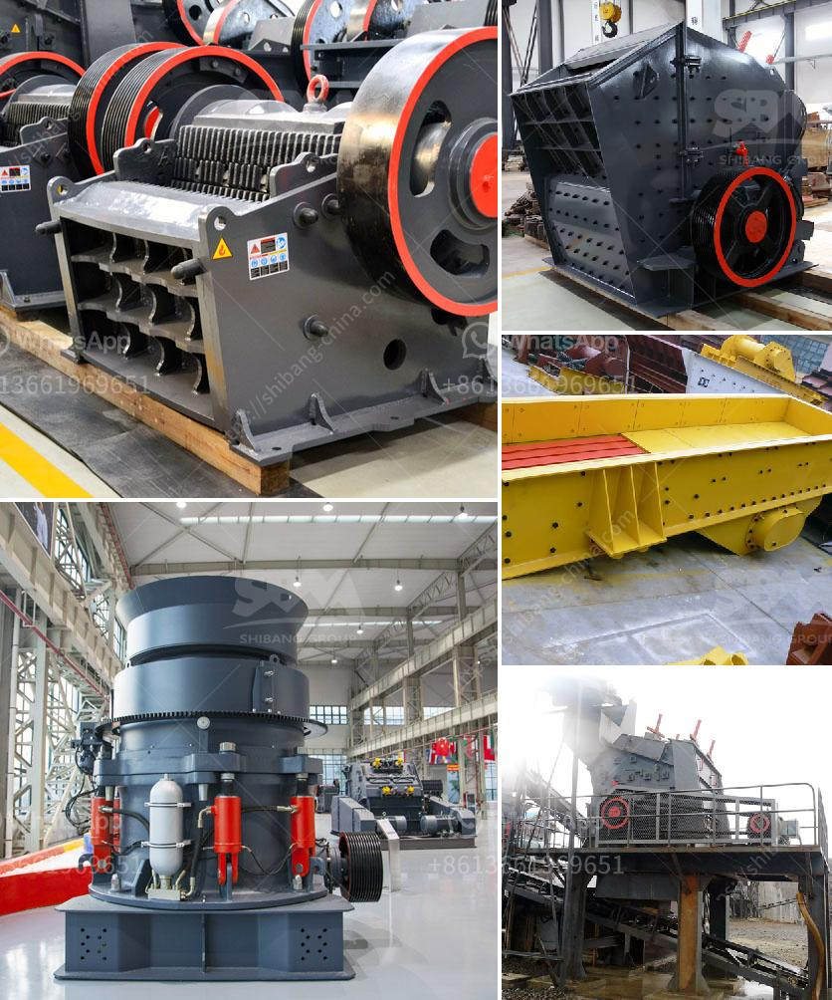

<h3>What procedures need to be done for a quarry?</h3>
Quarries play a vital role in modern society as they provide us with essential raw materials. These materials are used for constructing roads, buildings, and infrastructure. However, operating a quarry is not as simple as extracting rocks from the ground. A quarry entails several procedures to ensure it operates efficiently while minimizing environmental impacts. In this article, we will explore the key procedures needed for a quarry.

The first step in establishing a quarry is acquiring the proper permits and licenses. Quarry operators must adhere to government regulations, obtaining permits that specify the size, location, duration, and methods of extraction. These permits also ensure that the quarry operates within legal boundaries and meets environmental standards.

Next, the development of an extraction plan is essential. This plan outlines the techniques and equipment needed to extract the desired materials. It should consider factors such as the geological composition of the site, the depth of the resource, and the surrounding environment.

Once the extraction plan is in place, the quarry operator must assess the impact on the surrounding area. Environmental impact assessments (EIAs) are conducted to evaluate the potential effects on air, water, and soil quality, as well as wildlife habitats and local communities. This assessment aids in determining the necessary measures to mitigate any negative impacts.

To minimize air pollution, quarries often employ dust suppression systems. These systems use water sprays or chemicals to control dust generated during the extraction and transportation of materials. Additionally, equipment operators may wear masks to prevent inhalation of harmful particles.

Similarly, water management is a crucial procedure. Quarry operations can affect local water sources through sedimentation, contamination, or drying up of streams and wells. To maintain water quality and availability, quarries implement measures such as constructing settling ponds and using water recycling systems. These methods help to filter and reuse water, reducing the impact on local water resources.

Rehabilitation is another essential step in the quarrying process. The extraction of materials leaves behind large open pits and disturbed land areas. To restore the site, quarries implement reclamation strategies. This involves reshaping the quarry to create stability and planting vegetation to prevent erosion. Rehabilitation efforts may also include creating wildlife habitats as a way to compensate for any lost or disturbed ecosystems.

Furthermore, the quarry must have effective monitoring systems in place. Regular monitoring of environmental and operational parameters, such as noise levels, air quality, and water pollution, ensures compliance with regulations and identifies potential issues early on. Monitoring allows for timely intervention and mitigation, minimizing risks and improving the overall sustainability of the quarrying operation.

In conclusion, several procedures are necessary for the establishment and operation of a quarry. These include obtaining permits and licenses, developing an extraction plan, assessing environmental impacts, implementing dust and water management systems, conducting rehabilitation, and establishing monitoring mechanisms. By following these procedures, quarries can extract raw materials sustainably, minimizing their environmental footprint and supporting the development of our society.
<h3>Contact us</h3><ul><li><strong>Whatsapp:&nbsp;<a href="https://wa.me/8613661969651">+8613661969651</a></strong></li><li><a href="https://swt.shibang-china.com/?git&amp;zhl&amp;What procedures need to be done for a quarry"><strong>Online Service(chat now)</strong></a></li></ul><h3>Related</h3><ul><li><a href='What happened in the vibrating screen.md'>What happened in the vibrating screen?</a></li><li><a href='what is the process to buy stone crusher in Nigeria.md'>what is the process to buy stone crusher in Nigeria</a></li><li><a href='What machines are required for a limestone powder factory.md'>What machines are required for a limestone powder factory?</a></li><li><a href='What types of crushers are used in copper mining in Zambia.md'>What types of crushers are used in copper mining in Zambia?</a></li><li><a href='What are the different parts of a crusher in a power plant.md'>What are the different parts of a crusher in a power plant?</a></li></ul>