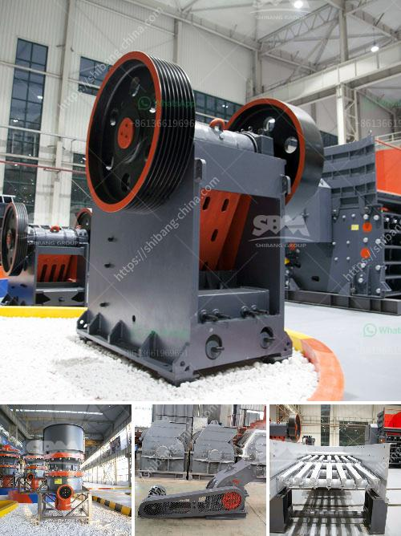

<h3>What products are produced from a cone crusher?</h3>
A cone crusher is a key piece of equipment used for crushing materials. It is widely used in the mining and construction industry, and helps to process materials such as ores, minerals, limestone, granite, and other aggregates. Cone crushers offer numerous benefits, including less downtime, easier maintenance, and lower costs due to their relatively simple design.

One of the main products produced from a cone crusher is aggregate. This material is used in construction projects such as roadways, bridges, and buildings. The cone crusher breaks down larger pieces of aggregate into smaller particles that can be used as a base for concrete or asphalt. It ensures that the aggregates are of the desired size and shape, making them suitable for various applications.

Another important product produced from a cone crusher is crushed stone. This material is used in road construction, railroad ballast, and as a base for concrete and asphalt. The cone crusher breaks down the material into smaller pieces that are then screened to achieve the desired size and shape for different applications. Crushed stone is a versatile material that is widely used in the construction and landscaping industries.

Furthermore, cone crushers are used to produce manufactured sand. This is a high-quality alternative to natural sand, which is becoming increasingly scarce. Manufactured sand is produced by crushing rocks, boulders, or gravel, and then sieving it to the required size. Cone crushers are highly efficient in producing manufactured sand due to their unique crushing process. This material can be used in various applications, including concrete production, plastering, and landscaping.

Crushed ore is another product that can be produced from a cone crusher. The ore is usually extracted from the earth's crust through mining operations and then crushed into smaller pieces using a cone crusher. This process helps to extract valuable minerals and metals from the ore, which are then used in various industries such as manufacturing, construction, and electronics. A cone crusher plays a crucial role in the crushing and processing of ore, ensuring that the desired particle size is achieved for efficient extraction.

Overall, cone crushers are versatile machines that produce a wide range of products. They are particularly important in the construction and mining industries, where they help to reduce large rocks and ores into smaller particles for further processing. The main products produced from a cone crusher include aggregate, crushed stone, manufactured sand, and crushed ore. These materials are used in a variety of applications, such as construction, road building, landscaping, and manufacturing. Cone crushers have revolutionized the crushing industry by providing efficient and cost-effective solutions for material processing.
<h3>Contact us</h3><ul><li><strong>Whatsapp:&nbsp;<a href="https://wa.me/8613661969651">+8613661969651</a></strong></li><li><a href="https://swt.shibang-china.com/?git&amp;zhl&amp;What products are produced from a cone crusher"><strong>Online Service(chat now)</strong></a></li></ul><h3>Related</h3><ul><li><a href='what size material can be made with an impact crusher？.md'>what size material can be made with an impact crusher？</a></li><li><a href='what is the cost of stone crusher？.md'>what is the cost of stone crusher？</a></li><li><a href='What is the major step in the process of openpit and underground mining.md'>What is the major step in the process of open-pit and underground mining?</a></li><li><a href='What is a hammermill crusher machine.md'>What is a hammermill crusher machine?</a></li><li><a href='What mechanical equipment is used to mine copper？.md'>What mechanical equipment is used to mine copper？</a></li></ul>