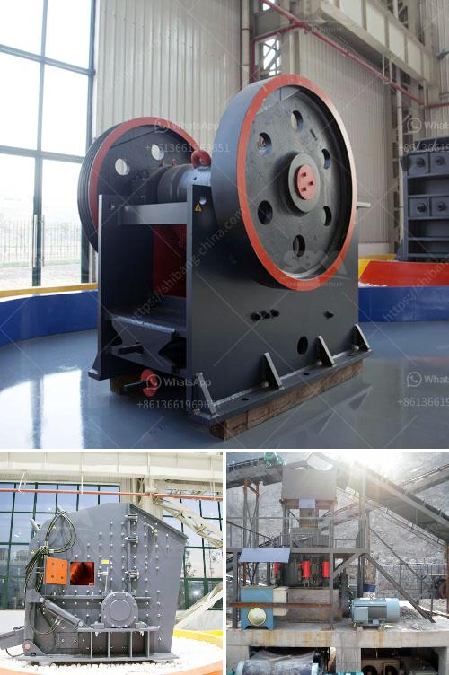

<h3>What raw materials and equipment are needed for artificial sand?</h3>
Artificial sand, also called crushed sand or mechanical sand, refers to rocks, mine tailings or industrial waste granules with a particle size of less than 4.75 mm. It is processed by mechanical crushing and sieving. In China, the artificial sand was mainly used in the construction of hydropower systems. For years, the demand for artificial sand for construction and infrastructure projects has been increasing due to the rapid urbanization and industrialization, resulting in the depletion of natural sand resources.

To produce artificial sand, it is necessary to select the appropriate raw materials. In general, natural sand is limited by resources and transportation, which brings natural limitations to the production of natural sand. The use of artificial sand can effectively improve resource utilization and project efficiency.

The raw materials for artificial sand are crushed stone, river pebble, limestone, granite, basalt, etc. With the development of construction industry, the demand for artificial sand is increasing rapidly, leading to a shortage of natural sand resources. However, there are many types of stone materials on the market, and the properties of each type of stone are different. Therefore, it is necessary to select the appropriate stone materials according to different construction projects to produce artificial sand with stable performance.

In addition to raw materials, specific equipment is required to produce artificial sand. The main equipment for producing artificial sand includes jaw crusher, impact crusher, cone crusher, sand making machine, vibrating screen, sand washing machine, etc. The coarse, medium, and fine crushed stones are differently processed by these equipments.

Jaw crusher is mainly used for coarse crushing of raw materials. It is one of the most important crushing equipment in the artificial sand production line. Its crushing ratio is large and the particle size of the finished product is uniform.

The impact crusher is mainly used for medium and fine crushing in the artificial sand production line. It can produce highly cubic-shaped sand and gravel materials with uniform size, strong compressive strength, high quality aggregates, and low powder content.

The cone crusher is mainly used for crushing hard stones, such as granite, basalt, and river pebble. It has the advantages of large crushing ratio, high output, and uniform product size. It is the first choice for crushing large stones into artificial sand.

The sand making machine is the core equipment of the artificial sand production line. It is designed to crush cobblestones, limestone, granite, basalt, diabase, and other similar materials.

The sand washing machine removes impurities and dust from sand and gravel materials to improve the quality of artificial sand.

In conclusion, to produce artificial sand, raw materials such as crushed stone, river pebble, limestone, granite, basalt, etc., are selected according to different construction needs. The specific equipment required includes jaw crushers, impact crushers, cone crushers, sand making machines, vibrating screens, and sand washing machines. With the increase in demand for artificial sand, the production of artificial sand will continue to be an important part of the construction industry.
<h3>Contact us</h3><ul><li><strong>Whatsapp:&nbsp;<a href="https://wa.me/8613661969651">+8613661969651</a></strong></li><li><a href="https://swt.shibang-china.com/?git&amp;zhl&amp;What raw materials and equipment are needed for artificial sand"><strong>Online Service(chat now)</strong></a></li></ul><h3>Related</h3><ul><li><a href='What type of crusher produces the least amount of fines.md'>What type of crusher produces the least amount of fines?</a></li><li><a href='What material is the jaw crusher tooth plate.md'>What material is the jaw crusher tooth plate?</a></li><li><a href='What equipment is used in salt mining.md'>What equipment is used in salt mining?</a></li><li><a href='What is the cascading effect in a ball mill.md'>What is the cascading effect in a ball mill?</a></li><li><a href='What determines the capacity of a stone crusher.md'>What determines the capacity of a stone crusher?</a></li></ul>