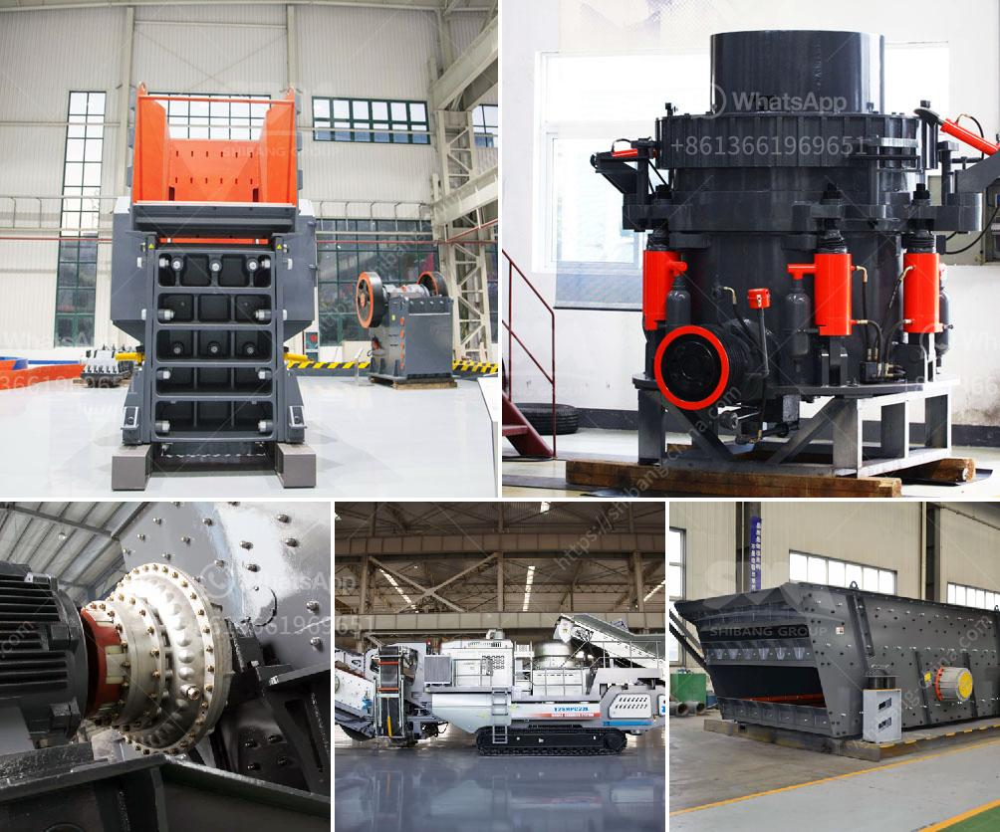

<h3>What should I know about a crusher plant?</h3>
A crusher plant is a crucial part of any construction or mining project, as it helps to break down the large rocks into smaller components. This process of crushing the rocks is achieved through mechanical means like the use of crushers. However, before diving into the operational aspects of a crusher plant, it is essential to understand some general aspects that can help you make informed decisions.

Firstly, it is vital to have a comprehensive understanding of your project's requirements. Be it a road construction project or a mining venture, each project's specific needs will determine the type of crusher plant that you need. There are various types of crusher plants available, such as jaw crushers, cone crushers, impact crushers, and gyratory crushers, among others. Each type has its unique characteristics and benefits, so it is essential to choose the one that suits your project requirements.

Another crucial factor to consider about a crusher plant is its production capacity. The production capacity of the plant will indicate how much material it can process within a given period. This information is essential because it helps you estimate the time needed to complete your project. Additionally, knowing the production capacity can also aid in determining the size and number of crushers you need.

Apart from production capacity, the feeding size of the materials is another aspect that must be considered. The size of the incoming materials will determine the type and size of crushers that can efficiently break them down. If the feeding size is too large, the crusher plant may be unable to handle it, leading to blockages and inefficiencies. On the other hand, if the feeding size is too small, it may not be cost-effective to use a large crusher plant. Therefore, thoroughly understanding the feeding size requirements is crucial.

Maintenance and wear parts are critical aspects that you should be aware of when it comes to crusher plants. Proper maintenance can extend the plant's lifespan, reduce downtime, and prevent unexpected breakdowns. Additionally, having an adequate supply of wear parts, such as jaw plates or cone liners, is essential to ensure smooth operations. Regularly inspecting and replacing these parts, when necessary, will help optimize the crusher plant's performance and avoid unexpected interruptions.

Lastly, it is essential to consider the environmental impact of your crusher plant. Crushing rocks can create a lot of dust, noise, and vibrations, which may have consequences on the surrounding environment and nearby communities. Therefore, it is essential to implement robust dust suppression measures, noise reduction strategies, and vibration control mechanisms to minimize any adverse impacts.

In conclusion, a crusher plant plays a crucial role in construction and mining projects by breaking down large rocks into smaller components. To make informed decisions about a crusher plant, you should consider factors such as project requirements, production capacity, feeding size, maintenance and wear parts, and environmental impact. By carefully assessing these aspects, you can ensure the smooth and efficient operation of your crusher plant, leading to successful project completion.
<h3>Contact us</h3><ul><li><strong>Whatsapp:&nbsp;<a href="https://wa.me/8613661969651">+8613661969651</a></strong></li><li><a href="https://swt.shibang-china.com/?git&amp;zhl&amp;What should I know about a crusher plant"><strong>Online Service(chat now)</strong></a></li></ul><h3>Related</h3><ul><li><a href='What is a belt conveyor machine .md'>What is a belt conveyor machine ?</a></li><li><a href='what is cost for putting up a 2500 tpd cement plant.md'>what is cost for putting up a 2500 tpd cement plant?</a></li><li><a href='What is the cascading effect in a ball mill.md'>What is the cascading effect in a ball mill?</a></li><li><a href='What procedures need to be done for a quarry.md'>What procedures need to be done for a quarry?</a></li><li><a href='What is the best granite crusher machine.md'>What is the best granite crusher machine?</a></li></ul>