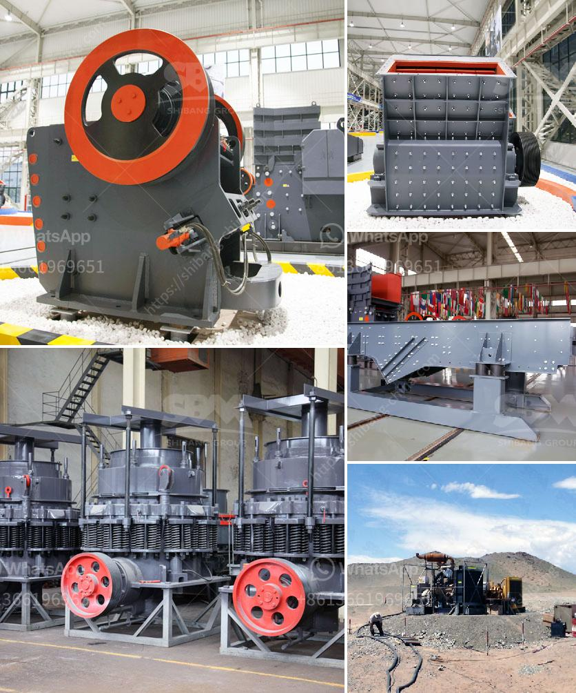

<h3>What should be the RPM of a ball mill with a 45-inch diameter?</h3>
A ball mill is a crucial equipment for grinding after materials are crushed. It is an efficient tool for grinding various materials into powder. Ball mills are widely used in the production of cement, silicate products, new building materials, refractory materials, fertilizers, black and non-ferrous metal dressings, and glass ceramics, dry or wet grinding of various ores and other grindable materials. 

One important thing to consider when designing a ball mill is its rotation speed. A ball mill should be rotating with an optimal speed to achieve the desired grinding effect. Generally, the rotational speed of a ball mill is about 70-75% of the critical speed. This speed is determined by several factors including mill diameter, ball diameter, and charge proportions. 

The critical speed of a ball mill is defined as the rotational speed where centrifugal forces overcome the gravitational forces and causes a grinding action. At critical speed, the grinding media inside the mill are not subjected to any centrifugal force and do not fall, which results in low grinding efficiency. On the other hand, if the mill rotates too slowly, the grinding media will not make sufficient impact or promote grinding action, resulting in a lower productivity. Therefore, it is essential to find the optimal rotational speed to achieve maximum grinding efficiency.

In this case, we have a ball mill with a diameter of 45 inches. To determine the critical speed of this mill, we need to process two pieces of information: the diameter of the mill and the radius of the mill. The formula for calculating the critical speed of a ball mill is:

By substituting the radius value (45 inches = 1143 millimeters) into this formula, we can calculate the critical speed of the ball mill as follows:

Now, let's assume that the rpm is unknown, and we want to determine the appropriate rpm for this mill. We need to consider the factors mentioned earlier, including mill diameter and the size of the grinding media used. Typically, a ball mill with a diameter of 45 inches would have a grinding media size of around 12-14 mm.

Considering the mill diameter and typical grinding media size, a moderately loaded mill with a rotational speed of around 70-75% of the critical speed would generate effective grinding action. Thus, the desired rpm for this ball mill would range between 42 to 45.

However, it is crucial to note that specific conditions might require adjustment of the rotational speed. Factors such as the type and hardness of the material being ground, the desired fineness, and the presence of any moisture in the material can influence the ideal rotational speed. Experimentation and practical experience are necessary to optimize the mill performance for specific applications.

In conclusion, the optimal rpm for a ball mill with a 45-inch diameter would generally range between 42 to 45. However, diverse factors determine the actual rotational speed needed for maximum grinding efficiency. It is advisable to experiment and fine-tune the rpm based on the material properties and desired grinding outcomes to achieve optimal performance.
<h3>Contact us</h3><ul><li><strong>Whatsapp:&nbsp;<a href="https://wa.me/8613661969651">+8613661969651</a></strong></li><li><a href="https://swt.shibang-china.com/?git&amp;zhl&amp;What should be the RPM of a ball mill with a 45inch diameter"><strong>Online Service(chat now)</strong></a></li></ul><h3>Related</h3><ul><li><a href='What machine crushes talcum powder for building stone？.md'>What machine crushes talcum powder for building stone？</a></li><li><a href='What is quarry crushing .md'>What is quarry crushing ?</a></li><li><a href='What is the price of a cone crusher in Venezuela.md'>What is the price of a cone crusher in Venezuela?</a></li><li><a href='What mining process is used for zinc extraction.md'>What mining process is used for zinc extraction?</a></li><li><a href='What is the definition of crushing in mining.md'>What is the definition of crushing in mining?</a></li></ul>