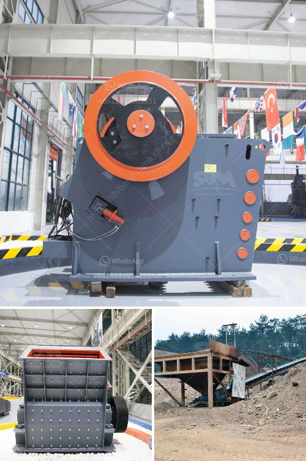

<h3>What should you pay attention to in iron ore mining?</h3>
Iron ore mining is a complex and demanding industry, requiring significant attention to several key factors to ensure maximum productivity and profitability. From exploration and extraction to processing and transportation, there are numerous stages involved in iron ore mining that should be carefully monitored and managed. Here are some crucial aspects to consider:

1. Quality of ore deposits: The quality and composition of iron ore deposits vary widely across different regions. It is crucial to identify rich ore bodies with high iron content and low impurities to optimize yield during extraction. Employing advanced geological mapping techniques and conducting detailed surveys can help determine the quality of the ore and select the most suitable mining sites.

2. Sustainability and environmental impact: Mining operations can have severe environmental consequences if not managed properly. Sustainable mining practices are essential to minimize the impact on ecosystems, water bodies, and local communities. Implementing effective waste management systems, utilizing water recycling techniques, and mitigating air and noise emissions are vital steps towards sustainable iron ore mining.

3. Safety measures: Mining is inherently dangerous; therefore, prioritizing safety measures is of paramount importance. Adequate safety training, use of personal protective equipment, implementation of protocols, and monitoring of risks are necessary to prevent accidents and promote a safe working environment.

4. Efficient extraction techniques: The method of extraction employed greatly influences the cost and productivity of iron ore mining. Open-pit mining is commonly utilized when the orebody is close to the surface, while underground mining is suitable for deeper deposits. Selecting the appropriate extraction technique and adopting technologies like drilling, blasting, and excavation that optimize productivity and minimize costs are essential considerations.

5. Processing and beneficiation: Extracted iron ore usually requires processing and beneficiation to remove impurities and improve its quality, making it suitable for various applications. Choosing efficient and advanced processing methods will enhance yield, reduce waste generation, and ensure the production of high-quality iron ore, thereby enhancing market competitiveness.

6. Logistics and transportation: Efficient transportation systems play a critical role in the success of iron ore mining. Establishing reliable transportation infrastructure, such as railways, ports, and roads, is crucial for safely and economically moving iron ore from mining sites to processing plants and finally to customers. Optimizing logistics can reduce costs, increase efficiency, minimize delays, and improve overall supply chain management.

7. Market conditions and demand: Iron ore mining is heavily influenced by global market conditions and demand dynamics. Monitoring and staying updated on market trends, prices, and demand fluctuations are crucial for making informed decisions and maximizing profits. A thorough understanding of customer requirements and building long-term partnerships with key stakeholders can ensure a steady demand for the mined iron ore.

In conclusion, iron ore mining requires a multifaceted approach with careful attention to various factors. By prioritizing the quality of ore deposits, sustainability and safety measures, efficient extraction and processing techniques, robust logistics, and market conditions, mining companies can optimize their operations and achieve long-term success in this demanding industry.
<h3>Contact us</h3><ul><li><strong>Whatsapp:&nbsp;<a href="https://wa.me/8613661969651">+8613661969651</a></strong></li><li><a href="https://swt.shibang-china.com/?git&amp;zhl&amp;What should you pay attention to in iron ore mining"><strong>Online Service(chat now)</strong></a></li></ul><h3>Related</h3><ul><li><a href='What is the disk spacing in a jaw crusher known as.md'>What is the disk spacing in a jaw crusher known as?</a></li><li><a href='What kind of equipment is used for fine crushed stone？.md'>What kind of equipment is used for fine crushed stone？</a></li><li><a href='What parameters should be considered when going to purchase jaw crushers.md'>What parameters should be considered when going to purchase jaw crushers?</a></li><li><a href='What procedures need to be done for a quarry.md'>What procedures need to be done for a quarry?</a></li><li><a href='What is the difference between a singletoggle and doubletoggle crusher.md'>What is the difference between a single-toggle and double-toggle crusher?</a></li></ul>