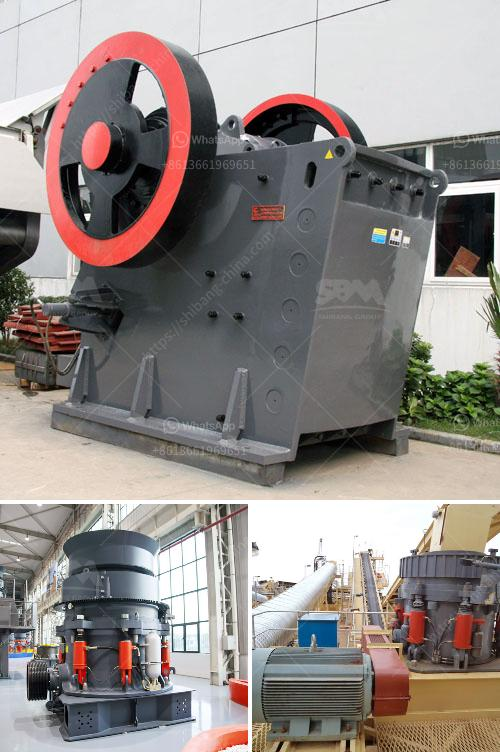

<h3>What size aggregate is used in concrete?</h3>
Concrete, the widely used construction material, consists of a mixture of cement, water, and aggregates. Aggregates are key components in concrete as they provide a solid framework and contribute to the overall strength and durability of the material. There are different sizes of aggregates available, and choosing the right size is crucial to achieving the desired properties in the concrete mix.

Aggregates can be classified into two main categories: Fine aggregates and coarse aggregates. Fine aggregates are usually sand or crushed stone particles with a size smaller than 5mm. Coarse aggregates, on the other hand, are larger particles typically ranging from 5mm to 20mm in diameter. Both types of aggregates have unique characteristics that impact the properties of the concrete.

The size of aggregate used in concrete depends on various factors, including the intended use of the concrete, the strength requirements, and the desired appearance. Fine aggregates are commonly used when a smooth surface finish is desired or when the concrete needs to be easily workable. They fill the voids between cement particles, enhancing the cohesion of the mix. Fine aggregates also improve the shrinkage properties of concrete, reducing the risk of cracking.

On the other hand, coarse aggregates are employed to increase the strength and load-bearing capacity of the concrete. The size of coarse aggregates significantly affects the strength of the mix. Larger particles provide better interlocking between the aggregates, resulting in a stronger and more durable concrete structure. However, it is important to strike a balance between the size of the coarse aggregates and the workability of the mix. Excessive use of large aggregates may reduce workability, making it difficult to properly place and compact the concrete.

The selection of aggregate size also depends on the grading requirements of the concrete mix. Grading refers to the distribution of different-sized particles in the aggregate mixture. Well-graded aggregates have a balanced distribution of sizes, which promotes better packing and reduces the voids between particles. This results in a more dense and durable concrete. Poorly-graded aggregates, on the other hand, may cause segregation during the pouring and finishing processes, leading to a weaker and less consistent concrete.

In general, the most common sizes of coarse aggregates used in concrete construction are 10mm, 20mm, and 40mm. These sizes are readily available and provide a good balance between strength and workability. Finer aggregates, such as sands, are often used in combination with the larger coarse aggregates to achieve a well-graded mix.

It is important to note that the specific size of aggregate used in concrete may vary depending on local regulations, standards, and practices. Different regions or projects may have specific requirements that determine the appropriate size range. Therefore, it is essential to consult with local authorities or industry experts to ensure compliance with the applicable guidelines.

In conclusion, the size of aggregate used in concrete plays a crucial role in determining the strength, workability, and overall durability of the material. Fine aggregates enhance cohesion and improve the appearance of the concrete, while coarse aggregates increase strength and load-bearing capacity. The selection of aggregate size should consider the specific requirements of the project, the desired properties of the concrete, and local regulations. By choosing the right aggregates, construction professionals can ensure the successful and long-lasting performance of concrete structures.
<h3>Contact us</h3><ul><li><strong>Whatsapp:&nbsp;<a href="https://wa.me/8613661969651">+8613661969651</a></strong></li><li><a href="https://swt.shibang-china.com/?git&amp;zhl&amp;What size aggregate is used in concrete"><strong>Online Service(chat now)</strong></a></li></ul><h3>Related</h3><ul><li><a href='What is the purpose of secondary crushing in the production of lime.md'>What is the purpose of secondary crushing in the production of lime?</a></li><li><a href='what is the process to buy stone crusher in Nigeria.md'>what is the process to buy stone crusher in Nigeria</a></li><li><a href='What is the best design for stone screening equipment.md'>What is the best design for stone screening equipment</a></li><li><a href='What is the price of mobile crusher.md'>What is the price of mobile crusher?</a></li><li><a href='What is the best jaw crusher for coal processing.md'>What is the best jaw crusher for coal processing?</a></li></ul>