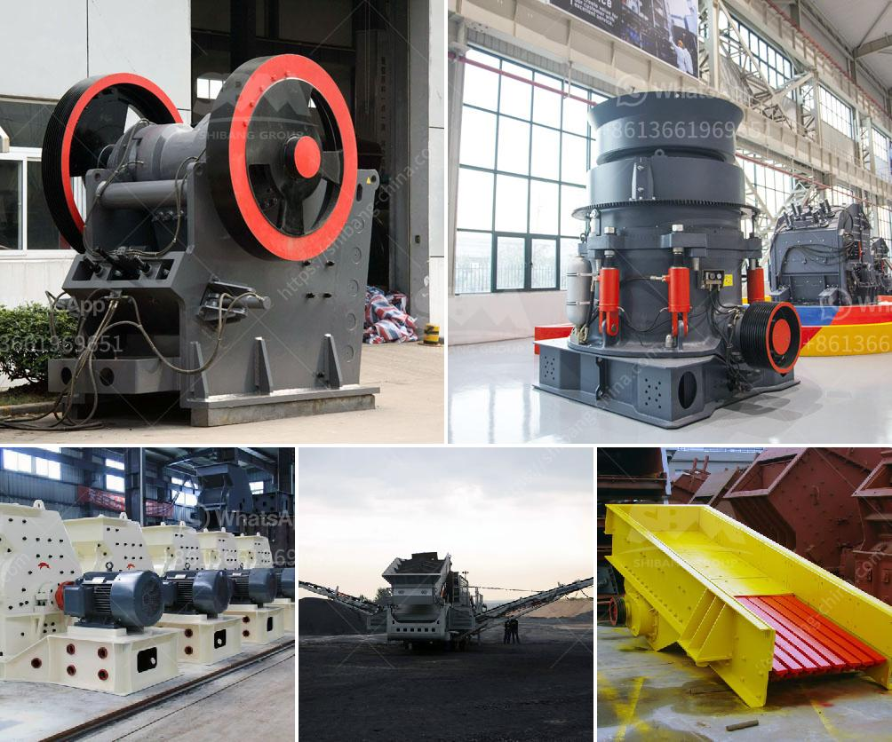

<h3>What tests are used to select a suitable gold ore processing plant?</h3>
When it comes to selecting a gold ore processing plant, various tests are conducted to assess the metallurgical characteristics of the ore and determine the optimal processing route. These tests help determine the plant design, equipment selection, and overall plant performance. Let's take a look at some of the common tests used in the selection process.

1. Gravity Tests: Gravity concentration is often used to separate gold from the gangue minerals through the difference in specific gravity. Tests such as jigging, shaking tables, and centrifugal concentrators assess the potential of gravity concentration in recovering gold. The results from these tests provide insights into the appropriate equipment and circuit design for the plant.

2. Floatation Tests: Floatation is a widely used technique in gold ore processing to separate sulfide minerals from the gold-bearing ore. Through floatation tests, the behavior of different reagents, froth quality, and recovery rates can be assessed. These tests help in designing an efficient floatation circuit and selecting the appropriate chemicals for gold recovery.

3. Leaching Tests: Gold can be leached from ore using various methods, such as cyanidation, thiosulfate leaching, or bioleaching. Leaching tests evaluate the leaching kinetics, gold recovery rates, and reagent consumption. This information is critical in determining the appropriate leaching conditions, process design, and equipment sizes for the plant.

4. Diagnostic Leaching: Diagnostic leaching involves testing the ore under different leaching conditions to understand the distribution of gold and its association with various minerals. By analyzing the leach residues, valuable insights are gained about the gold minerals' refractory nature and the need for additional processing steps such as ultrafine grinding or roasting.

5. Comminution Tests: Comminution refers to the size reduction of ore particles through crushing and grinding. Comminution tests assess the ore's hardness, grindability, and energy requirements. These tests help in selecting the appropriate crushing and grinding equipment, as well as determining the optimal particle size for gold recovery.

6. Mineralogical Analysis: Detailed mineralogical analysis provides crucial information about the ore's mineral composition and associations. This information helps identify the mineralogical factors impacting the gold recovery and suggests possible solutions. Mineralogical analysis also aids in selecting the best processing techniques and equipment.

7. Metallurgical Balance: Metallurgical balance tests involve the mass and element-by-element analysis of the ore, concentrates, and tailings. These tests ensure that the beneficiation and extraction processes are efficient and that all stages of the plant are performing optimally.

In conclusion, selecting a suitable gold ore processing plant involves conducting a range of tests to understand the ore's characteristics and behavior during processing. The results of these tests guide the plant design, equipment selection, and operating parameters. By carefully considering these tests' outcomes, operators can maximize gold recovery rates and minimize operational costs in gold ore processing plants.
<h3>Contact us</h3><ul><li><strong>Whatsapp:&nbsp;<a href="https://wa.me/8613661969651">+8613661969651</a></strong></li><li><a href="https://swt.shibang-china.com/?git&amp;zhl&amp;What tests are used to select a suitable gold ore processing plant"><strong>Online Service(chat now)</strong></a></li></ul><h3>Related</h3><ul><li><a href='What is needed to open a quarry .md'>What is needed to open a quarry ?</a></li><li><a href='What is the effect of ball size in a ball mill.md'>What is the effect of ball size in a ball mill?</a></li><li><a href='What are the mechanical devices used in mining What is the role of each.md'>What are the mechanical devices used in mining? What is the role of each?</a></li><li><a href='What are the functions of a gyratory crusher in mining.md'>What are the functions of a gyratory crusher in mining?</a></li><li><a href='What is the cost of a 32ton per hour aggregate crusher in China.md'>What is the cost of a 32-ton per hour aggregate crusher in China?</a></li></ul>