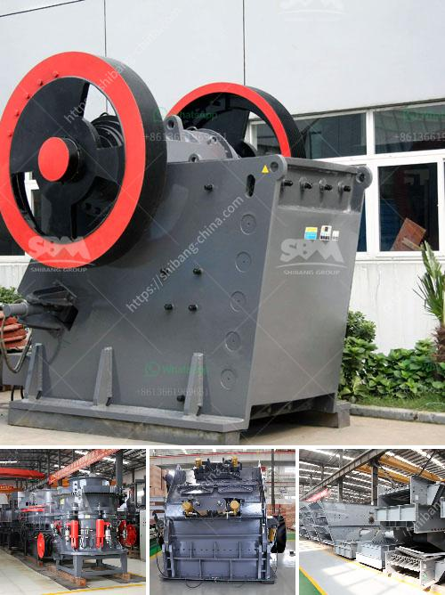

<h3>What to people use silica sand mining for ?</h3>
Silica sand mining has been a significant industry in various countries and regions around the world. This valuable resource is widely used in various sectors due to its unique properties, making it a highly sought-after material. From construction and glass manufacturing to hydraulic fracturing ("fracking") and water filtration, silica sand mining plays a crucial role in numerous industries.

One of the primary uses of silica sand mining is in the production of glass. Silica sand is an essential ingredient in the manufacturing of glass products of various types, including windows, drinking glasses, bottles, and jars. The high purity of silica sand makes it ideal for creating transparent glass with excellent optical properties. The consistent size and shape of the grains of silica sand also contribute to the overall quality of the glass, ensuring its strength and clarity.

In addition to glass production, silica sand mining is also vital in the construction industry. Silica sand acts as a key ingredient in the production of concrete and mortar. Its binding properties help create a stronger, more durable material for building structures. Silica sand is also utilized in the manufacturing of bricks, tiles, and other construction materials. It provides stability and strength to these products, making them suitable for use in various construction projects.

Another significant application of silica sand mining is in the oil and gas industry. Silica sand, particularly the high-quality and round grain variants, is used in hydraulic fracturing (fracking) operations. Fracking involves injecting a mixture of water, chemicals, and proppants into the ground to release natural gas and oil trapped in shale formations. Silica sand acts as a proppant, which props open the fractures created in the shale, allowing the release and extraction of valuable hydrocarbons.

Apart from these industries, silica sand mining is vital in the field of water filtration. Silica sand is widely used in water treatment plants to improve the quality of drinking water. The sand's high purity and ability to effectively filter out impurities and contaminants make it an ideal choice for this application. Silica sand filters out particles, sediments, and bacteria, providing cleaner and safer water for consumption.

Silica sand mining is also utilized in various industrial processes and applications, such as foundry molds, ceramics, paints, and coatings. Its high melting point and resistance to heat make it suitable for use in metal casting molds, while its fine particle size and smooth texture enhance the quality and finish of ceramic products. Silica sand is also a key ingredient in producing pigments and fillers used in paints, coatings, and other industrial materials.

In conclusion, silica sand mining finds its applications in several industries, due to its unique qualities and properties. From glass production and construction to fracking and water filtration, silica sand is a valuable resource that plays a vital role in various sectors. As the demand for these industries grows, it is essential to ensure the sustainable and responsible extraction of silica sand to ensure its availability for future generations.
<h3>Contact us</h3><ul><li><strong>Whatsapp:&nbsp;<a href="https://wa.me/8613661969651">+8613661969651</a></strong></li><li><a href="https://swt.shibang-china.com/?git&amp;zhl&amp;What to people use silica sand mining for "><strong>Online Service(chat now)</strong></a></li></ul><h3>Related</h3><ul><li><a href='What materials are used in concrete alternatives to sand.md'>What materials are used in concrete alternatives to sand?</a></li><li><a href='What is the best jaw crusher for coal processing.md'>What is the best jaw crusher for coal processing?</a></li><li><a href='What are the main current crusher and which is good.md'>What are the main current crusher and which is good?</a></li><li><a href='What is the price of mobile crusher.md'>What is the price of mobile crusher?</a></li><li><a href='What procedures need to be done for a quarry.md'>What procedures need to be done for a quarry?</a></li></ul>