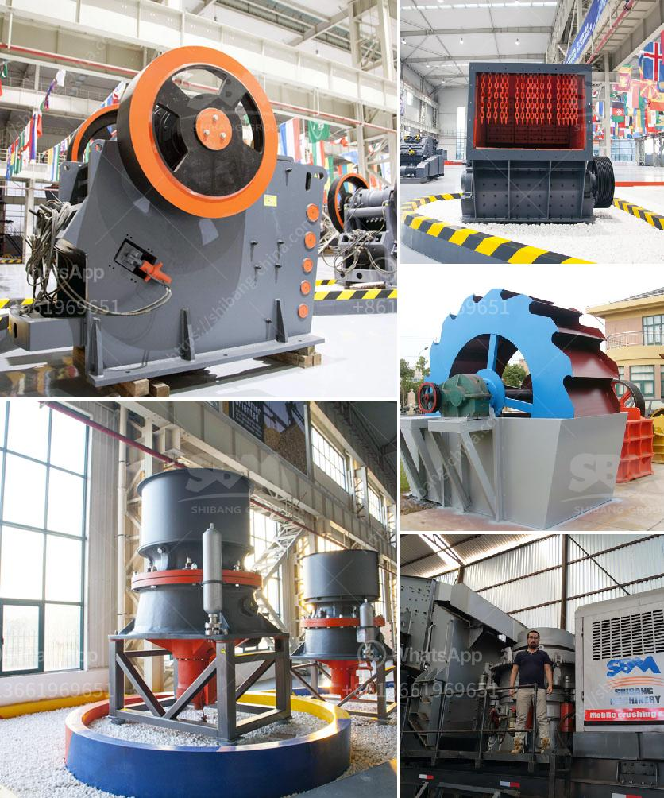

<h3>What type of couplings are generally used for a gyratory crusher?</h3>
Gyratory crushers are commonly used in the field of mining and quarrying because of their ability to crush tough and abrasive materials. However, the mechanical reliability of the equipment is highly dependent on the type of coupling used to connect the crusher mainshaft to the driving motor.

There are several types of couplings available in the market, each with its own unique features and benefits. The choice of coupling depends on various factors such as torque requirements, misalignment tolerance, and ease of installation and maintenance.

One of the most commonly used types of couplings in gyratory crushers is the gear coupling. This type of coupling consists of two gear hubs that are connected by a sleeve with internal teeth. The hubs are attached to the mainshaft and the motor shaft, respectively, and the teeth on each hub engage with one another to transmit torque. Gear couplings are highly efficient and have the ability to handle high levels of torque, making them suitable for heavy-duty applications.

Another type of coupling often used in gyratory crushers is the elastomeric coupling. This type of coupling utilizes a flexible element made of rubber or polyurethane to transmit torque between the mainshaft and motor shaft. Elastomeric couplings are known for their excellent misalignment tolerance and vibration dampening properties. They can absorb shocks and vibrations, reducing stress on the equipment and enhancing its operational lifespan. Additionally, elastomeric couplings require minimal maintenance and are easy to install.

In some cases, jaw couplings are also used in gyratory crushers. These couplings are composed of two hubs with a spider-shaped insert made of polyurethane or elastomer. The spider insert is located between the hubs and transmits torque from the motor to the crusher mainshaft. Jaw couplings are simple in design, cost-effective, and provide good misalignment tolerance. However, they may not be as efficient as gear couplings in handling high levels of torque.

When selecting a coupling for a gyratory crusher, it is crucial to consider factors such as power requirements, speed, misalignment, and maintenance needs. The coupling must be able to handle the torque generated by the motor and transmit it efficiently to the crusher mainshaft. It should also have sufficient misalignment tolerance to accommodate any shaft misalignment caused by installation or operational conditions.

Furthermore, proper installation and regular maintenance are essential to ensure the optimal performance of the coupling. Regular inspection of the coupling's alignment, lubrication, and wear is necessary to identify and rectify any issues before they lead to more significant problems or equipment failure.

In conclusion, the choice of coupling for a gyratory crusher is a critical decision that can impact the equipment's mechanical reliability and overall performance. Gear couplings, elastomeric couplings, and jaw couplings are among the commonly used types, each with its own advantages and limitations. Considering the specific requirements of the application and adhering to proper installation and maintenance practices will help maximize the efficiency and longevity of the gyratory crusher.
<h3>Contact us</h3><ul><li><strong>Whatsapp:&nbsp;<a href="https://wa.me/8613661969651">+8613661969651</a></strong></li><li><a href="https://swt.shibang-china.com/?git&amp;zhl&amp;What type of couplings are generally used for a gyratory crusher"><strong>Online Service(chat now)</strong></a></li></ul><h3>Related</h3><ul><li><a href='What is the purpose of using hydraulic cylinders in cone crushers.md'>What is the purpose of using hydraulic cylinders in cone crushers?</a></li><li><a href='What are the mechanical devices used in mining What is the role of each.md'>What are the mechanical devices used in mining? What is the role of each?</a></li><li><a href='What is the cost of roller mills.md'>What is the cost of roller mills?</a></li><li><a href='What is the major step in the process of openpit and underground mining.md'>What is the major step in the process of open-pit and underground mining?</a></li><li><a href='What machines are used in quarry mining What is the role of each.md'>What machines are used in quarry mining? What is the role of each?</a></li></ul>