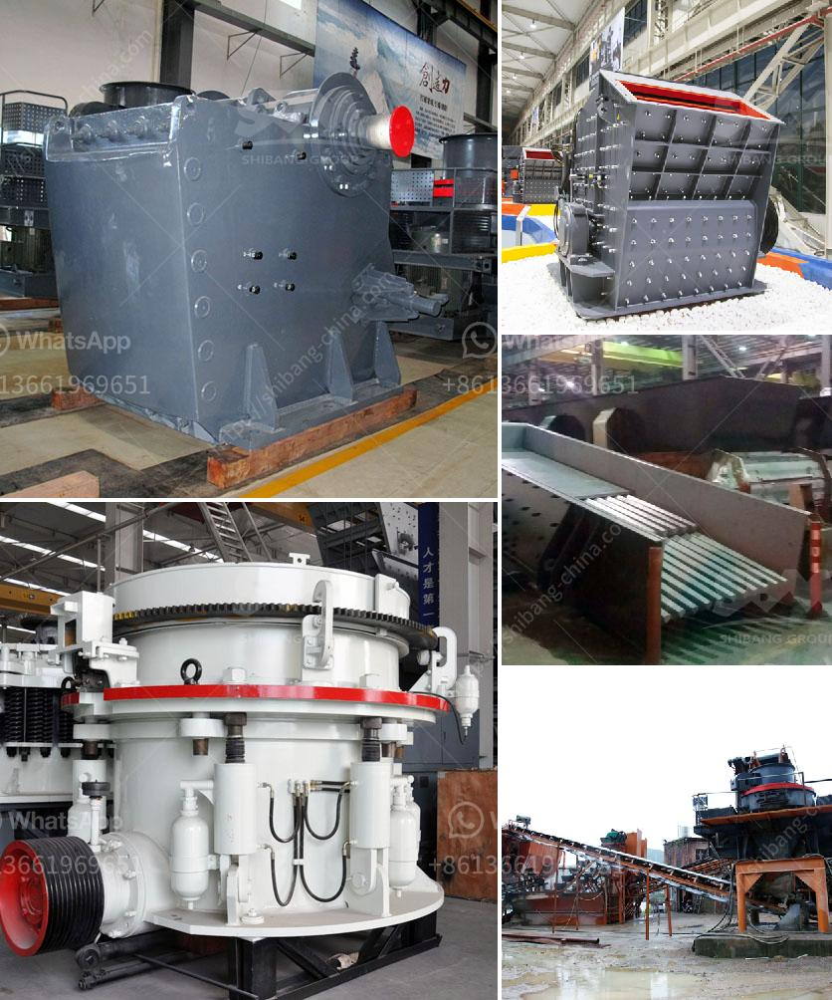

<h3>What type of crusher do I need for gold?</h3>
When it comes to extracting gold, choosing the right type of crusher can greatly enhance your productivity and efficiency. At the same time, it is important to remember that there are various types of crushers available in the market that can be utilized for different purposes.

Let's take a closer look at these different types of crushers and how they can be used to process gold ore.

Jaw crushers are commonly used as primary crushers. They are designed to crush hard and abrasive materials, including gold ore. Generally, jaw crushers are versatile machines that can crush different materials such as granite, marble, basalt, limestone, quartz, river pebbles, copper ore, iron ore, etc. It has a high crushing ratio and can be used as a primary or secondary crusher.

Impact crushers are mostly used for crushing medium-hard to hard materials, such as limestone, gravel, concrete, asphalt, gold ore, and other types of minerals. This type of crusher is versatile and can be used as a primary or secondary crusher. There are many variations of the impact crusher; some rotate at high speeds, while others grind the materials down.

Cone crushers are popular rock crushing machines in the mining industry. They are often used for secondary or tertiary crushing stages. Some of the materials that can be crushed by cone crushers include limestone, granite, basalt, river pebbles, gold ore, and other minerals. The versatility of cone crushers is impressive, as they can crush various materials with different hardness levels.

Hammer crushers are mainly used for the crushing of coal, limestone, granite, cobblestone, shale, and other materials that are moderately hard and do not require high crushing ratios. This type of crusher is usually used for soft and non-abrasive materials.

Roll crushers are another compression-type crusher that is commonly used in the mining industry. They have a relatively low reduction ratio and are excellent for reducing the size of medium-hard and soft materials, such as fertilizers, coal, gypsum, and gold ore.

In conclusion, the type of crusher you choose for your gold ore processing project depends on the characteristics of your ore, the investment budget, and the amount of time you have. Some of the important factors to consider include the hardness of the ore, the required product size, capacity requirements, and the final particle size.

It is always recommended to conduct a thorough analysis of your ore before selecting a crusher. Consulting with experienced professionals can help you make an informed decision and maximize the efficiency and productivity of your gold processing operation. Remember, the right crusher can significantly impact the overall success of your gold extraction project.
<h3>Contact us</h3><ul><li><strong>Whatsapp:&nbsp;<a href="https://wa.me/8613661969651">+8613661969651</a></strong></li><li><a href="https://swt.shibang-china.com/?git&amp;zhl&amp;What type of crusher do I need for gold"><strong>Online Service(chat now)</strong></a></li></ul><h3>Related</h3><ul><li><a href='What are the mechanical devices used in mining What is the role of each.md'>What are the mechanical devices used in mining? What is the role of each?</a></li><li><a href='What are some good ways to improve the capacity of a cement ball mill.md'>What are some good ways to improve the capacity of a cement ball mill?</a></li><li><a href='What happens to the crusher when the manganese liner starts to wear out.md'>What happens to the crusher when the manganese liner starts to wear out?</a></li><li><a href='What is the yield in mineral processing.md'>What is the yield in mineral processing?</a></li><li><a href='What is tpd in stone crusher plant capacity.md'>What is "tpd" in stone crusher plant capacity?</a></li></ul>