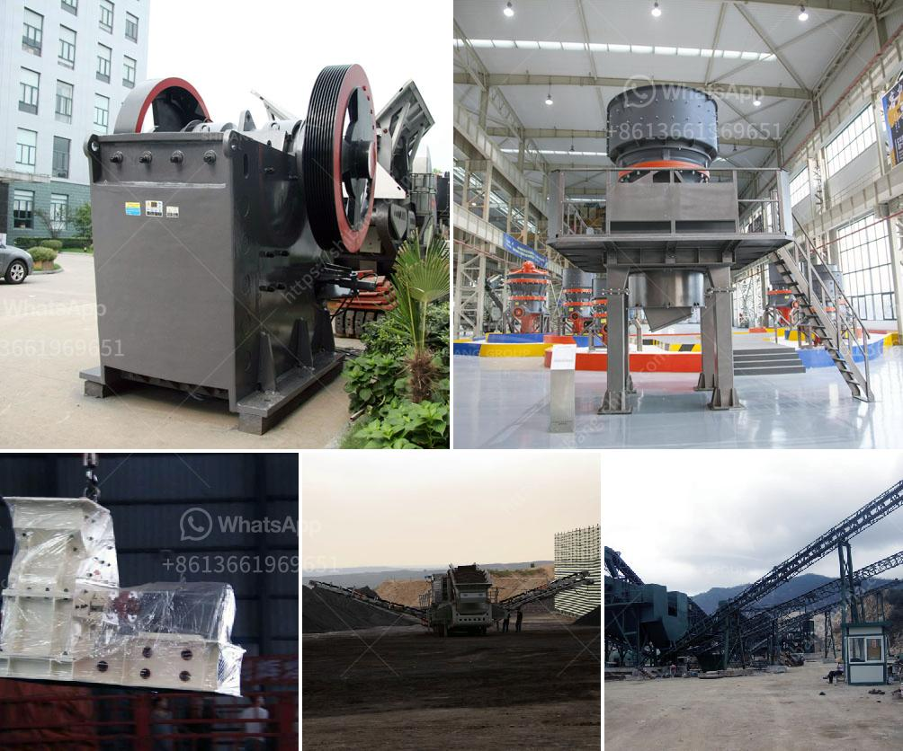

<h3>What type of crusher is good for bentonite and dolomite?</h3>
When it comes to crushing materials, there is a wide range of crushers available in the market. However, selecting the right crusher for your application can be a challenging task, especially if you are handling materials like bentonite and dolomite. These materials require specific types of crushers that can effectively break them down into smaller pieces. In this article, we will discuss the best crushers for processing bentonite and dolomite.

Bentonite is a type of clay that has high water absorption properties. It is commonly used in various industrial applications such as foundry molding sand, drilling mud, and wastewater treatment. To process bentonite into suitable sizes for various uses, a primary crusher, usually a jaw crusher, is used. The jaw crusher breaks down the large chunks of bentonite into smaller pieces, suitable for further processing.

One important factor to consider when choosing a jaw crusher is the feed opening size. Larger feed openings allow larger-sized rocks to be fed into the crusher. This is particularly important for bentonite, as it often contains large lumps that need to be broken down. Additionally, a jaw crusher with a high reduction ratio is beneficial for efficient size reduction of the bentonite material.

Dolomite, on the other hand, is a sedimentary rock composed primarily of calcium and magnesium carbonate. It is commonly used in construction, agriculture, and various industrial applications. To process dolomite, a secondary or tertiary crusher such as impact crusher or cone crusher is often required.

Impact crushers are ideal for processing dolomite due to their ability to handle high capacities and produce a cubical-shaped product. They can also be used in both primary and secondary crushing stages. These crushers use impact force to break the dolomite and are suitable for materials with high abrasiveness.

Cone crushers, on the other hand, are more commonly used for secondary crushing of dolomite. The crushing chamber of a cone crusher utilizes a rotating mantle and a concave liner. As the materials are squeezed between these two surfaces, they are broken down into smaller pieces. Cone crushers are known for their high production capacity and low operating costs.

In conclusion, when it comes to crushing bentonite and dolomite, it is important to select the appropriate type of crusher for the job. For bentonite, a jaw crusher with a large feed opening and high reduction ratio is ideal, whereas for dolomite, impact crushers or cone crushers with high capacity and cubical-shaped product are preferred. By choosing the right crusher, you can ensure efficient and effective crushing of these materials, leading to optimal outcomes in your application.
<h3>Contact us</h3><ul><li><strong>Whatsapp:&nbsp;<a href="https://wa.me/8613661969651">+8613661969651</a></strong></li><li><a href="https://swt.shibang-china.com/?git&amp;zhl&amp;What type of crusher is good for bentonite and dolomite"><strong>Online Service(chat now)</strong></a></li></ul><h3>Related</h3><ul><li><a href='What is the maintenance of a jaw crusher.md'>What is the maintenance of a jaw crusher?</a></li><li><a href='what are the steps limestone ore processed？.md'>what are the steps limestone ore processed？</a></li><li><a href='What is the price of coal crusher in Indonesia.md'>What is the price of coal crusher in Indonesia?</a></li><li><a href='What machine crushes talcum powder for building stone？.md'>What machine crushes talcum powder for building stone？</a></li><li><a href='What does a ball mill do in mining.md'>What does a ball mill do in mining?</a></li></ul>