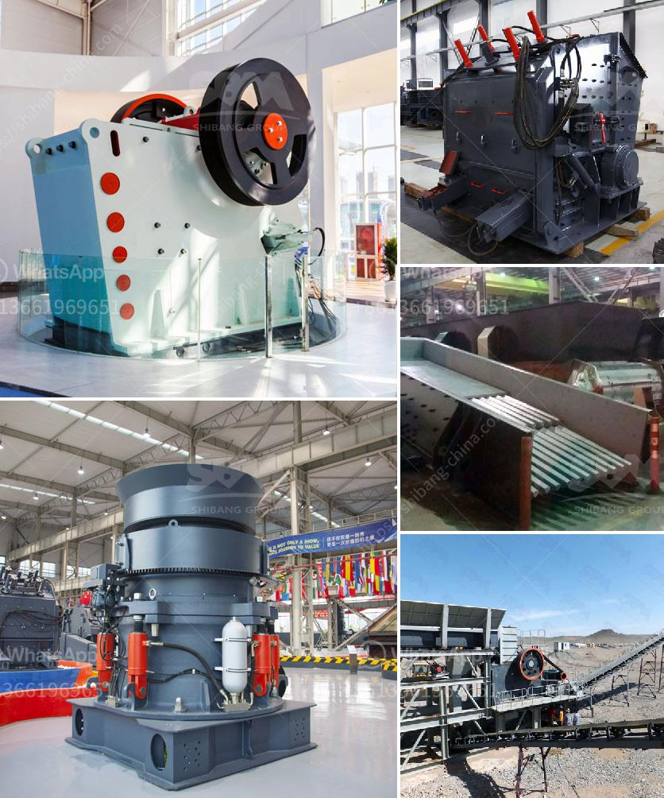

<h3>What type of crusher is needed to crush sillimanite？</h3>
Sillimanite, also known as Fibrolite, is a hydrous aluminum silicate mineral with the chemical formula Al2SiO5. It belongs to the orthorhombic crystal system and has a Mohs hardness of 6.5 to 7.5. Sillimanite is commonly found in metamorphic rocks and has various industrial applications due to its high temperature and pressure stability.

To extract the valuable minerals from sillimanite ore, it needs to undergo a series of crushing processes. The primary goal of crushing is to reduce the size of the ore for further processing. Choosing the right crusher for this purpose is crucial to ensure efficient and effective crushing operations.

Several types of crushers are commonly used for crushing minerals like sillimanite. Each type has its own advantages and limitations, and the choice depends on the specific requirements of the application. Let's explore some of the crushers commonly used for sillimanite crushing:

The jaw crusher is a popular choice for primary crushing due to its ability to crush large pieces of ore into smaller sizes. It consists of two jaws, one fixed and the other movable, which apply pressure to the rock by moving back and forth. Jaw crushers are known for their high reduction ratios and uniform product size.

Cone crushers are commonly used for secondary or tertiary crushing. They work by squeezing the ore between a mantle and a concave, crushing it into finer particles. Cone crushers are versatile and can handle various types of materials, including hard and abrasive ones. They are often used in processing plants where a finer product size is required.

An impact crusher uses the principle of impact to crush materials. It utilizes a rotor with high-speed rotating hammers to strike the ore and break it into smaller pieces. Impact crushers are ideal for processing softer to medium-hard materials and are often used in recycling and quarrying applications.

VSI crushers are capable of crushing hard and abrasive materials with high efficiency. They operate by throwing the ore against a hard surface, breaking it into smaller particles. VSI crushers have the advantage of shaping the final product cubically and can be used as a tertiary crusher in some cases.

When selecting the crusher for sillimanite crushing, it is essential to consider factors such as ore hardness, required product size, and the desired capacity of the crushing circuit. The crushing process should be designed to maximize the yield of valuable minerals while minimizing production costs and energy consumption.

In conclusion, crushing sillimanite ore requires a suitable crusher that can effectively reduce the size of the material. Jaw crushers, cone crushers, impact crushers, and VSI crushers are all viable options, each with its own strengths and limitations. By carefully evaluating the specific requirements of the application, one can select the most suitable crusher for crushing sillimanite and achieve efficient and productive crushing operations.
<h3>Contact us</h3><ul><li><strong>Whatsapp:&nbsp;<a href="https://wa.me/8613661969651">+8613661969651</a></strong></li><li><a href="https://swt.shibang-china.com/?git&amp;zhl&amp;What type of crusher is needed to crush sillimanite？"><strong>Online Service(chat now)</strong></a></li></ul><h3>Related</h3><ul><li><a href='What are the cement mill precrushing equipment .md'>What are the cement mill pre-crushing equipment ?</a></li><li><a href='What is the common ore crusher for aluminum.md'>What is the common ore crusher for aluminum?</a></li><li><a href='what is the cost of an 200mt capacity of cement plant？.md'>what is the cost of an 200mt capacity of cement plant？</a></li><li><a href='What is a ball mill for .md'>What is a ball mill for ?</a></li><li><a href='what profits from crusher machine in kenya？.md'>what profits from crusher machine in kenya？</a></li></ul>