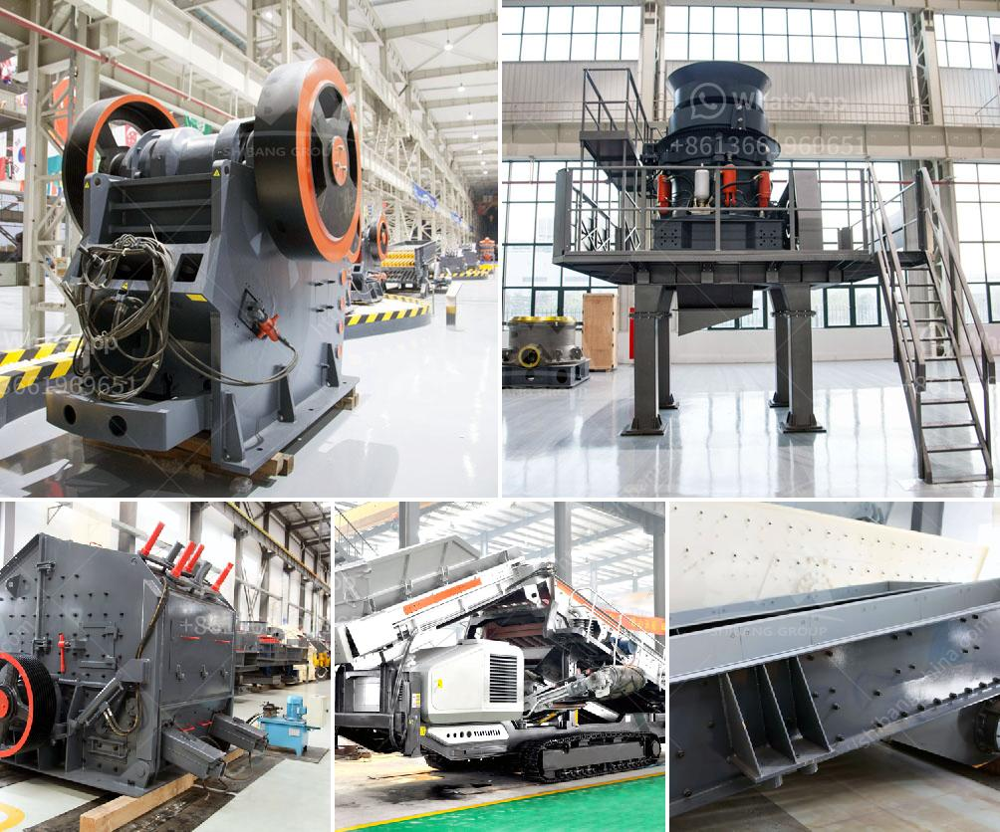

<h3>What type of crusher is used for iron ore？</h3>
Iron ore is a mineral that is abundant in nature and is widely distributed in various industrial sectors. It is one of the most important raw materials for iron and steel production enterprises. The iron ore resources are rich in our country, and the iron ore crusher is mainly used for coarse crushing and fine crushing in the production line. In this article, we will introduce the commonly used iron ore crushers.

Jaw crusher is a traditional crushing equipment with many advantages, such as high crushing efficiency, low production cost, easy maintenance, and good grain shape of finished products. It is suitable for crushing iron ore. However, due to its large feed size, high production capacity, and long service life, it is often used in large-scale iron ore processing plants. The jaw crusher has a stable performance and is favored by many customers.

Cone crusher is a commonly used crushing equipment for iron ore processing. Compared with jaw crusher, its production capacity is higher and particle size is more uniform. It is used in the medium and fine crushing stage to crush coarse and medium-hard materials. The selection of cone crusher is mainly based on the cone crusher's own performance and the requirements of the production line.

Impact crusher is mainly used for coarse crushing and second crushing operations. It can be used to crush various medium-hardness ores and rocks. Its advantages include large crushing ratio, high crushing efficiency, cubic shape of finished products, and low investment cost. For iron ore processing, impact crusher is generally used for secondary crushing, while cone crusher and jaw crusher are used for primary crushing.

Hammer crusher is used for crushing raw iron ore into small particles, so that further beneficiation processes can be carried out. In the iron ore processing line, jaw crusher and cone crusher are the most commonly used machinery. Hammer crusher has high crushing efficiency, large capacity, and low power consumption.

Roller crusher is suitable for crushing medium-hardness materials such as limestone, slag, coke, and coal in cement, chemical, electric power, metallurgy, building materials, refractory materials, coal mines, etc. The roller crusher is composed of two rollers, which rotate in opposite directions. The material falls between the two rollers and is crushed by the pressure generated by the rollers. Roller crusher has the advantages of simple structure, reliable performance, and low cost.

In conclusion, different types of crushers are used in different iron ore processing plants. The jaw crusher is suitable for coarse crushing, the cone crusher is suitable for medium crushing, the impact crusher and hammer crusher are suitable for medium and fine crushing, and the roller crusher is suitable for crushing and shaping operations. The selection of crusher equipment should be based on the properties of the iron ore, production requirements, and investment budget. By choosing the appropriate crusher, it can effectively improve the efficiency of the entire iron ore processing line and make a significant contribution to the iron and steel industry.
<h3>Contact us</h3><ul><li><strong>Whatsapp:&nbsp;<a href="https://wa.me/8613661969651">+8613661969651</a></strong></li><li><a href="https://swt.shibang-china.com/?git&amp;zhl&amp;What type of crusher is used for iron ore？"><strong>Online Service(chat now)</strong></a></li></ul><h3>Related</h3><ul><li><a href='What is rotary screen cement plant .md'>What is rotary screen cement plant ?</a></li><li><a href='What are the advantages of dry magnetic separator？.md'>What are the advantages of dry magnetic separator？</a></li><li><a href='What are the factors that promote the development of mining.md'>What are the factors that promote the development of mining?</a></li><li><a href='What is a dry ball mill.md'>What is a dry ball mill?</a></li><li><a href='What is the feed of the jaw crusher .md'>What is the feed of the jaw crusher ?</a></li></ul>