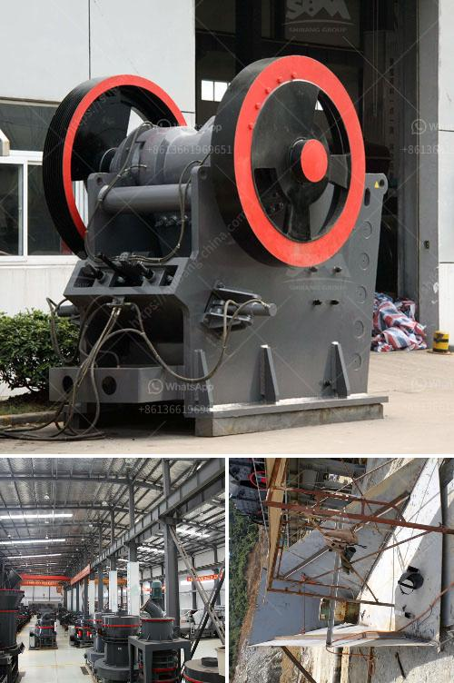

<h3>What type of crusher produces the least amount of fines?</h3>
When it comes to crushing materials for various applications, one of the key considerations is determining the type of crusher that produces the least amount of fines. Fines, also known as crushed fines or crusher dust, are small particles of crushed rock that result from the crushing process. While fines can be beneficial in certain situations, such as providing a stable base for roads or improving the workability of concrete, excessive fines can lead to issues such as dust generation, poor drainage, and reduced load-bearing capacity. Therefore, selecting the right crusher is crucial to minimize the generation of fines.

Impact crushers and cone crushers are two commonly used crushers for crushing various materials, and both can be effective in producing aggregates with minimal fines. But which type of crusher is superior in terms of reducing fines? Let's delve into the characteristics of each:

Impact crushers, also known as hammer crushers, involve the use of impact rather than pressure to crush material. They are ideal for processing medium-hard to hard materials and are often used for primary or secondary crushing stages. Impact crushers consist of a rotor with hammers that strike the material, causing it to break along its natural cleavage lines or fractures.

Impact crushers are known for their high production capacity and ability to generate cubical-shaped aggregates. However, they tend to generate more fines compared to cone crushers, especially when handling highly abrasive materials. The intense impact forces can cause the fractured particles to disintegrate into smaller fines.

Cone crushers, also known as compression crushers, use compression rather than impact to crush material. They are primarily used for the secondary and tertiary crushing stages. Cone crushers consist of a mantle that rotates eccentrically within a concave bowl. As the mantle approaches the concave, the material is crushed by compressive forces.

Cone crushers are widely recognized for their ability to produce aggregates with a low amount of fines. The compressive forces applied during crushing help to keep the materials intact, reducing the generation of fines. Cone crushers are particularly advantageous when processing hard and abrasive materials. Additionally, they provide excellent control over the final product size and shape.

While both impact crushers and cone crushers have their advantages, cone crushers are generally preferred when the goal is to minimize the generation of fines. Their ability to maintain the integrity of the material during the crushing process leads to a higher proportion of desirable-sized aggregates.

In conclusion, selecting the right crusher to minimize fines is a critical decision in the crushing process. Although impact crushers are capable of high production capacities and cubical-shaped aggregates, they tend to generate more fines compared to cone crushers. Cone crushers, on the other hand, excel at producing aggregates with a low amount of fines due to their compression crushing mechanism. By understanding the characteristics and requirements of the materials to be crushed, one can make an informed decision on which type of crusher is best suited for their specific needs.
<h3>Contact us</h3><ul><li><strong>Whatsapp:&nbsp;<a href="https://wa.me/8613661969651">+8613661969651</a></strong></li><li><a href="https://swt.shibang-china.com/?git&amp;zhl&amp;What type of crusher produces the least amount of fines"><strong>Online Service(chat now)</strong></a></li></ul><h3>Related</h3><ul><li><a href='What is the waste of ore crushing plant .md'>What is the waste of ore crushing plant ?</a></li><li><a href='What type of flywheel is used in the double toggle jaw crusher.md'>What type of flywheel is used in the double toggle jaw crusher</a></li><li><a href='What is the price of a cone crusher in Venezuela.md'>What is the price of a cone crusher in Venezuela?</a></li><li><a href='what are the various uses of lime stone powder？.md'>what are the various uses of lime stone powder？</a></li><li><a href='What is Raymond mill and ball mill process .md'>What is Raymond mill and ball mill process ?</a></li></ul>